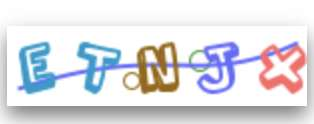

## 1. 用户注册

请求：

```
POST https://xrobo.qiniu.com/xiaozhi/user/register
Content-Type: application/json
```

```json
{
"username": "",
"password": "",
"captcha": "",
"mobileCaptcha": "",
"captchaId": ""
}
```

响应：

```json
{
    "code": 0,
    "msg": "",
    "data": {}
}

```

### 获取 captcha

GET <https://xrobo.qiniu.com/xiaozhi/user/captcha?uuid=cfa94872-48b6-425b-8e6a-17b912b6b6f4>

uuid 随机生成

响应：



## 2. 用户登录

请求：

```
POST <https://xrobo.qiniuapi.com/xiaozhi/user/login>
Content-Type: application/json
```

```json

{
    "areaCode": "+86",
    "captcha": "xxxxx",
    "captchaId": "d4224c42-a0a2-4e38-87a5-edc3ad03c014",
    "mobile": "",
    "password": "xxxx",
    "username": "xxx",
}
响应：
{
    "code": 0,
    "msg": "success",
    "data": {
        "token": "4fxxxxxxxxxxxxxxxxxxxxxxx",
        "expire": 43200,
        "clientHash": "xxxxxx"
    }
}
```

返回的`token`为后续大多数api的凭证
