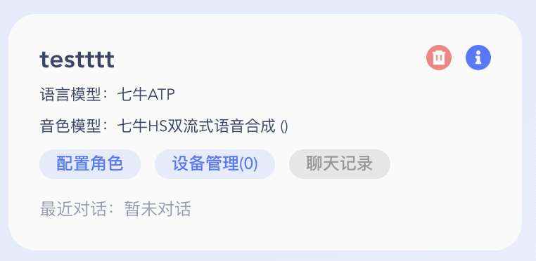
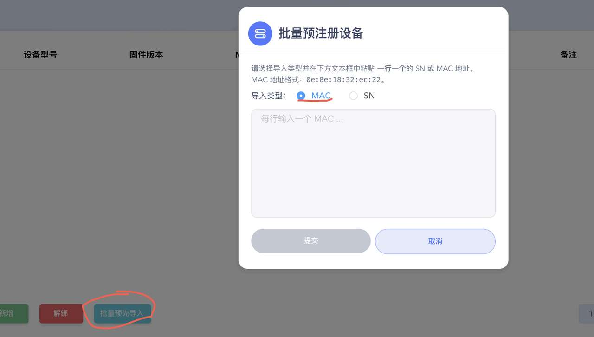
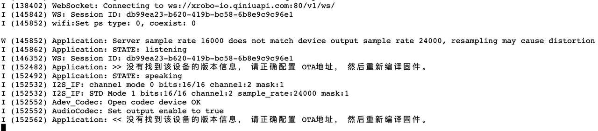

## 1. 绑定 MAC 地址

- 第一步：访问控制台，注册账号，登录

- 第二步：新建智能体：

  

- 第三步：在“设备管理”中，选择 批量导入，填写设备的 mac 地址：

  

  不知道设备 mac 地址怎么办？

## 2. 绑定设备激活码

- 第三步：通过 在“设备管理”中，选择新增，填写 设备激活码
  

怎么获取设备激活码？

### 2.1 获取设备激活码

通过 OTA 通信协议获取，如下详细描述

#### 2.1.1 OTA 协议描述

请求方法

- POST /api/ota/
  请求头
- Device-Id: 设备的唯一标识符（必需，使用 MAC 地址或由硬件 ID 生成的伪 MAC 地址）
- Client-Id: 客户端的唯一标识符，由软件自动生成的 UUID v4（必需，擦除 FLASH 或重装后会变化）
- User-Agent: 客户端的名字和版本号（必需，例如 esp-box-3/1.5.6）
- Accept-Language: 客户端的当前语言（可选，例如 zh-CN）
  请求体
  请求体应为 JSON 格式，包含以下字段：
- application: 包含设备当前固件版本信息的对象（必需）
  - version: 当前固件版本号
  - elf_sha256: 用于校验固件文件完整性 Hash
- mac_address: MAC 地址（可选，与 HTTP header 里的 device-id 一致）
- uuid: ClientId（可选，与 HTTP header 里的 client-id 一致）
- chip_model_name: 设备的芯片型号，例如 esp32s3（可选）
- flash_size: 设备的闪存大小（可选）
- psram_size: 设备的 PSRAM 大小（可选）
- partition_table: 设备分区表，用于检查是否有足够的空间，用于下载固件（可选）
- board: 开发板类型与版本，以及所运行的环境（必需）
  - type: 开发板类型
  - name: 开发板 SKU（与 user-agent 中的前面部分保持一致）
  - ssid: 设备接入的 Wi-Fi 名字
  - rssi: 设备接入的 Wi-Fi 信号强度
    响应
    成功响应
    响应体为 JSON 格式，包含以下字段：
- activation: 设备需要激活
  - code: 激活码
  - message: 屏幕显示消息
- mqtt: MQTT 协议服务器配置信息
- websocket: Websocket 协议服务器配置信息
- server_time: 服务器时间信息（用于同步设备时间）
  - timestamp: 当前时间戳
  - timezone: 服务器时区
  - timezone_offset: 服务器时区偏移量
- firmware: 最新版本固件信息
  - version: 固件版本号
  - url: 固件下载链接（如果有更新）
    错误响应
- 400 Bad Request: 请求缺少必需的字段或字段无效
  - error: 错误信息
- 500 Internal Server Error: 服务器内部错误 - error: 错误信息
  2.1.2 OTA 协议举例
  以 Web 端模拟设备为例，也可以直接体验我们的 Web-demo

```
POST https://xrobo.qiniuapi.com/v1/ota/
Host: xrobo.qiniuapi.com
Accept-Language: zh-CN
Content-Type: application/json
Device-Id: D4:06:06:B6:A9:FB
Client-Id: web_test_client

{
{"version":0,
"uuid":"",
"application":
{ "name":"xiaoniu-web-test",
"version":"1.0.0",
"compile_time":"2025-04-16 10:00:00",
"idf_version":"4.4.3",
"elf_sha256":"1234567890abcdef1234567890abcdef1234567890abcdef"
},
"ota":{"label":"xiaoling-web-test"},
"board":{"type":"xiaoling-web-test",
"ssid":"xiaoling-web-test",
"rssi":0,"channel":0,
"ip":"192.168.1.1",
"mac":"D4:06:06:B6:A9:FA"},
"flash_size":0,
"minimum_free_heap_size":0,
"mac_address":"D4:06:06:B6:A9:FA",
"chip_model_name":"",
"chip_info":{"model":0,"cores":0,"revision":0,"features":0},
"partition_table":[{"label":"","type":0,"subtype":0,"address":0,"size":0}]}

}
响应示例
{
"server_time": {
"timestamp": 1752119934489,
"timeZone": "Asia/Shanghai",
"timezone_offset": 480
},
"activation": {
"code": "608303", //【这就是我们需要的激活码】
"message": "http://60.205.58.18:8002\n608303",
"challenge": "D4:06:06:B6:A9:FA"
},
"firmware": {
"version": "1.0.0",
"url": "https://xrobo.qiniuapi.com/v1/ota/INVALID_FIRMWARE_FOR_TEST"
},
"websocket": {
"url": "ws://xrobo-io.qiniuapi.com/v1/ws/"
}
}
错误响应
//缺少 device-id
HTTP/1.1 400 Bad Request
Content-Type: application/json

{
"error": "Device ID is required"
}

//无效的 OTA 请求
{
"error": "Invalid OTA request"
}

//服务器内部错误
{
"error": "Failed to read device auto_update status"
}

```

### 2.2 ESP32 设备通过 OTA 拿到激活码后，没有及时绑定会怎么样？

首先，设备会一直定期的发送 ota/activate 请求，提醒您去绑定；此时设备也无法唤醒，无法通话


其次，如果服务端 auth 验证需要 token，这个 token 是有保活期，超过了，需要重启设备，因为市面上的固件都没有定期 ota 过程，只有重启设备才会有 ota 消息发送。

### 2.3 怎么重新绑定

需要在控制台先解除绑定，再重新绑定，设备解除绑定后，设备当前通话并不会立刻终止，只有当重新开启会话时，会提醒你重启设备，重新拿到激活码，重新去走一遍流程。


