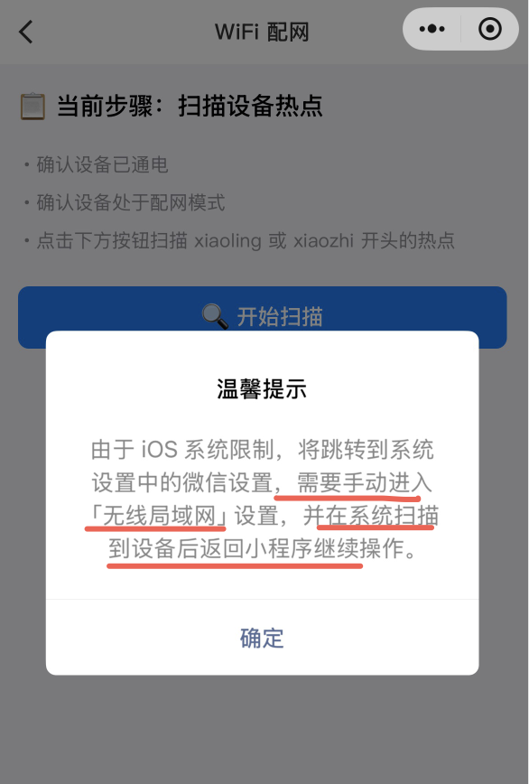
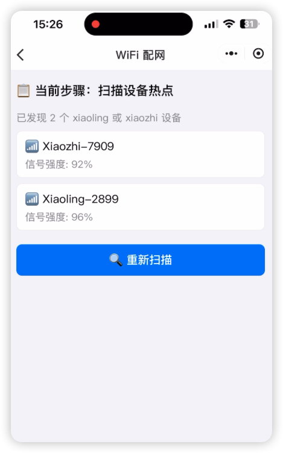
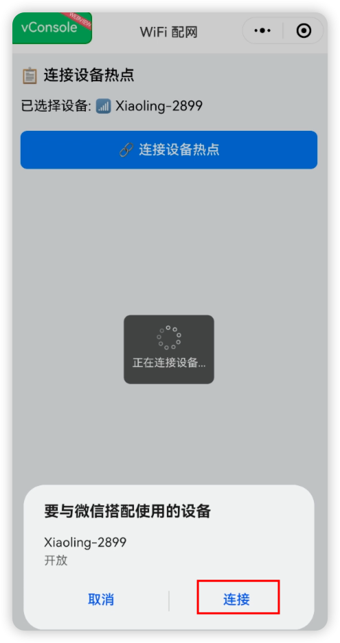

## 1.烧录

1. 七牛灵芯云提供最新版本的设备固件：

   | 芯片     | 固件                                                                                                                              |
   | :------- | :-------------------------------------------------------------------------------------------------------------------------------- |
   | ESP32-C3 | <https://algorithm.qnaigc.com/xiaoling-rom/xiaoling-202507021613-ESP32C3-xiage_mini_c3-nihaoxiaozhi-without_dns.bin>              |
   | ESP32-S3 | <https://algorithm.qnaigc.com/xiaoling-rom/xiaoling-202507021613-ESP32S3-bread_compact-nihaoxiaozhi_nihaoxiaoxin-without_dns.bin> |

2. 下载固件后，可参考 Flash 工具/Web 端烧录固件（无 IDF 开发环境）中的 3 种烧录方式进行烧录，推荐使用第 2 种，比较方便。

## 2.七牛云服务

| 服务         | 网址                                 |
| ------------ | ------------------------------------ |
| 网页端控制台 | <https://xrobo.qiniu.com/#/home>     |
| OTA 地址     | <https://xrobo.qiniuapi.com/v1/ota/> |
| websocket    | <wss://xrobo-io.qiniuapi.com/v1/ws/> |

## 3.WiFi 配网

七牛灵芯云新增小程序配网模式。

### 1）初次设备启动则进入配网状态

bin 固件烧录后，设备保持接通电源状态，重启设备，设备进入配网模式。

| 芯片                                     | 说明图片                                           |
| ---------------------------------------- | -------------------------------------------------- |
| ESP32-C3（将红圈所示的开关关闭后再打开） |  |
| ESP32-S3（按一下红圈所示的 RST 按钮）    |  |

### 2）重新配网

如果设备固件版本>=0.2.2，在重试 3 次连接原有 WI-FI 网络失败后，会重新进入配网模式（切换网络时可能需要按 RST 按键重启一下设备）。如果设备固件版本较新，在设备开机后，如果处于扫描 wifi 状态时按一下 boot 键（如图中绿圈所示），设备将重新配网，不再连接上次的 WIFI 网络。

| 芯片     | 说明图片                                          |
| -------- | ------------------------------------------------- |
| ESP32-C3 |  |
| ESP32-S3 |  |

### 3）配网步骤

## 3.1. 使用小程序配网

### 1）小程序二维码：

### 2）扫码进入配网小程序

## 3.1.a IOS/苹果设备

1. 搜寻设备热点，在 IOS 「设置->无线局域网」 页面搜寻到设备热点后返回小程序继续操作。

   |  |  |  |
   | -------------------------------------------- | -------------------------------------------- | -------------------------------------------- |

2. 连接设备热点。

   |  |  |
   | -------------------------------------------- | -------------------------------------------- |

3. 配置 wifi。
   |  |  |  |
   | -------------------------------------------- | -------------------------------------------- | -------------------------------------------- |

## 3.1.b 安卓设备

1. 搜寻设备热点，并连接。
   |  |  |  |
   | -------------------------------------------- | -------------------------------------------- | -------------------------------------------- |

2. 配置 wifi。
   |  |  |  |
   | -------------------------------------------- | -------------------------------------------- | -------------------------------------------- |

## 3.2. 浏览器登录

1. 连接设备热点 （Xiaoling-XXXX 或 Xiaozhi-XXXX，后四位为数字和大写字母构成的设备 UID）

   使用手机或电脑连接到设备的 WiFi 网络，通常以 Xiaoling-XXXX 或 Xiaozhi-XXXX 命名。

   选中并连接, 使用浏览器地址栏输入网址 <http://192.168.4.1> 进入设备的网络配置页面，如下图示（截图以 Iphone 为例）：

   |  |  |
   | ------------------------------------------ | ------------------------------------------ |

2. 配置 WiFi

   选择 WiFi 网络，选择名称后会自动填写（也可手动录入）。在密码输入框中输入当前选择的 wifi 密码，点击 连接 按钮提交即可（如果是手机已经保存过的密码会自动提交）。

   |  |  |
   | ------------------------------------------ | ------------------------------------------ |

3. 配置 OTA 地址

   点击高级选项，输入该 OTA 地址后点击保存：<https://xrobo.qiniuapi.com/v1/ota/>

   

4. 连接并重启设备

   连接可能需要耗费 5 秒，请耐心等待，连接成功后设备将重启。重启后设备已经连上 wifi 网络，如果 wifi 不可用，重新配网。

   |  |  |
   | ------------------------------------------ | ------------------------------------------ |

## 4. 添加新设备到 [七牛云灵芯平台](https://xrobo.qiniu.com/)

你的设备在 WI-FI 或 4G 联网后，需要到 七牛云灵芯平台-控制面板 添加设备验证通过，才能正常使用设备进行 AI 语音聊天，请按照以下步骤操作：

请先确保设备已连接到互联网，通过“你好，小智”唤醒，并出现要求添加设备的提示语 6 位设备验证码（可以重复唤醒重听）。

如使用不带离线唤醒的设备，如 esp32-C3 系列开发板或产品，请使用按键唤醒设备，进行通信，根据语音播报或屏幕显示的 6 位验证码，到控制面板添加设备。

注意：如果用户没有听到语音播报，喇叭没有发声，面包板方案用户请检查功放和喇叭接线是否正常，使用第三方开发板用户请检查固件是否匹配且正常运行。

电脑浏览器访问 七牛云灵芯平台-控制面板 后台：https://xrobo.qiniu.com/ ，如未注册请先注册账号。

### 第一步：注册账号

### 第二步：创建智能体

智能体名称用户随意。

新建智能体完成后，出现在智能体列表中，如下图示：

### 第三步：配置角色

提供了集中角色模板，也可以设置您自己的角色，通过修改“角色介绍”中的说明。

### 第四步：添加新设备

首先获得 6 位设备 ID，配网重启后设备自动产生，如果设备已经绑定智能体则需要先解绑，再通过设备 RTS 键重启获得。

已经添加过设备：请点击对应智能体模块下方 “设备管理” 进入设备列表页面，再通过右侧 “+添加设备” 按钮添加新设备，如下图示：

设备添加后将自动激活，并显示在“设备管理”列表页面上，如上图示，就可以正常使用了。

## 6.通信协议

设备绑定请参考 [七牛云灵芯平台-设备绑定](./device-bind.md)

Websocket 通信请参考 [七牛云灵芯平台-设备服务通信协议](./device-protocol.md)
