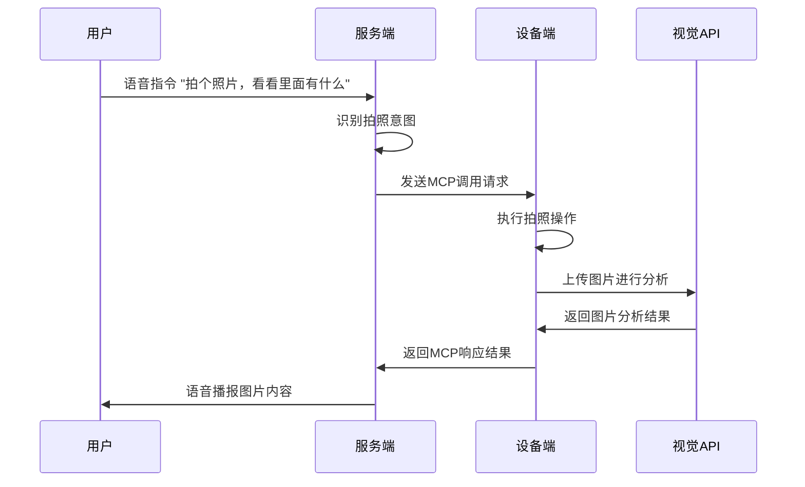

# 拍照功能

拍照功能是灵矽中一个重要的交互特性，允许用户通过语音指令控制设备拍摄照片，并获得智能化的图片内容解析。

## 工作流程

拍照功能的整个工作流程如下：



## 技术实现

### 1. 服务端意图识别

当用户发出拍照相关的语音指令时，服务端会识别到拍照意图，例如用户说"拍个照片，看看里面有什么"。

### 2. MCP调用

服务端识别到拍照意图后，会向设备端发送MCP（Model Context Protocol）调用请求：

```json
{
  "type": "mcp",
  "payload": {
    "jsonrpc": "2.0",
    "id": 1,
    "method": "tools/call",
    "params": {
      "name": "self.camera.take_photo",
      "arguments": {
        "question": "XXXXX"
      }
    }
  }
}
```

### 3. 设备端处理

设备端收到MCP调用后：

1. **捕获图片**：通过摄像头模块拍摄一张照片
2. **上传分析**：将图片发送到视觉分析接口进行处理
3. **返回结果**：将分析结果包装在MCP响应中返回

### 4. 视觉分析接口

设备端将捕获的图片发送到视觉分析接口（可通过mcp里面的capabilities获取url以及token）：

**接口地址**：`https://xrobo-io.qiniuapi.com/mcp/vision/explain`

**请求示例**：
```bash
curl -X POST "https://xrobo-io.qiniuapi.com/mcp/vision/explain" \
    -H "Authorization: Bearer xxx" \
    -H "Device-Id: xxxx" \
    -H "Client-Id: xxxx" \
    -F "question=XXX" \
    -F "image=@/xxxx/XXX.png"
```

**请求参数**：
- `Authorization`: Bearer token，用于身份验证
- `Device-Id`: 设备唯一标识
- `Client-Id`: 客户端标识
- `question`: 对图片的提问或分析要求
- `image`: 要分析的图片文件

### 5. MCP响应格式

设备端收到视觉分析结果后，将其封装在MCP响应中：

```json
{
  "session_id": "XXXXXX",
  "type": "mcp",
  "payload": {
    "jsonrpc": "2.0",
    "id": 3,
    "result": {
      "content": [
        {
          "type": "text",
          "text": "{\"success\":true,\"action\":\"RESPONSE\",\"response\":\"XXXXXX\"}"
        }
      ],
      "isError": false
    }
  }
}
```

### 6. 语音反馈

服务端接收到MCP响应后，会将图片分析信息进行处理，然后通过语音合成技术将结果播报给用户。

## 应用场景

拍照功能可以应用在多种场景中：

- **物体识别**：识别照片中的物品、食物、动植物等
- **场景描述**：描述照片中的环境、人物、活动等
- **文字识别**：识别照片中的文字内容
- **安全监控**：分析监控画面中的异常情况
- **智能助手**：为视障用户提供环境描述服务

## 注意事项

1. **网络连接**：拍照功能需要稳定的网络连接以便上传图片到分析接口
2. **隐私保护**：确保图片数据的传输和处理符合隐私保护要求
3. **响应时间**：根据图片大小和网络状况，分析过程可能需要几秒钟时间
4. **权限管理**：确保设备具有相应的摄像头访问权限

## 故障排除

如果拍照功能出现问题，可以检查以下方面：

- 设备摄像头是否正常工作
- 网络连接是否稳定
- API认证信息是否正确
- 设备端MCP服务是否正常运行