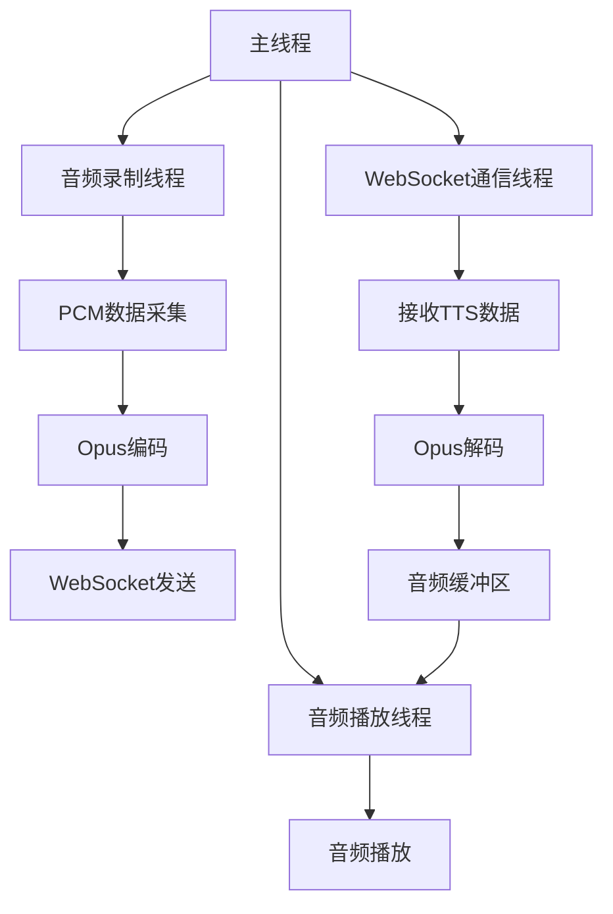
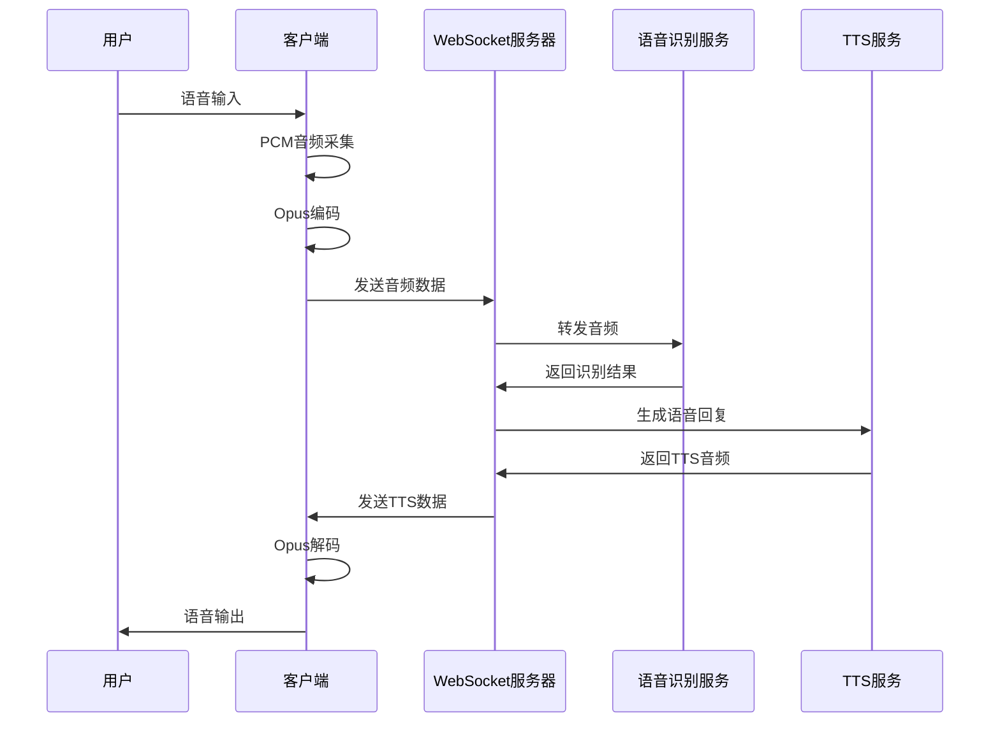

# 客户端demo

本页面介绍灵矽平台的跨平台音频客户端演示程序，该程序基于C++开发，支持Linux和macOS平台，实现了完整的语音交互功能。

## 项目概述

**项目名称**: Linx Audio Client
**GitHub地址**: https://github.com/sunqirui1987/linx-linux


这是一个跨平台的音频客户端项目，支持实时音频录制、播放和WebSocket通信，提供完整的语音交互体验。

## 核心特性

- **跨平台音频支持**: 自动检测平台并使用相应的音频API
  - Linux: 使用ALSA音频系统
  - macOS: 使用PortAudio音频系统
- **实时音频处理**: 支持音频录制和播放
- **Opus编解码**: 高质量音频压缩，低延迟编解码
- **WebSocket通信**: 实时双向通信，支持文本和二进制消息
- **HTTP客户端**: 支持RESTful API调用和OTA更新
- **结构化日志**: 使用spdlog进行详细日志记录

## 系统架构

### 音频系统抽象

项目使用抽象接口设计，实现跨平台支持：

```cpp
// 音频操作的抽象基类
AudioInterface* CreateAudioInterface();

#ifdef __APPLE__
    // macOS平台: PortAudio实现
    return new PortAudioImpl();
#else
    // Linux平台: ALSA实现
    return new AlsaAudio();
#endif
```

### 多线程架构

应用程序采用多线程设计，确保音频处理的实时性：



## 技术实现

### 1. 音频参数配置

```cpp
const int CHUNK = 960;        // 音频数据块大小（样本数）
const int SAMPLE_RATE = 16000; // 采样率（16kHz）
const int CHANNELS = 1;       // 声道数（单声道）
```

### 2. WebSocket连接配置

- **服务器地址**: `ws://xrobo-io.qiniuapi.com/v1/ws/`
- **音频编码**: Opus格式
- **帧持续时间**: 60ms
- **协议版本**: v1

### 3. OTA更新功能

支持设备固件在线更新，启动时自动检查版本：

```cpp
// OTA服务器地址
const std::string ota_url = "https://xrobo.qiniuapi.com/v1/ota/";

// 发送设备信息获取更新
json ota_post_data = {
    {"flash_size", 16777216},
    {"mac_address", device_mac},
    {"chip_model_name", "esp32s3"},
    {"application", {{"name", "Linx"}, {"version", "1.6.0"}}}
};
```

### 4. 音频缓冲区管理

采用生产者-消费者模式解决TTS音频播放的同步问题：

```cpp
struct AudioBuffer {
    std::queue<std::vector<short>> buffer_queue;  // 音频数据队列
    std::mutex buffer_mutex;                      // 线程安全
    std::condition_variable buffer_cv;            // 条件变量同步
    std::atomic<bool> has_data{false};           // 数据状态标识
};
```

## 工作流程

### 语音交互完整流程



### 状态管理

客户端维护三个主要状态：

- `running`: 控制所有线程的运行状态
- `listen_state`: 语音识别状态（"start"/"stop"）
- `tts_state`: TTS播放状态（"start"/"stop"/"idle"）

## 快速开始

### 环境要求

**Linux系统:**
- Ubuntu 18.04+ 或支持ALSA的Linux发行版
- CMake 3.22+
- GCC 7.0+ 或 Clang 6.0+

**macOS系统:**
- macOS 10.15+
- Xcode Command Line Tools
- Homebrew包管理器
- CMake 3.22+

### 安装依赖

**Linux (Ubuntu/Debian):**
```bash
# 使用项目脚本安装
make prepare

# 或手动安装
sudo apt update
sudo apt install -y build-essential cmake pkg-config
sudo apt install -y libasound2-dev libopus-dev libcurl4-openssl-dev
sudo apt install -y libssl-dev libwebsockets-dev portaudio19-dev
```

**macOS:**
```bash
# 使用项目脚本安装
make prepare

# 或手动安装
brew install websocketpp portaudio opus curl openssl cmake
```

### 编译和运行

```bash
# 克隆项目
git clone https://github.com/sunqirui1987/linx-linux
cd linx-linux

# 编译项目
make build

# 运行演示程序
make run
```

### 手动编译步骤

```bash
# 创建构建目录
mkdir -p build && cd build

# 配置CMake
cmake -DBUILD_SHARED_LIBS=OFF \
      -DCMAKE_POSITION_INDEPENDENT_CODE=ON \
      -DCMAKE_BUILD_TYPE=Debug \
      -DCMAKE_INSTALL_PREFIX=./install ..

# 编译和安装
make -j 4
make install

# 运行程序
cd install/bin
./linx_app
```

## 项目结构

```
Linx-linux/
├── CMakeLists.txt          # 主CMake配置文件
├── Makefile               # 便捷构建脚本
├── README.md              # 项目说明文档
├── demo/                  # 演示应用
│   ├── CMakeLists.txt
│   └── linx.cc           # 主程序入口
├── docs/                  # 项目文档
│   ├── quickstart.md      # 快速开始指南
│   ├── api-reference.md   # API参考文档
│   └── modules/           # 模块文档
└── linxsdk/              # 核心SDK库
    ├── alsaaudio/        # Linux ALSA音频实现
    ├── audio/            # 跨平台音频接口
    ├── filestream/       # 文件流处理
    ├── http/             # HTTP客户端
    ├── json/             # JSON处理
    ├── log/              # 日志系统
    ├── opus/             # Opus音频编解码
    ├── thirdparty/       # 第三方库
    └── websocket/        # WebSocket客户端
```

## 应用示例

### 简单音频录制示例

```cpp
#include "AudioInterface.h"
#include "Log.h"

using namespace linx;

int main() {
    // 创建音频接口
    auto audio = CreateAudioInterface();

    // 初始化并配置
    audio->Init();
    audio->SetConfig(16000, 320, 1, 4, 4096, 1024);

    // 开始录制
    audio->Record();

    short buffer[320];
    while (true) {
        if (audio->Read(buffer, 320)) {
            // 处理音频数据
            INFO("录制音频数据");
        }
    }

    return 0;
}
```

### WebSocket客户端示例

```cpp
#include "Websocket.h"
#include "Json.h"

using namespace linx;

int main() {
    WebSocketClient ws_client("wss://example.com/ws");

    // 设置回调函数
    ws_client.SetOnOpenCallback([]() -> std::string {
        json hello = {{"type", "hello"}, {"message", "连接成功"}};
        return hello.dump();
    });

    ws_client.SetOnMessageCallback([](const std::string& msg, bool binary) -> std::string {
        if (!binary) {
            json received = json::parse(msg);
            INFO("收到消息: {}", received["message"]);
        }
        return "";
    });

    // 启动连接
    ws_client.start();

    return 0;
}
```

## 故障排除

### 常见问题

1. **音频权限问题 (macOS)**
   - 在系统偏好设置 → 安全性与隐私 → 隐私 → 麦克风中授权

2. **编译错误：找不到头文件**
   ```bash
   # 检查依赖安装
   pkg-config --list-all | grep -E "opus|websockets|alsa"
   ```

3. **运行时错误：找不到动态库**
   ```bash
   # Linux
   export LD_LIBRARY_PATH=/usr/local/lib:$LD_LIBRARY_PATH

   # macOS
   export DYLD_LIBRARY_PATH=/usr/local/lib:$DYLD_LIBRARY_PATH
   ```

4. **WebSocket连接失败**
   - 检查网络连接和防火墙设置
   - 确认服务器地址和认证信息正确

### 调试模式

项目默认使用Debug模式编译，包含详细的日志输出，便于问题排查。

## 开发指南

### 代码风格

- 使用C++17标准
- 遵循Google C++代码风格
- 使用智能指针管理内存
- 适当使用命名空间

### 添加新功能

1. 遵循现有的代码结构和命名规范
2. 使用`AudioInterface`抽象接口而不是直接使用平台特定的音频类
3. 添加适当的错误处理和日志记录
4. 确保新功能在所有支持的平台上都能正常工作

## 许可证

本项目采用开源许可证，欢迎贡献代码和提交改进建议。

## 获取帮助

如果遇到问题，可以：

1. 查看项目的GitHub Issues页面
2. 阅读相关模块的详细文档
3. 检查日志输出获取错误信息
4. 参考demo代码的实现方式