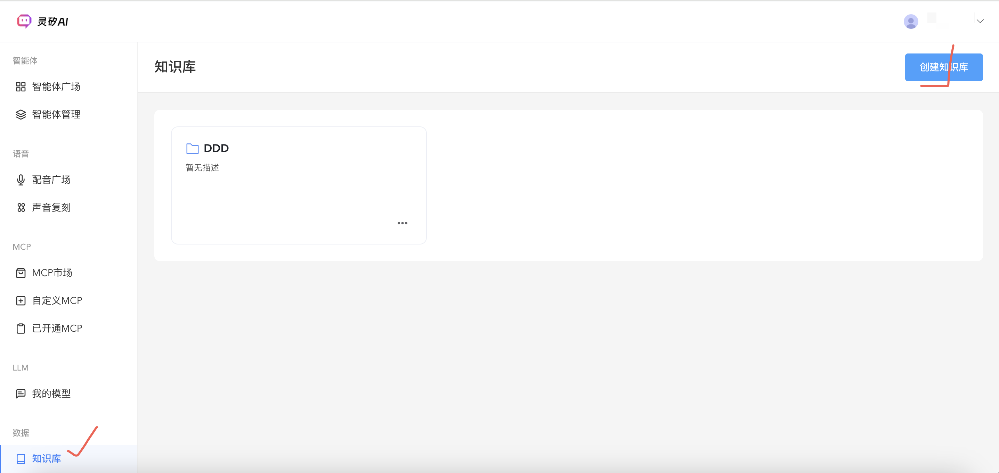

# 知识库使用最佳实践指南

## 1. 概述

知识库是灵矽AI平台的核心功能之一，为智能体提供专业领域知识支持，显著提升问答的准确性和专业性。本指南将帮助您快速掌握知识库的创建、配置和优化技巧，最大化发挥知识库的价值。

### 1.1 知识库的价值

- **专业性提升**：注入领域专业知识，让智能体具备专家级问答能力
- **准确性保障**：基于真实文档内容回答，避免幻觉和错误信息
- **个性化定制**：针对特定业务场景定制知识内容
- **持续优化**：支持知识内容的动态更新和迭代

### 1.2 适用场景

| 应用场景 | 典型用例 | 价值体现 |
|---------|---------|----------|
| **客户服务** | 产品说明书、FAQ文档、服务流程 | 7x24小时专业客服，降低人工成本 |
| **技术支持** | 技术文档、故障排除手册、API文档 | 快速定位问题，提供准确解决方案 |
| **企业培训** | 员工手册、培训材料、制度文件 | 个性化学习助手，提升培训效率 |
| **法律咨询** | 法律条文、案例分析、合规指南 | 专业法律问答，降低咨询门槛 |

## 2. 快速开始

### 2.1 创建您的第一个知识库

**API使用示例**：

```
curl -X POST "https://api.example.com/v1/datasets" \
  -H "Content-Type: application/json" \
  -H "Authorization: Bearer YOUR_API_TOKEN" \
  -d '{
    "name": "产品知识库",
    "desc": "包含产品功能介绍、使用指南和常见问题解答",
    "retrieval_model": {
      "top_k": 5,
      "score_threshold": 0.5
    }
  }'
```

**参数配置建议**：
- `top_k`: 建议设置为3-5，平衡相关性和响应速度
- `score_threshold`: 建议设置为0.4-0.6，过低会引入噪音，过高会遗漏相关内容

**控制台页面示例**：


### 2.2 上传文档的最佳实践

#### 2.2.1 支持的文档格式

| 文档类型 | 推荐场景 | 注意事项 |
|---------|---------|----------|
| **PDF** | 正式文档、产品说明书、技术手册 | 确保文字可选择，避免纯图片PDF |
| **Word** | 内部文档、流程说明、培训材料 | 保持良好的章节结构 |
| **Markdown** | 技术文档、API文档、知识笔记 | 利用标题层级优化分块效果 |
| **纯文本** | 简单的FAQ、配置文件、日志 | 使用空行分隔不同主题 |

#### 2.2.2 文档上传示例

**API使用示例**：

```
curl -X POST "https://api.example.com/v1/datasets/{dataset_id}/documents" \
  -H "Content-Type: multipart/form-data" \
  -H "Authorization: Bearer YOUR_API_TOKEN" \
  -d '{
    "name": "产品使用指南v2.0",
    "url": "https://your-domain.com/docs/product-guide.pdf",
    "process_rule": {
      "mode": "automatic",
      "rules": {
        "segmentation": {
          "separator": "\n\n",
          "max_tokens": 1024
        }
      }
    }
  }'
```

**分块参数优化建议**：
- `separator`: 使用`\n\n`（双换行）保持语义完整性，或者\n 使用单行，片段切的更细致
- `max_tokens`: 1024是平衡信息完整性和检索精度的理想值

**控制台页面示例**：


## 3. 文档优化策略

### 3.1 文档结构优化

#### 良好的文档结构示例

```
# 产品功能介绍

## 核心功能

### 1. 智能问答
智能问答功能基于大语言模型技术，能够理解用户的自然语言输入，提供准确的回答。

主要特点：
- 支持多轮对话
- 上下文理解能力强
- 支持多种语言

### 2. 知识管理
...

## 使用指南

### 快速开始
1. 注册账号
2. 创建项目
3. 配置参数
...
```

#### 避免的文档结构

```
# 混乱的文档结构

产品功能很多，包括智能问答，知识管理，还有其他功能。智能问答支持多轮对话，知识管理可以上传文档。使用方法是先注册再创建项目。常见问题有登录失败、上传失败等...
```

### 3.2 内容质量优化

#### 高质量内容特征

1. **信息完整性**
   - 每个主题都有完整的描述
   - 包含必要的背景信息和上下文
   - 提供具体的操作步骤和示例

2. **逻辑清晰性**
   - 使用标题和子标题构建层次结构(仅限word格式)
   - 相关信息集中在同一段落或章节

3. **语言准确性**
   - 使用准确的专业术语
   - 避免歧义和模糊表达
   - 保持术语的一致性

### 3.3 文档维护策略

#### 定期更新计划

```
graph TD
    A[内容审查] --> B{是否需要更新?}
    B -->|是| C[更新文档]
    B -->|否| D[保持现状]
    C --> E[重新上传]
    E --> F[测试检索效果]
    F --> G[优化调整]
    G --> A
    D --> H[定期检查]
    H --> A
```

## 4. 检索优化技巧

### 4.1 参数调优策略

#### Top-K参数优化

| 场景类型 | 推荐Top-K | 理由 |
|---------|-----------|------|
| **精确问答** | 3-5 | 确保高质量答案，避免信息冗余 |
| **探索性查询** | 5-10 | 提供更多相关信息供用户参考 |
| **实时问答** | 3 | 平衡准确性和响应速度 |

#### Score Threshold调优

```
# 不同阈值的效果对比
thresholds = {
    0.3: "召回率高，但可能包含不相关内容",
    0.5: "平衡准确性和召回率的理想值",
    0.8: "极高准确性，但可能遗漏相关内容"
}
```

### 4.2 检索测试示例

::: warning 注意事项
灵矽AI目前提供语义检索，不支持模糊查询、关键词匹配，以提高检索实时性。
:::

**API使用示例**：

```
# 测试检索效果
curl -X POST "https://api.example.com/v1/datasets/{dataset_id}/retrieve" \
  -H "Content-Type: application/json" \
  -H "Authorization: Bearer YOUR_API_TOKEN" \
  -d '{
    "query": "如何设置智能体的知识库？",
    "retrieval_model": {
      "top_k": 3,
      "score_threshold": 0.5
    }
  }'
```

**控制台页面示例**：


### 4.3 结果质量评估

#### 评估指标

1. **相关性评分**: 检索结果与查询的匹配度
2. **完整性**: 答案是否包含完整信息
3. **准确性**: 信息是否正确无误
4. **时效性**: 信息是否为最新版本

#### 优化建议

```
{
  "低分结果优化": {
    "问题": "检索分数普遍偏低",
    "可能原因": ["文档质量差", "分块过大", "查询表达不准确"],
    "解决方案": ["优化文档内容", "调整分块参数", "改进查询语句"]
  },
  "结果不相关优化": {
    "问题": "检索结果与查询不匹配",
    "可能原因": ["阈值设置过低", "文档内容不够全面"],
    "解决方案": ["提高score_threshold", "补充相关文档"]
  }
}
```

## 5. 智能体集成最佳实践

### 5.1 集成流程

**API使用示例**
1. 获取知识库ID
   
```
# 将知识库与智能体关联
curl -X GET "https://xrobo.qiniu.com/v1/datasets" \
  -H "Content-Type: application/json" \
  -H "Authorization: Bearer YOUR_API_TOKEN" 
```

```json
{
    "code": 0,
    "reqid": "YeYAAABhWoW_FWgY",
    "data": {
        "datasets": [
            {
                "id": "46dfd0cfe3624970b534b25836a691ce",
                "name": "DDD",
                "desc": "",
                "retrieval_model": {
                    "top_k": 3,
                    "score_threshold": 0.5
                },
                "created_at": "2025-09-23 13:52:19",
                "updated_at": "2025-09-23 13:52:19"
            }
        ]
    }
}
```

2. 选择需要关联的知识库id更新智能体

```
# 将知识库与智能体关联  
curl -X PUT "https://xrobo.qiniu.com/xiaozhi/agent/$agent_id" \
  -H "Content-Type: application/json" \
  -H "Authorization: Bearer YOUR_API_TOKEN" \
  -d '{
    "agentCode": "AGT_1757647593460",
    "agentName": "星际游子", 
    "asrModelId": "ASR_DoubaoASR",
    "chatHistoryConf": 1,
    "conversationLanguage": "en",
    "datasetIds": ["46dfd0cfe3624970b534b25836a691ce"],
    "llmModelId": "LLM_AliLLM",
    "memModelId": "Memory_mem_local_short"
  }'
```

::: tip 参数说明
- `datasetIds`: 知识库ID数组，支持绑定多个知识库
- 其他参数为智能体的基础配置参数
:::

**控制台页面使用示例**

### 5.1 知识库与智能体绑定

```
# 将知识库与智能体关联
curl -X POST "https://api.example.com/v1/agents/{agent_id}/datasets" \
  -H "Content-Type: application/json" \
  -H "Authorization: Bearer YOUR_API_TOKEN" \
  -d '{
    "dataset_id": "your_dataset_id",
    "priority": 1
  }'
```

**控制台页面示例**
)

### 5.2 多知识库策略

#### 按领域分类

```
graph TB
    Agent[智能体] --> KB1[产品知识库]
    Agent --> KB2[技术文档库]
    Agent --> KB3[FAQ知识库]
    
    KB1 --> D1[产品介绍]
    KB1 --> D2[功能说明]
    
    KB2 --> D3[API文档]
    KB2 --> D4[开发指南]
    
    KB3 --> D5[常见问题]
    KB3 --> D6[故障排除]
```

#### 优先级设置策略

| 知识库类型 | 优先级 | 使用场景 |
|-----------|--------|----------|
| **核心产品库** | 1 | 产品相关问题优先检索 |
| **技术文档库** | 2 | 技术问题的专业支持 |
| **FAQ库** | 3 | 通用问题的快速解答 |
| **补充资料库** | 4 | 背景信息和延伸阅读 |

## 6. 性能优化与监控

### 6.1 性能监控指标

#### 关键指标定义

```
{
  "检索性能": {
    "平均响应时间": "< 200ms",
    "检索成功率": "> 95%",
    "相关性评分": "> 0.7"
  },
  "使用统计": {
    "日均查询量": "统计趋势",
    "热门查询": "优化重点",
    "零结果查询": "改进方向"
  }
}
```

### 6.2 容量规划

#### 文档数量建议

| 业务规模 | 文档数量 | 单文档大小 | 总容量预估 |
|---------|---------|------------|------------|
| **小型项目** | 10-50篇 | 1-5MB | 50MB以内 |
| **中型项目** | 50-200篇 | 1-10MB | 200MB-2GB |
| **大型项目** | 200-1000篇 | 5-20MB | 2GB-20GB |

### 6.3 成本优化建议

1. **存储成本优化**
   - 定期清理过期文档
   - 压缩大文件
   - 避免重复内容

2. **检索成本优化**
   - 合理设置top_k参数
   - 优化查询频率
   - 使用缓存机制

## 7. 常见问题与解决方案

### 7.1 文档处理问题

#### 问题1：PDF文档无法正确解析

**症状**：文档上传成功，但检索结果为空或乱码

**解决方案**：
```
# 检查文档状态
curl -X GET "https://api.example.com/v1/datasets/{dataset_id}/documents/{document_id}" \
  -H "Authorization: Bearer YOUR_API_TOKEN"

# 如果状态为failed，重新上传可选择的文字版PDF
```

#### 问题2：文档分块效果不理想

**症状**：检索结果信息不完整或上下文断裂

**解决方案**：
```
// 调整分块参数
{
  "process_rule": {
    "mode": "automatic",
    "rules": {
      "segmentation": {
        "separator": "\n\n",
        "max_tokens": 512  // 减小分块大小
      }
    }
  }
}
```

### 7.2 检索效果问题

#### 问题3：检索结果不准确

**诊断步骤**：
1. 检查查询语句是否准确
2. 验证文档内容是否包含相关信息
3. 调整score_threshold参数
4. 增加top_k获取更多候选结果

**优化示例**：
```
# 原始查询
curl -d '{"query": "登录", "retrieval_model": {"top_k": 3, "score_threshold": 0.8}}'

# 优化后查询
curl -d '{"query": "用户登录流程和步骤", "retrieval_model": {"top_k": 5, "score_threshold": 0.6}}'
```

### 7.3 集成问题

#### 问题4：智能体无法访问知识库

**检查清单**：
- [ ] 知识库ID是否正确
- [ ] 智能体是否已绑定知识库
- [ ] 文档是否处理完成

## 8. 总结与建议

### 8.1 最佳实践清单

- [ ] **文档质量**：确保文档结构清晰、内容准确、格式规范
- [ ] **参数调优**：根据业务场景合理设置top_k和score_threshold
- [ ] **定期维护**：建立文档更新机制，保持知识的时效性
- [ ] **效果监控**：定期评估检索质量，持续优化改进
- [ ] **用户反馈**：收集使用反馈，不断完善知识内容

### 8.2 进阶学习资源

- [知识库API文档](../api/knowledge.md) - 完整的API接口说明

---

**技术支持**：如果您在使用过程中遇到问题，请参考API文档或联系技术支持团队。我们将为您提供专业的指导和解决方案.