# 灵矽平台 + LinxClaw：打造具备行动力的全能AI助理

## 概述

[灵矽平台](https://xrobo.qiniu.com/#) 通过深度集成 **LinxClaw** ，实现了 AI 能力从“语音对话”到“系统级闭环行动”的质变。LinxClaw 作为强大的 Agent 宿主，能将大模型的能力边界扩展至网页自动化、API 调度及复杂任务流执行。

---

## 第一步：部署 LinxClaw （基于七牛云 LAS）

推荐使用七牛云全栈应用服务器（[LAS](https://developer.qiniu.com/las)）进行部署，其 Serverless 架构相比传统硬件部署不仅成本极低（约 1/500），且支持镜像一键直达。

### 专属镜像一键部署LinxClaw 

1. 创建 LAS 实例
   登录[七牛云控制台](https://portal.qiniu.com/las)，进入云基础资源 - 全栈应用服务器 LAS 页面，点击「实例」-「创建服务器」；
   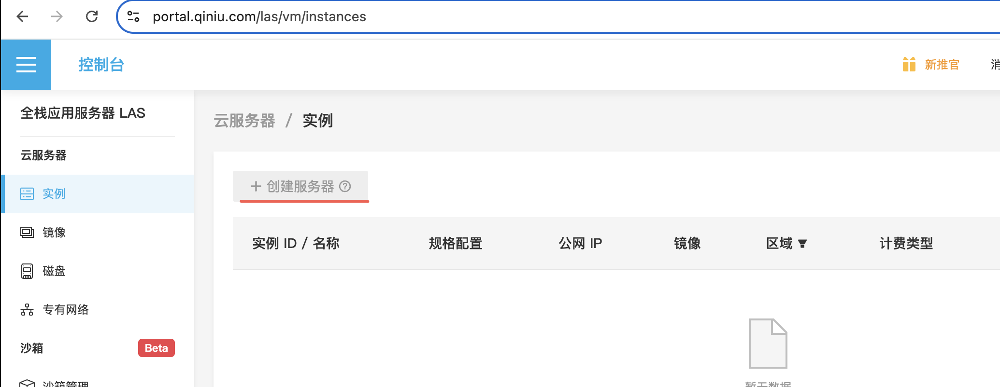  

2. 实例配置选择，选择 LinxClaw  专属镜像
   
   - 地域：按需选择（中国、亚太等多区域已部署，推荐就近选择降低延迟）；
   - 实例规格：个人测试推荐轻量型 T1（ecs.t1.c1m2，1 核 2GiB），企业使用可选择计算型 C1 系列（ecs.c1.c2m4，2 核 4GiB）；
   - 镜像：必须选择社区镜像 LinxClaw-v0.1.4，操作系统为 Ubuntu 24.04LTS，已预装 LinxClaw 核心环境；
   - 填写并确认实例密码（需牢记，后续 SSH 登录使用），点击「立即购买并创建」，等待 1-2 分钟，实例即可运行。
   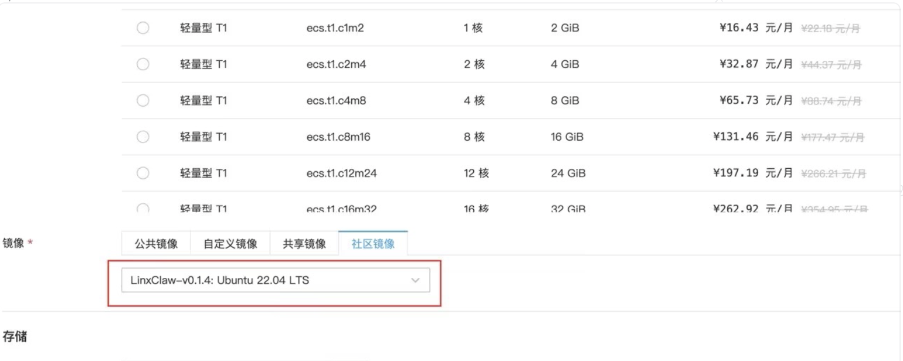  

3. 远程连接 LAS 实例，初始化 LinxClaw 环境
   
   **公网Ipv4**就是我们要的的:<LAS实例IP>
   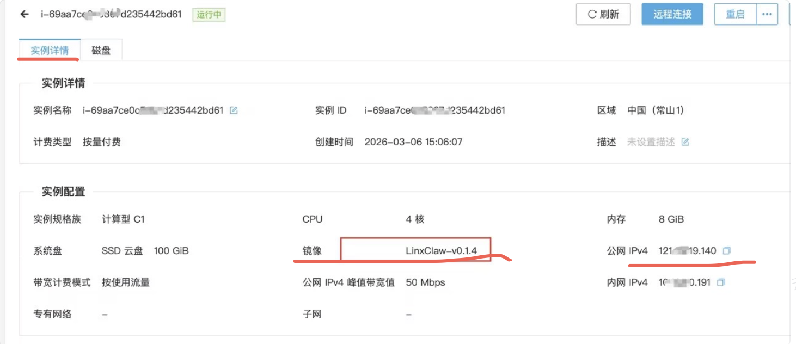  

4. 接入七牛云大模型，注入 AI 能力
   LinxClaw 的核心能力依赖大模型支持，需配置[七牛云的 MaaS API Key](https://portal.qiniu.com/ai-inference/model)，实现与 DeepSeek、MiniMax 等模型的无缝对接.

   1. 获取Maas的API Key
   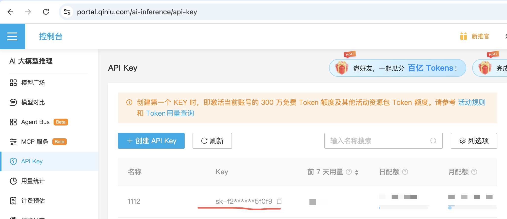  

   2. LinxClaw 的控制台配置Maas的API Key 登陆
   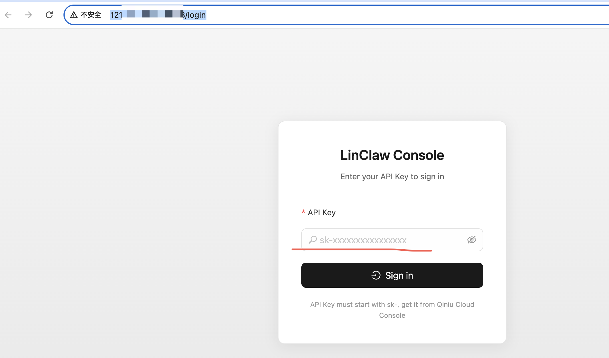  

5. 部署后，启动服务LinxClaw

   | 项目 | 说明 |
   |------|------|
   | IP 地址 | LAS 实际实例 IP |
   | 端口 | 8088 |
   | 控制台地址 | `http://<LAS实例IP>:8088/chat` |

   浏览器访问控制台:

   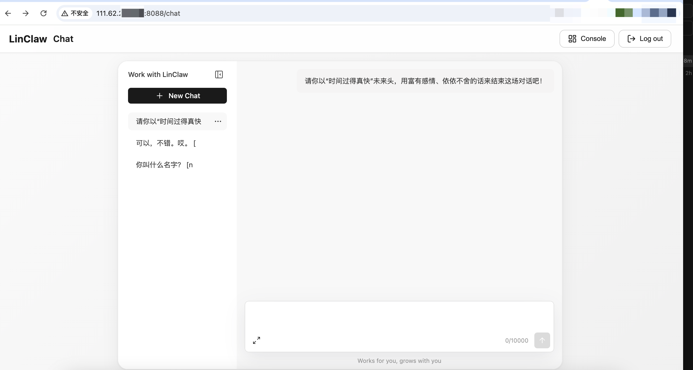  

---

## 第二步：接入灵矽平台

### 工作原理

将部署好的 LinxClaw 实例视为一个标准的大模型接口（LLM Endpoint），直接通过 OpenAI 兼容 API 调用。

### LinxClaw API 信息

| 项目 | 值 |
|------|-----|
| 基础地址 | `http://<LAS实例IP>:8088` |
| OpenAI 端点 | `http://<LAS实例IP>:8088/v1/chat/completions` |
| 控制台 | `http://<LAS实例IP>:8088/chat` |

### 配置流程
 
#### 步骤一、添加自定义模型

在[灵矽平台](https://xrobo.qiniu.com/#)  的[我的模型](https://xrobo.qiniu.com/#/llm-edit)中，添加自定义模型。
   
   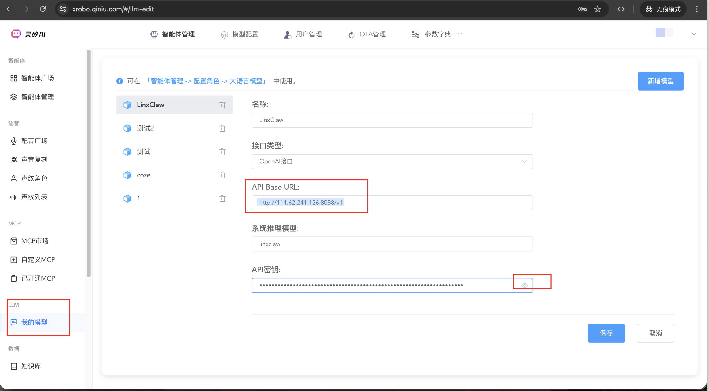
   
   图中所需的参数从以下途经获得：
   1.1. **确定 API 地址**：
   - http://<LAS实例IP>:8088

   1.2. **模型选择**：
   - 可以在 LinxClaw 控制台中配置,
     **登陆linxclaw 控制台**
     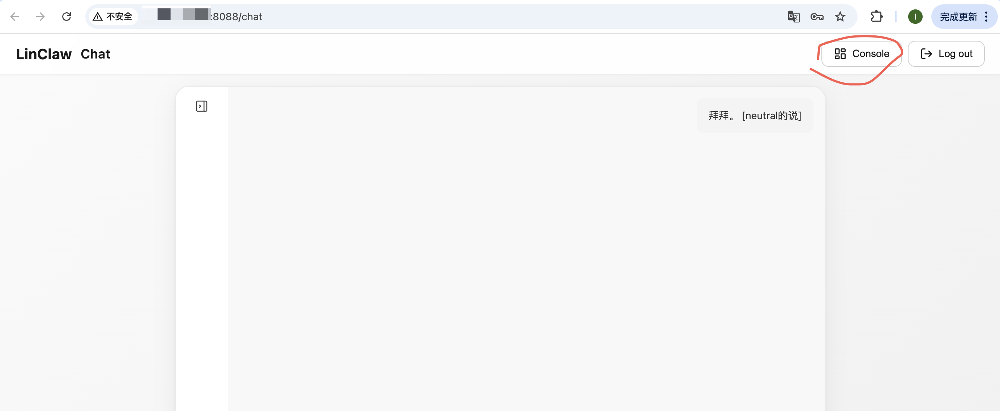  

     **点击models**
     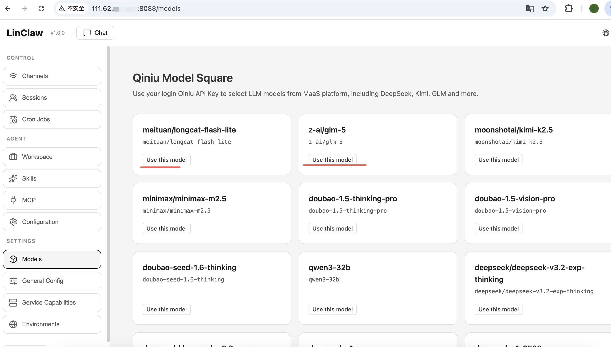

     **选择模型**
     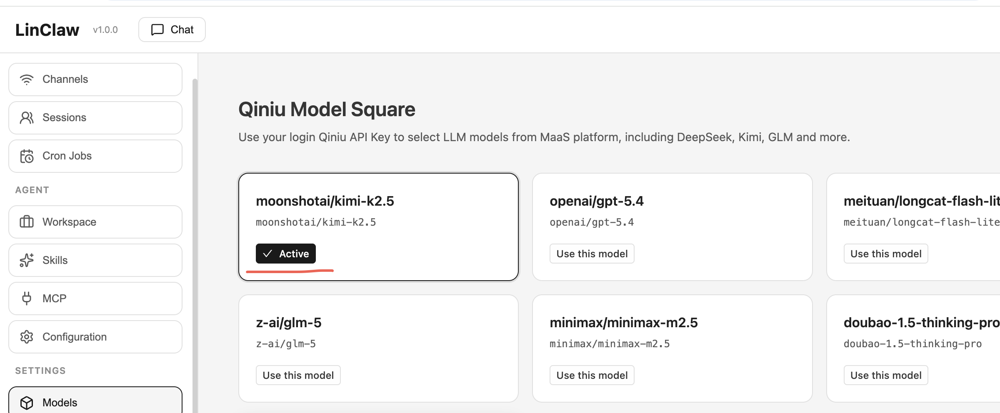  

   1.3 **获取apikey**
      同样在LinxClaw 控制台中配置，如下
     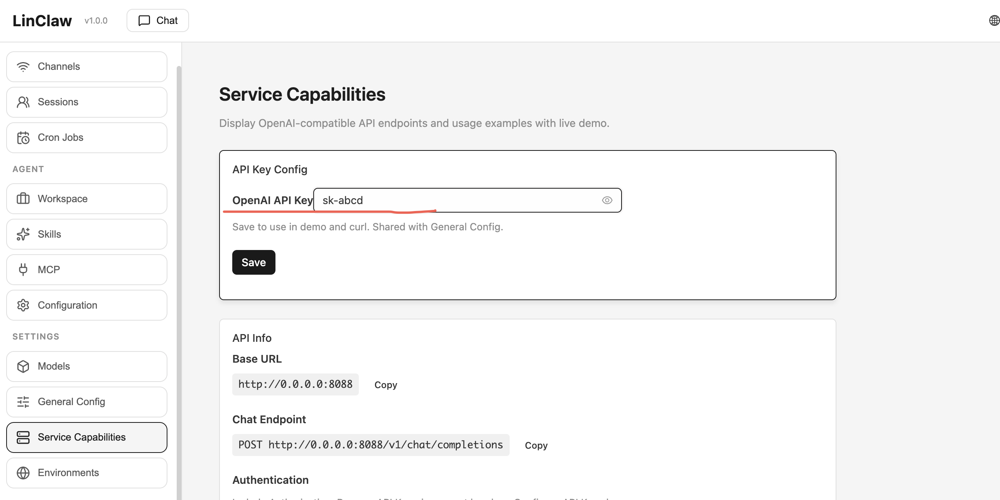  

#### 步骤二、对话中选择Linxclaw

在[灵矽平台](https://xrobo.qiniu.com/#)智能体中选择模型，验证对话效果 
   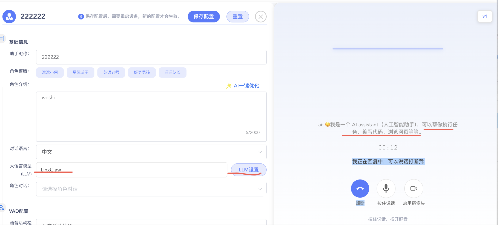  

---

## 总结
根据您的实际需求选择合适的接入方式，即可充分发挥 AI 的潜力！
