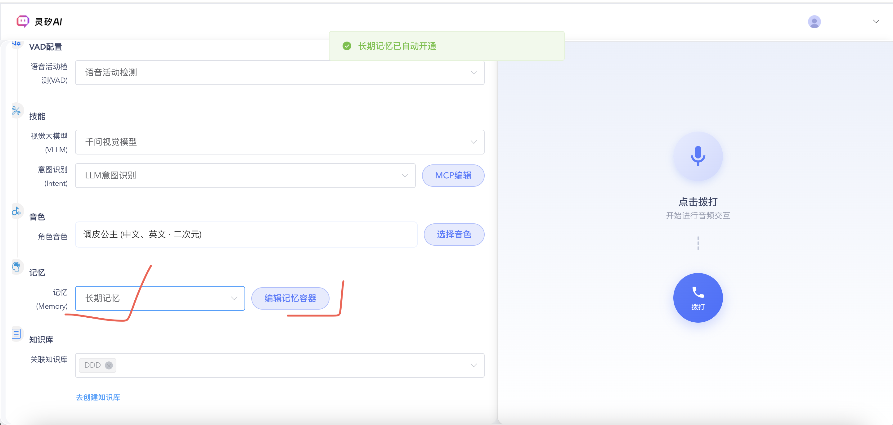
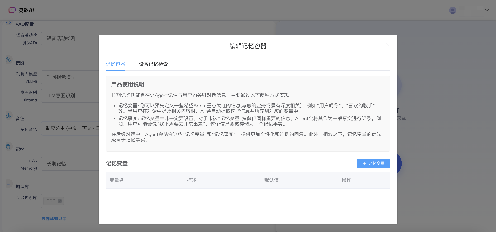

# 长期记忆使用最佳实践指南

## 1. 概述

长期记忆是灵矽AI平台的核心功能之一，为智能体提供跨会话的持久化记忆能力，显著提升对话的个性化、连贯性和一致性。本指南将帮助您快速掌握长期记忆的创建、配置和优化技巧，让您的智能体真正"记住"用户。

### 1.1 长期记忆的价值

- **个性化体验**：记住用户偏好和历史信息，提供个性化服务
- **连贯性对话**：跨会话保持对话的连续性和上下文理解
- **智能推理**：基于历史交互自动推理和更新用户画像
- **情感连接**：通过记忆建立与用户的情感纽带，提升用户体验

### 1.2 适用场景

| 应用场景 | 典型用例 | 价值体现 |
|---------|---------|----------|
| **个人助手** | 日程管理、偏好记录、习惯追踪 | 贴心的个性化服务，如私人管家 |
| **客户服务** | 客户画像、服务历史、问题追踪 | 提供连贯的服务体验，避免重复询问 |
| **教育培训** | 学习进度、知识点掌握、个性化推荐 | 个性化学习路径，提升学习效果 |
| **智能家居** | 家庭成员识别、使用习惯、环境偏好 | 智能化的家居体验，自动适应需求 |

## 2. 快速开始

### 2.1 创建您的第一个记忆容器

**API使用示例**：

```bash
curl -X POST "https://api.example.com/v1/memories" \
  -H "Content-Type: application/json" \
  -H "Authorization: Bearer YOUR_API_TOKEN" \
  -d '{
    "agentId": "AGT_1750667902769",
    "enabled": true,
    "memoryPrompt": "请从对话中提取用户的个人信息、偏好和重要事实。"
  }'
```

**配置参数说明**：
- `agentId`: 要关联的智能体ID，一对一绑定
- `enabled`: 是否启用记忆功能，建议设为true
- `memoryPrompt`: 自定义提取提示词，指导AI如何提取记忆

**控制台页面示例**：


### 2.2 设计记忆变量的最佳实践

#### 2.2.1 推荐的记忆变量类型

| 焦点类型 | 推荐场景 | 示例内容 |
|---------|---------|----------|
| **基本信息** | 用户身份识别、基础档案 | 姓名、年龄、职业、居住地 |
| **偏好设置** | 个性化推荐、服务定制 | 饮食偏好、兴趣爱好、消费习惯 |
| **行为模式** | 智能预测、主动服务 | 作息时间、使用习惯、交互方式 |
| **情感状态** | 情感化交互、关怀服务 | 情绪倾向、压力状态、关注事项 |

#### 2.2.2 创建记忆变量示例

**API使用示例**：

```bash
curl -X POST "https://api.example.com/v1/memories/mem_a1b2c3d4e5f6789/attentions" \
  -H "Content-Type: application/json" \
  -H "Authorization: Bearer YOUR_API_TOKEN" \
  -d '{
    "name": "用户饮食偏好",
    "description": "用户喜欢和不喜欢的食物类型，包括口味偏好、过敏信息、饮食习惯等",
    "defaultValue": "暂无记录"
  }'
```

::: tip 设计建议
- **名称要具体**：使用"用户饮食偏好"而非"偏好"
- **描述要详细**：帮助AI理解如何提取和归纳信息
- **数量要适中**：建议每个智能体的记忆焦点控制在10-20个
:::

**控制台页面示例**：


## 3. 记忆变量设计策略

#### 良好的变量设计示例

```json
{
  "基础信息类": {
    "用户姓名": "用户的真实姓名或昵称",
    "用户年龄": "用户的年龄范围或具体年龄",
    "职业信息": "用户的工作领域和具体职位"
  },
  "偏好设置类": {
    "饮食偏好": "喜欢的菜系、口味、忌口食物",
    "兴趣爱好": "运动、娱乐、学习方面的兴趣",
    "购物习惯": "品牌偏好、价格敏感度、购买决策因素"
  },
  "行为模式类": {
    "作息规律": "起床、就餐、休息时间规律",
    "沟通风格": "喜欢的交流方式和语言风格",
    "学习方式": "偏好的信息接收和处理方式"
  }
}
```

#### 避免的变量设计

```json
{
  "用户信息": "包含所有用户相关信息的大杂烩",
  "偏好": "笼统的偏好描述，范围过于宽泛",
  "其他": "无法明确分类的杂项信息"
}
```


## 4. 记忆召回优化技巧

#### 召回数量配置

| 应用场景 | 记忆变量限制 | 记忆片段限制 | 理由 |
|---------|-------------|-------------|------|
| **快速响应** | 5-10个 | 3-5个 | 保证响应速度，避免信息过载 |
| **深度对话** | 15-20个 | 8-10个 | 提供丰富上下文，支持复杂交互 |
| **个性化推荐** | 10-15个 | 5-8个 | 平衡个性化程度和推理效率 |


## 5. 智能体集成最佳实践


**记忆功能启用示例**：

```bash
curl -X PUT "https://api.example.com/xiaozhi/agent/AGT_1750667902769" \
  -H "Content-Type: application/json" \
  -H "Authorization: Bearer YOUR_API_TOKEN" \
  -d '{
    "agentCode": "AGT_1750667902769",
    "agentName": "智能助手小智",
    "memModelId": "Memory_longterm",
    "systemPrompt": "你是一个能够记住用户偏好的智能助手，请根据用户的历史信息提供个性化服务。",
    "extra": {
      "memory": {
        "enabled": true,
        "autoInfer": true,
        "recallLimit": 15,
        "retentionDays": 365
      }
    }
  }'
```

## 6. 常见问题与解决方案

### 问题1 记忆提取问题

**症状**：AI提取的信息与用户实际表达不符

**解决方案**：
```bash
# 优化记忆提取提示词
curl -X PUT "https://api.example.com/v1/memories/mem_a1b2c3d4e5f6789" \
  -d '{
    "memoryPrompt": "请仔细分析对话内容，只提取用户明确表达的信息，避免过度推理。对于不确定的信息，请标注确定性程度。"
  }'
```

## 7. 总结与建议

### 7.1 最佳实践清单

- [ ] **记忆变量设计**：合理规划变量类型和数量，确保覆盖核心用户信息
- [ ] **提取质量控制**：优化提取提示词，确保记忆的准确性和相关性
- [ ] **召回参数调优**：根据应用场景调整召回数量和质量阈值

### 7.2 进阶学习资源

- [长期记忆API文档](../api/longterm_memory.md) - 完整的API接口说明
- [智能体配置指南](./agent-config.md) - 智能体与长期记忆集成
- [WebSocket协议文档](../platform/websocket.md) - 了解通信协议

---

**技术支持**：如果您在使用过程中遇到问题，请参考API文档或联系技术支持团队。我们将为您提供专业的指导和解决方案。