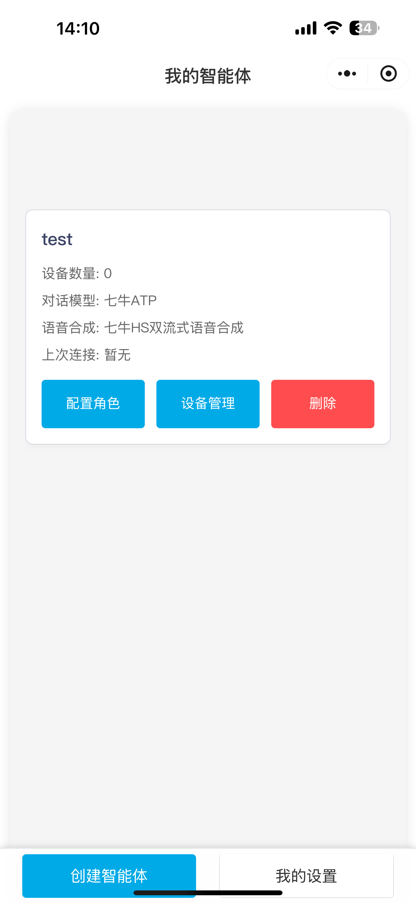
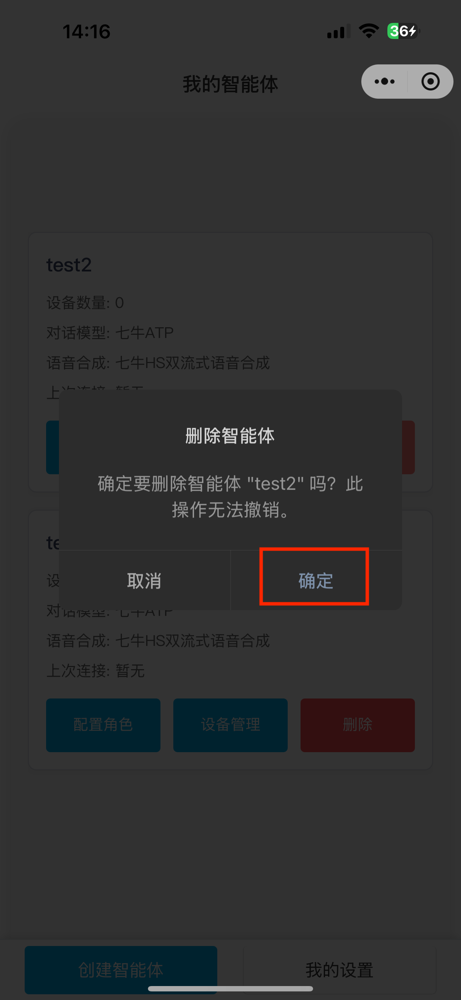

## 1. 进入小程序

扫描小程序二维码，登陆后即进入智能体管理页面。

todo: 图片错误

## 2. 添加智能体

点击左下角创建智能体，输入智能体名称后点击确定，即成功添加。

|  |  |  |
| ------------------------------------------------------------------------------- | ------------------------------------------------------------------------------- | ------------------------------------------------------------------------------- |

## 3. 删除智能体

点击想要删除的智能体卡片的删除按钮，出现删除智能体弹窗后点击确定，即删除成功。

|  |  |  |
| ------------------------------------------------------------------------------- | ------------------------------------------------------------------------------- | ------------------------------------------------------------------------------- |
