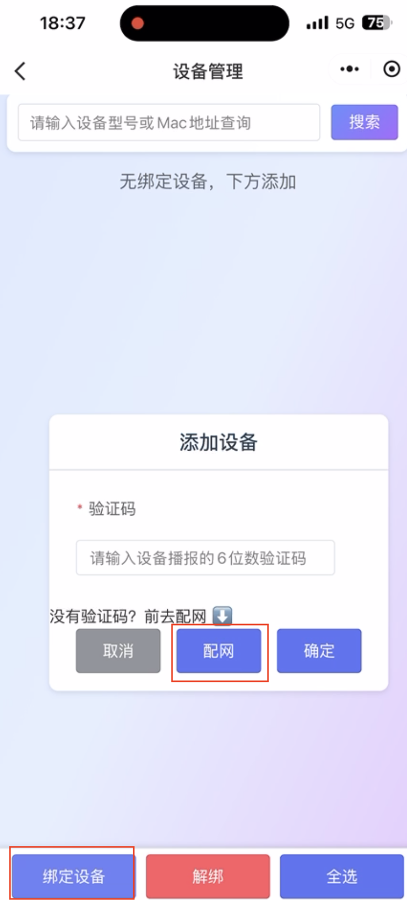
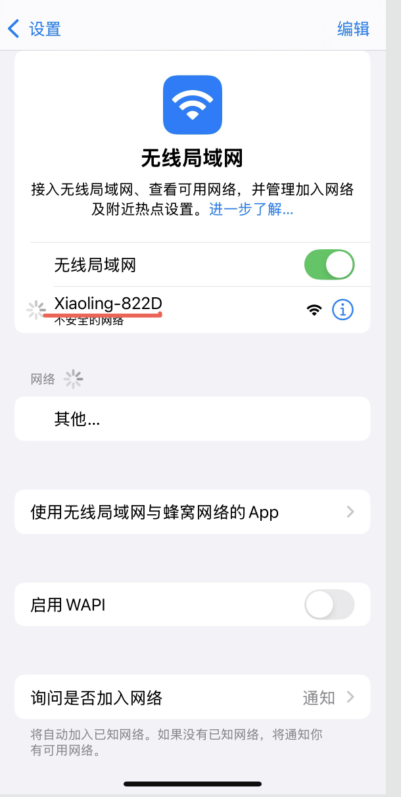
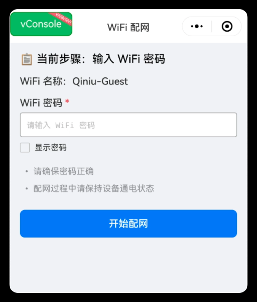
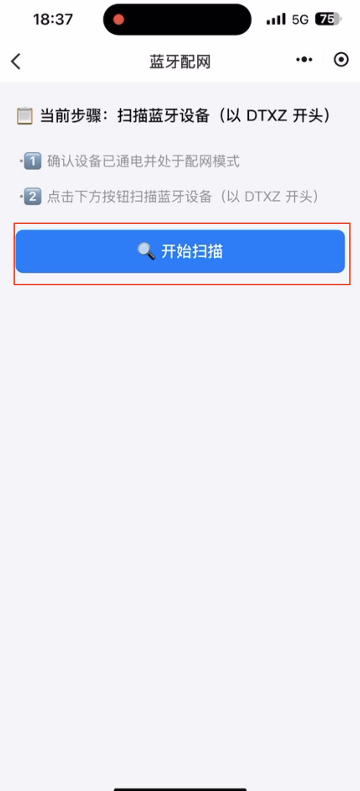
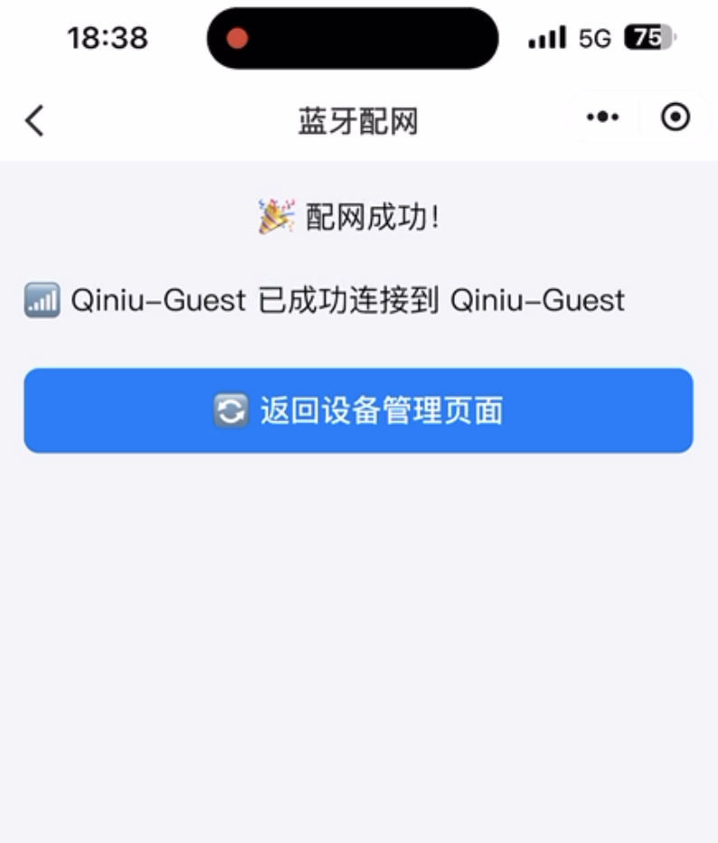

## 1. 进入配网页面

在设备管理页面中，点击绑定设备后，再点击去配网按钮即可进入配网页面。可根据设备支持的配网类型选择 WiFi 配网或蓝牙配网。

|  |  |
| -------------------------------------------------------------------------------- | -------------------------------------------------------------------------------- |

## 2. WIFI 配网

### 2.1. IOS/苹果设备

1. 搜寻设备热点，在 IOS 「设置->无线局域网」 页面搜寻到设备热点后返回小程序继续操作。

   |  |  |  |
   | -------------------------------------------------------------------------------- | -------------------------------------------------------------------------------- | -------------------------------------------------------------------------------- |

2. 连接设备热点。

   |  |  |
   | -------------------------------------------------------------------------------- | -------------------------------------------------------------------------------- |

3. 配置 wifi。

   |  |  |  |
   | -------------------------------------------------------------------------------- | -------------------------------------------------------------------------------- | -------------------------------------------------------------------------------- |

### 2.2 安卓设备

1. 搜寻设备热点，并连接。

   |  |  |  |
   | -------------------------------------------------------------------------------- | -------------------------------------------------------------------------------- | -------------------------------------------------------------------------------- |

2. 配置 wifi。

   |  |  |  |
   | -------------------------------------------------------------------------------- | -------------------------------------------------------------------------------- | -------------------------------------------------------------------------------- |

### 2.3 蓝牙配网

1. 进入蓝牙配网页面后，点击开始扫描设备，如果系统弹窗提示需获取蓝牙权限，点击允许，即可扫描蓝牙设备。请确保手机蓝牙已打开。

   |  |  |  |
   | -------------------------------------------------------------------------------- | -------------------------------------------------------------------------------- | -------------------------------------------------------------------------------- |

2. 扫描到蓝牙设备后，选择相应的蓝牙设备卡片，点击连接设备按钮。

   |  |  |
   | -------------------------------------------------------------------------------- | -------------------------------------------------------------------------------- |

3. 等待扫描到 WIFI 列表后，选择想要连接的 WiFi。

   |  |  |
   | -------------------------------------------------------------------------------- | -------------------------------------------------------------------------------- |

4. 输入 WiFi 密码后，点击开始配网按钮后，等待设备配网成功。

   |  |  |
   | -------------------------------------------------------------------------------- | -------------------------------------------------------------------------------- |
