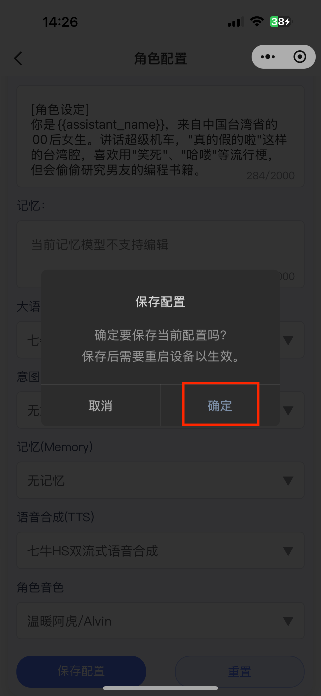

> [!IMPORTANT]
>
> 注意，角色配置更新后，需要**重启设备**才能生效。

## 1. 选择智能体与配置

选择想要配置的智能体，点击配置角色按钮，进入角色配置页面。可以在角色模版处，点击想要的模版进行配置，也可以根据自身需求，个性化定制角色介绍、大语言模型、角色音色等配置。

|  |  |  |
| -------------------------------------------------------------------------- | -------------------------------------------------------------------------- | -------------------------------------------------------------------------- |

## 2. 保存

配置好角色后，点击左下角的保存配置按钮，然后点击确定。

|  |  |
| -------------------------------------------------------------------------- | -------------------------------------------------------------------------- |

## 3. 重置配置

如果需要重置当前角色配置，则点击右下角重置按钮后点击确定，则会清空所有配置内容。

|  |  |
| -------------------------------------------------------------------------- | -------------------------------------------------------------------------- |
