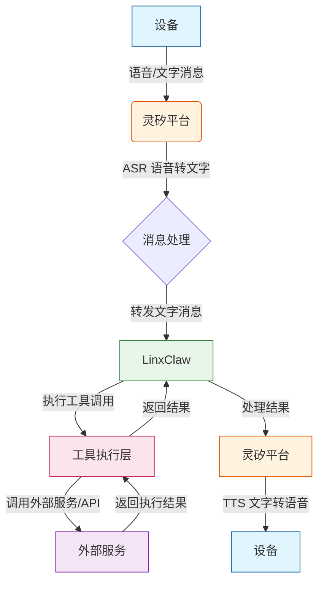
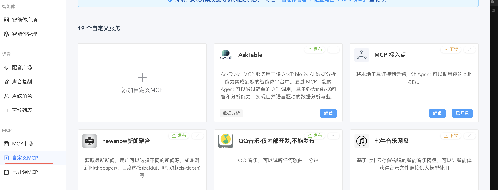

# 灵矽平台 + OpenClaw/LinxClaw 全能 AI 助理集成指南

## 概述

**灵矽平台**通过与 **OpenClaw/LinxClaw** 的深度整合，可以将 AI 的能力边界从单纯的对话扩展到具备系统级行动力的"数字员工"。

本文档将介绍两种主要的接入方式：

1. **大模型方式直接接入** - 将 LinxClaw 封装为标准的大模型接口
2. **MCP 方式接入** - 灵矽平台作为客户端，通过 MCP 协议调用 OpenClaw
---

## 准备工作：在七牛云部署 OpenClaw/LinxClaw

在连接[灵矽平台](https://xrobo.qiniu.com/#)之前，您需要先部署好 OpenClaw 或 LinxClaw 环境。推荐使用七牛云全栈应用服务器（[LAS](https://developer.qiniu.com/las)），成本仅为传统硬件部署的 1/500，支持开箱即用。

### 部署方式一：OpenClaw 资源栈编排部署

**适用场景**：喜欢开箱即用、自动化配置的用户

参考文档：[七牛云 LAS 一键部署 OpenClaw](https://developer.qiniu.com/las/13329/las-one-click-deployment-of-openclaw#rsf)

---

### 部署方式二：LinxClaw 专属镜像一键部署

**适用场景**：喜欢开箱即用、无需手动编译的用户，支持 LinxClaw 镜像安装

**部署步骤**：

OpenClaw 的安装方式见文档：[七牛云 LAS 镜像模式部署](https://developer.qiniu.com/las/13329/las-one-click-deployment-of-openclaw#ecs)
LinxClaw 的安装，将镜像名替换为 `linx-claw-v1.0`;

### 部署后，启动服务LinxClaw

| 项目 | 说明 |
|------|------|
| IP 地址 | LAS 实际实例 IP |
| 端口 | 8088 |
| 控制台地址 | `http://<LAS实例IP>:8088/chat` |

浏览器访问控制台:

  

---

## 接入灵矽平台

### 接入方式一：以大模型方式直接接入（推荐）

如果您希望将 LinxClaw 封装为一个具备特定逻辑处理能力的"模型地址"供灵矽平台调用，可以使用此方式。

#### 工作原理

将部署好的 LinxClaw 实例视为一个标准的大模型接口（LLM Endpoint），直接通过 OpenAI 兼容 API 调用。

#### LinxClaw API 信息

| 项目 | 值 |
|------|-----|
| 基础地址 | `http://YOUR_LAS_IP:8088` |
| OpenAI 端点 | `http://YOUR_LAS_IP:8088/v1/chat/completions` |
| 控制台 | `http://YOUR_LAS_IP:8088/` |

#### 配置流程

1. **确定 API 地址**：
   - LinxClaw 默认监听端口：**8088**

2. **模型选择**：
   - 可以在 LinxClaw 控制台中配置

   

3. **灵矽平台对接**：
   - 在[灵矽平台](https://xrobo.qiniu.com/#)  的[我的模型](https://xrobo.qiniu.com/#/llm-edit)中，添加自定义模型。
   - 填入 LinxClaw 的 API 端点地址
   - 配置 API Key：七牛云 MaaS API Key（获取地址：[七牛云 AI 推理 API Key](https://portal.qiniu.com/ai-inference/api-key)）

   

   - 智能体中选择模型，验证对话效果
    
  

  

#### 交互流程图

以下是 **大模型方式直接接入** 的完整交互流程：

**流程说明**：

1. **设备发送消息**：用户通过语音或文字向设备发送请求
2. **灵矽平台处理**：灵矽平台接收消息，通过 ASR 将语音转换为文字
3. **转发至 LinxClaw**：灵矽平台将文字消息通过 OpenAI 兼容 API 转发给 LinxClaw
4. **工具执行**：LinxClaw 分析意图，调用相应的工具或外部服务执行任务
5. **返回结果**：执行完成后，结果返回给灵矽平台
6. **响应设备**：灵矽平台将结果通过 TTS 转换为语音，回复给设备

---

### 接入方式二：通过 MCP 方式接入（开发中）

> **状态**：该功能正在开发中，敬请期待！

这是最推荐的交互方式。在这种模式下，**灵矽平台**作为客户端，通过 MCP（Model Context Protocol）协议调用 OpenClaw/LinxClaw，从而指挥其背后的海量 Skills。

#### 核心逻辑

灵矽平台利用双 WebSocket 桥接方案：

- 一端连接您的硬件设备（如 ESP32）
- 另一端连接 OpenClaw/LinxClaw Gateway

#### 配置流程

1. **获取 OpenClaw Gateway 信息**：
   - 在 OpenClaw 控制台获取公网可访问的 Gateway URL：`ws://<您的服务器IP>:18789`
   - 获取对应的 Token

2. **灵矽平台配置**：
   - 前往灵矽平台控制台
   - 在"MCP 市场"中新增 MCP 服务

   

3. **设备端调用**：
   - 您可以通过语音指令到灵矽（例如对它说"告诉 claw 去执行某任务"）来调度 OpenClaw

---

## 总结

通过以上两种接入方式，灵矽平台可以与 OpenClaw/LinxClaw 实现深度集成，将 AI 从单纯的对话助手升级为具备系统级行动力的"数字员工"。

- **MCP 方式**更适合需要灵活调度、多技能协作的场景
- **大模型接入方式**更适合标准化对话、插件化集成的场景

根据您的实际需求选择合适的接入方式，即可充分发挥 AI 的潜力！
