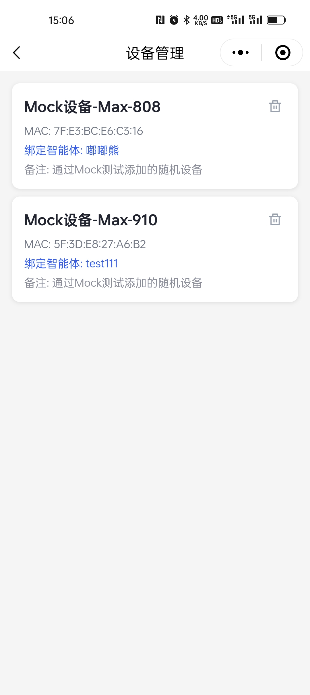

## 🚀 解决方案概述

灵矽AI官方打造的小程序+后台一体化解决方案，为企业提供完整的BtoC智能客服体系。通过深度对接灵矽AI平台，帮助企业快速构建专属的用户服务生态，实现从用户获取到服务交付的全链路数字化转型。

### 核心价值

- **🎯 真正的BtoC体验**：为企业提供面向终端用户的完整服务体系
- **👥 专属用户体系**：独立的用户管理和权限控制系统
- **📱 多端一体化**：小程序前端 + 管理后台的完整解决方案
- **💻 源代码级别交付**：提供完整源代码，支持二次开发和定制化需求
- **🔒 完全私有化部署**：数据完全掌控在企业手中，确保信息安全
- **🏢 独立品牌运营**：可部署到企业自有小程序和公众号，打造专属品牌形象
- **🛠️ 高度可定制**：开放源码架构，支持企业个性化功能扩展

## 📱 小程序功能特性

1. 用户自定义与管理智能体

用户可以自由创建智能体，配置音色与提示词。

|  |  |
| ------------------------------------------------------------ | ------------------------------------------------------------ |

2. 智能体广场

可以由管理员在后台将智能体添加到智能体广场，用户可以在小程序中查看并使用这些智能体。

|  |
| ------------------------------------------------------------ |

3. 设备管理

支持用户通过[蓝牙配网](/xrobot/platform/blufi-config)绑定设备，并将设备与智能体绑定。

|  |  |  |
| ------------------------------------------------------------ |  ------------------------------------------------------------ |------------------------------------------------------------ |

4. 音色复刻

支持用户上传一段音频，或录音一段时间，复刻音频音色。

*尚未上线，敬请期待。*

## 后台功能特性

后台前后端分离

### 后端

- 使用Mysql数据库
- 权限控制系统完善，精准控制用户权限
- 提供API接口，方便与小程序前端进行数据交互
- 配有微信插件，支持通过微信小程序注册、登录
- 通过灵矽apikey与灵矽AI平台进行交互

## 联系我们

通过灵矽AI小程序+后台解决方案，企业可以快速构建专业的智能客服体系，提升用户体验，降低运营成本，实现数字化转型升级。立即开始您的智能化之旅！
