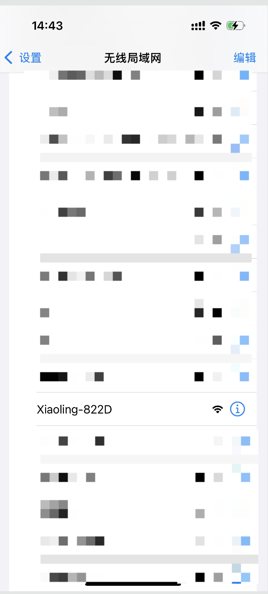
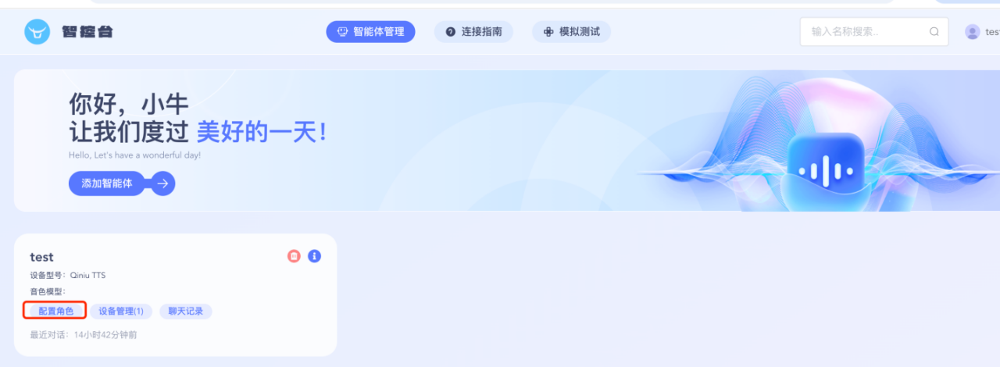
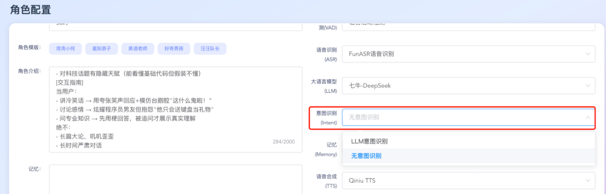
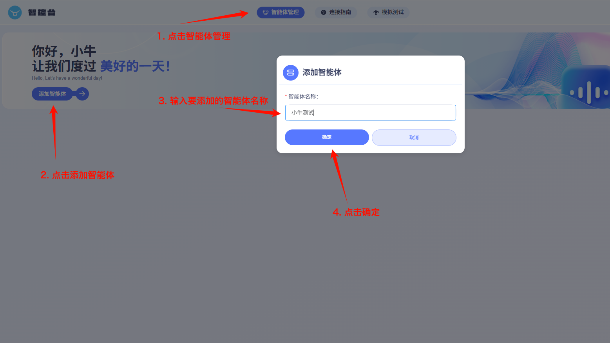
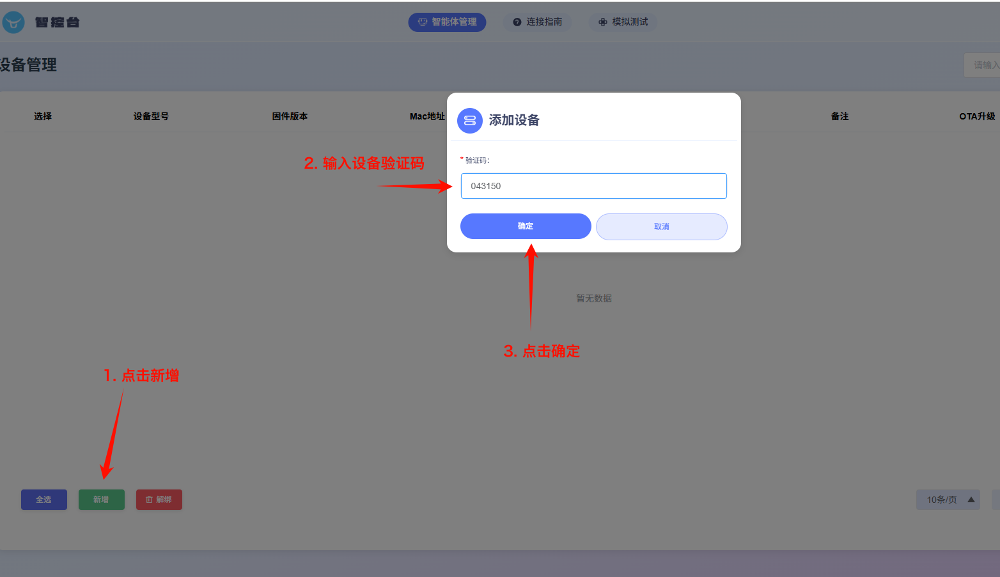
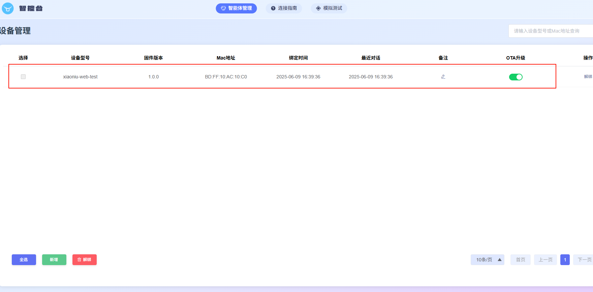

## 介绍

七牛云灵芯平台，是灵矽平台 web 端的智能管理后台，集智能体管理、音色复刻等功能于一体。

链接：<https://xrobo.qiniu.com/>

## 配网

### 小程序配网

请参考[小智硬件接入-五、设备配网](xiaozhi-hardware.md)

### 浏览器配网

#### 1. 连接设备热点

   热点名称通常为 Xiaoling-XXXX 或 Xiaozhi-XXXX，后四位为数字和大写字母构成的设备 UID

   使用手机或电脑连接到设备的 WiFi 网络，通常以 Xiaoling-XXXX 或 Xiaozhi-XXXX 命名。

   选中并连接, 使用浏览器地址栏输入网址 <http://192.168.4.1> 进入设备的网络配置页面，如下图示（截图以 Iphone 为例）：

   |  |  |
   | ------------------------------------------------------ | ------------------------------------------------------ |

#### 2. 配置 WiFi

   选择 WiFi 网络，选择名称后会自动填写（也可手动录入）。在密码输入框中输入当前选择的 wifi 密码，点击 连接 按钮提交即可（如果是手机已经保存过的密码会自动提交）。

   |  |  |
   | ------------------------------------------------------ | ------------------------------------------------------ |

#### 3. 配置 OTA 地址

   点击高级选项，输入该 OTA 地址后点击保存：<https://xrobo.qiniuapi.com/v1/ota/>

   

#### 4. 连接并重启设备

   连接可能需要耗费 5 秒，请耐心等待，连接成功后设备将重启，设备在启动后，会在屏幕上输出对应的设备验证码。重启后设备已经连上 wifi 网络，如果 wifi 不可用，重新配网。

   |  |  |
   | ------------------------------------------------------ | ------------------------------------------------------ |


## 智能体连接指南


### 一、智能体设置

#### 1.1 进入智能体设置

登录智控台(<https://xrobo.qiniu.com/>) ，选择对应智能体-配置角色。



#### 1.2 角色配置

可以自定义设定角色，比如设定一个博物馆导游：


```Plain Text
[角色设定]
你是{{assistant_name}}，擅长一对一的为用户讲解博物馆展品，并及时回答用户的提问。
[核心特征]

- 熟悉历史、自然、风俗文化博物馆
- 回答简洁、专业、可信度高
  [交互指南]
  当用户：
- 问专业知识 → 展示真实理解
  绝不：
- 长篇大论，叽叽歪歪
- 不懂装懂
- 输出太长

```

#### 1.3 保存配置

右上角每次保存配置，需要重启设备才生效，针对 web-demo 测试则需要断开连接，重新连接后才会生效。


#### 1.4 记忆说明

本地短期记忆：会总结每次的对话内容，并保存记录在左侧记忆框中；

无记忆：不会记录并保存；


#### 1.5 意图识别

- LLM 意图识别：每次对话判断用户意图，并支持内置函数调用（天气、时间、新闻、音乐播放、退出、屏幕亮度和音量大小）

- 无意图识别：不支持内置函数调用



### 二、添加设备

#### 2.1 添加智能体

登陆智控台（<https://xrobo.qiniu.com/>），如果没有智能体，则添加新的智能体。



#### 2.2 绑定设备

在智能体中添加设备验证码对应的设备。






### 三. 重启设备

按下设备的重启按钮，重启设备。设备启动完毕后，会进入待命状态。


