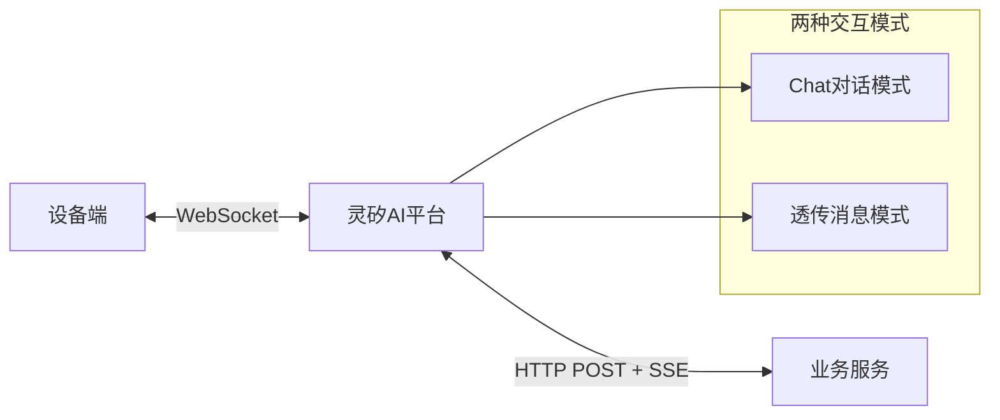
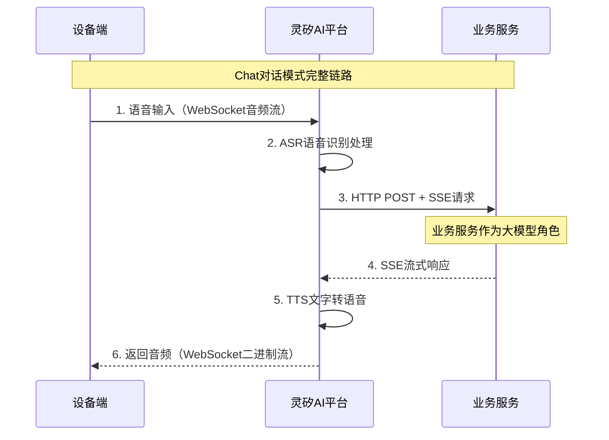
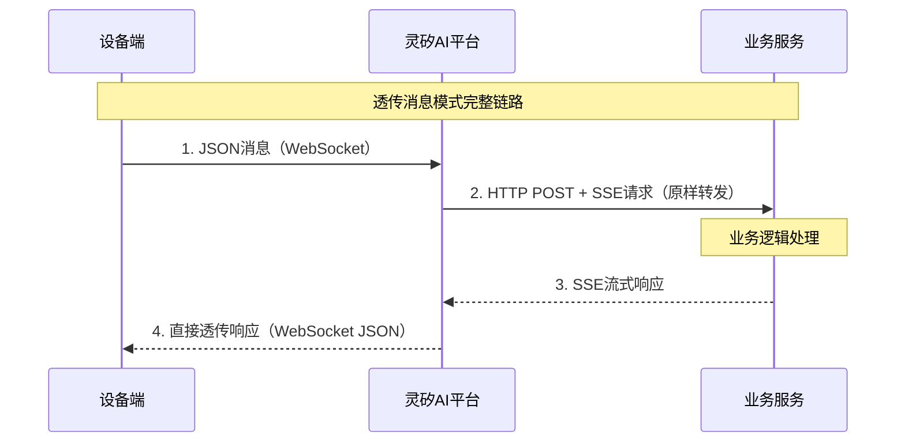

# 第三方业务系统接入指南

## 1. 概述

本文档面向业务系统开发商和集成商，提供将您的业务系统与灵矽AI平台集成的完整解决方案。

整个系统由三个核心组件构成，通过标准化的消息协议实现无缝集成：

- **设备端**：智能硬件设备（如机器狗、音箱、AI玩具等）
- **灵矽AI平台**：智能对话中枢和消息路由中心
- **业务服务**：您的核心业务逻辑服务

### 1.1 系统架构概览



### 1.2 核心组件职责

| 组件 | 主要职责 | 技术特点 | 通信协议 |
|------|---------|----------|----------|
| **设备端** | • 用户交互界面<br/>• 音频采集播放<br/>• 控制指令执行<br/>• 状态数据上报 | 硬件设备，直接面向用户 | WebSocket连接 |
| **灵矽AI平台** | • 语音识别(ASR)和合成(TTS)<br/>• 智能对话处理<br/>• 消息路由转发<br/>• 设备连接管理 | 双向消息路由中心 | WebSocket + SSE |
| **业务服务** | • 业务逻辑处理<br/>• 文字对话回复<br/>• 控制命令生成<br/>• 数据存储管理 | 两种工作模式的服务提供者 | SSE协议接入 |

### 1.3 两种业务模式对比

| 模式 | 触发方式 | 灵矽AI处理方式 | 业务服务角色 | 数据流向 |
|------|----------|---------------|-------------|----------|
| **Chat对话** | 设备端语音输入 | ASR+TTS处理 | 类似大模型的文字问答 | 语音→文字→文字→语音 |
| **透传消息** | 设备端主动上报 | 直接透传，不处理内容 | 设备控制和数据处理 | JSON→JSON→JSON→JSON |

## 2. Chat对话模式完整链路

Chat对话模式下，灵矽AI平台将您的业务服务当作一个大模型，输入文字，等待业务服务器的文字返回。

### 2.1 完整交互流程



### 2.2 设备端到灵矽AI平台

**设备端发送**：按照WebSocket协议发送语音数据

 设备端WebSocket协议详见：[WebSocket协议文档](../platform/websocket.md)

### 2.3 灵矽AI平台到业务服务

**灵矽AI平台发送**：
```bash
curl -X POST "http://your-domain.com/api/chat/stream" \
  -H "Content-Type: application/json" \
  -H "Accept: text/event-stream" \
  -H "Authorization: Bearer your_api_token" \
  -d '{
    "auth": {
      "device_id": "669C4BDA13EA"
    },
    "type": "chat",
    "details": {
      "msg": "用户说的话（经ASR处理后的文字）",
       "session_id": "session_12345",
      "timestamp": 1640995200000
    }
  }' \
  --no-buffer
```

### 2.4 业务服务响应格式

**业务服务SSE响应**：

::: warning Session ID协商机制
灵矽AI平台非常需要session_id做对话隔离，因此：
1. **灵矽AI在请求中传递session_id**：通过details.session_id字段传递
2. **业务服务必须原样返回**：在所有SSE响应中包含session_id字段
3. **用于对话上下文维护**：确保多设备并发对话的隔离性
:::

**纯文字回复示例：**
```
data: {"event": "message", "type": "chat", "session_id": "session_12345", "details": {"answer": "今天是晴天，很适合出去玩哦！", "tts_provider": "huoshan", "voice_type": "BV051_streaming", "speed_ratio": 1.0, "pitch_ratio": 1.0}}

data: {"event": "message_end", "session_id": "session_12345"}

```

**文字+动作指令示例：**
```
data: {"event": "message", "type": "chat", "session_id": "session_12345", "details": {"answer": "好的，我来摇摇尾巴！", "tts_provider": "huoshan", "voice_type": "BV051_streaming", "speed_ratio": 1.0, "pitch_ratio": 1.0}}

data: {"event": "message", "type": "command", "session_id": "session_12345", "details": {"actions": [{"action": "wag_tail", "params": {"duration": 3}}, {"action": "blink_eyes", "params": {}}]}}

data: {"event": "message_end", "session_id": "session_12345"}

```

### 2.5 灵矽AI平台到设备端

**灵矽AI平台处理规则**：
- 满足条件：`event = "message" AND type = "chat"` → 进行TTS语音合成
- 其他消息类型 → 直接透传给设备端

**返回给设备端**：
- TTS处理后的音频流（WebSocket二进制数据）
- 控制指令（WebSocket JSON消息）

## 3. 透传消息模式完整链路

透传消息模式下，灵矽AI平台对消息内容不做任何处理，直接透传。一旦透传，灵矽AI是不管里面具体内容的，直接copy转发。

### 3.1 完整交互流程



### 3.2 设备端到灵矽AI平台

**设备端发送**：Custom类型WebSocket消息
```json
{
  "session_id": "session_12345",
  "type": "custom",
  "payload":
    {
       "auth": {
      "device_id": "669C4BDA13EA"
    },
    "type": "report",
    "details": {
      "events": [
        {"event": "touch", "params": {"count": 1}},
        {"event": "feed", "params": {"count": 2}}
      ],
      "battery_level": 85,
      "volume_level": 80,
      "session_id": "session_12345",
      "timestamp": 1640995200000
    }
    }
  
}
```

### 3.3 灵矽AI平台到业务服务

**灵矽AI平台原样转发**：

**数据上报(report)示例：**
```bash
curl -X POST "http://your-domain.com/api/chat/stream" \
  -H "Content-Type: application/json" \
  -H "Accept: text/event-stream" \
  -H "Authorization: Bearer your_api_token" \
  -d '{
    "auth": {
      "device_id": "669C4BDA13EA"
    },
    "type": "report",
    "details": {
      "events": [
        {"event": "touch", "params": {"count": 1}},
        {"event": "feed", "params": {"count": 2}}
      ],
      "battery_level": 85,
      "volume_level": 80,
      "session_id": "session_12345",
      "timestamp": 1640995200000
    }
  }' \
  --no-buffer
```

**重置数据(reset)示例：**
```bash
curl -X POST "http://your-domain.com/api/chat/stream" \
  -H "Content-Type: application/json" \
  -H "Accept: text/event-stream" \
  -H "Authorization: Bearer your_api_token" \
  -d '{
    "auth": {
      "device_id": "669C4BDA13EA"
    },
    "type": "reset",
    "details": {
      "type": "count",
      "reason": "user_request",
      "session_id": "session_12345",
      "timestamp": 1640995200000
    }
  }' \
  --no-buffer
```

**获取资源(get)示例：**
```bash
curl -X POST "http://your-domain.com/api/chat/stream" \
  -H "Content-Type: application/json" \
  -H "Accept: text/event-stream" \
  -H "Authorization: Bearer your_api_token" \
  -d '{
    "auth": {
      "device_id": "669C4BDA13EA"
    },
    "type": "get",
    "details": {
      "events": [
        {"event": "getCurrentTime", "params": {}},
        {"event": "getBatteryLevel", "params": {}}
      ],
      "session_id": "session_12345",
      "timestamp": 1640995200000
    }
  }' \
  --no-buffer
```

### 3.4 业务服务响应格式

**业务服务SSE响应**：

**无响应示例（适用于report）：**
```
data: {"event": "message_end", "session_id": "session_12345"}

```

**命令响应示例（适用于reset）：**
```
data: {"event": "message", "type": "command", "session_id": "session_12345", "details": {"actions": [{"action": "reset_complete", "params": {"status": "success"}}]}}

data: {"event": "message_end", "session_id": "session_12345"}

```

**数据响应示例（适用于get）：**
```
data: {"event": "message", "type": "command", "session_id": "session_12345", "details": {"actions": [{"action": "data_response", "params": {"current_time": "2023-12-31 10:30:00", "battery_level": 85}}]}}

data: {"event": "message_end", "session_id": "session_12345"}

```

### 3.5 灵矽AI平台到设备端

**灵矽AI平台处理规则**：
- 不满足chat条件的所有消息 → 直接透传给设备端
- 不对消息内容做任何解析或处理

**返回给设备端**：原样透传业务服务的响应内容

#### 3.5.1 Custom消息透传格式

当业务服务响应后，灵矽AI平台将响应封装为WebSocket的custom消息下发给设备端：

**WebSocket Custom消息格式：**
```json
{
  "session_id": "session_12345",
  "type": "custom",
  "payload": {
     "type": "command",
     "details": {
     "actions": [
     {"action": "wag_tail", "params": {"duration": 3}}
  }
}
```

**字段说明：**

| 字段 | 类型 | 说明 |
|------|------|------|
| `session_id` | string | 会话标识符，与原始请求保持一致 |
| `type` | string | 固定为"custom"，标识自定义消息 |
| `payload.source` | string | 消息来源，固定为"business_service" |
| `payload.original_request_type` | string | 原始请求类型（report/reset/get） |
| `payload.business_response` | object | 业务服务的完整SSE响应内容 |
| `payload.timestamp` | number | 灵矽AI处理时间戳 |

#### 3.5.2 不同响应类型的透传示例

**Report类型无响应透传：**
```json
{
  "session_id": "session_12345",
  "type": "custom",
  "payload": {
    "source": "business_service",
    "original_request_type": "report",
    "business_response": {
      "event": "message_end",
      "session_id": "session_12345"
    },
    "timestamp": 1640995201000
  }
}
```

**Reset类型命令响应透传：**
```json
{
  "session_id": "session_12345",
  "type": "custom",
  "payload": {
    "source": "business_service",
    "original_request_type": "reset",
    "business_response": {
      "event": "message",
      "type": "command",
      "session_id": "session_12345",
      "details": {
        "actions": [
          {"action": "reset_complete", "params": {"status": "success"}}
        ]
      }
    },
    "timestamp": 1640995201000
  }
}
```

**Get类型数据响应透传：**
```json
{
  "session_id": "session_12345",
  "type": "custom",
  "payload": {
    "source": "business_service",
    "original_request_type": "get",
    "business_response": {
      "event": "message",
      "type": "command",
      "session_id": "session_12345",
      "details": {
        "actions": [
          {
            "action": "data_response", 
            "params": {
              "current_time": "2023-12-31 10:30:00",
              "battery_level": 85
            }
          }
        ]
      }
    },
    "timestamp": 1640995201000
  }
}
```

#### 3.5.3 设备端处理建议

设备端接收到custom消息后的处理流程：

1. **解析payload.original_request_type**：确定这是对哪种请求的响应
2. **提取payload.business_response**：获取业务服务的实际响应内容
3. **根据响应类型执行相应操作**：
   - `event="message" AND type="command"` → 解析actions并执行相应动作
   - `event="message_end"` → 结束当前请求处理
   - `event="error"` → 进行错误处理

**设备端处理示例代码参考**：
```cpp
// 伪代码示例
void handleCustomMessage(const json& message) {
    string sessionId = message["session_id"];
    json payload = message["payload"];
    string originalType = payload["original_request_type"];
    json businessResponse = payload["business_response"];
    
    if (businessResponse["event"] == "message" && 
        businessResponse["type"] == "command") {
        // 执行业务服务返回的命令
        executeActions(businessResponse["details"]["actions"]);
    } else if (businessResponse["event"] == "message_end") {
        // 处理完成，清理会话状态
        cleanupSession(sessionId);
    }
}
```

## 4. 参考文档

- [WebSocket协议文档](../platform/websocket.md) - 设备端实时通信协议规范
- [MCP协议接入指南](../mcp/software-mcp.md) - 新一代标准化接入方案
- [LLM API文档](../api/llm.md) - 自定义大模型配置
- [Agent API文档](../api/agent.md) - 智能体集成配置

---

**技术支持**：如果您在接入过程中遇到问题，请参考相关API文档或联系技术支持团队。我们将为您提供专业的集成指导和解决方案。