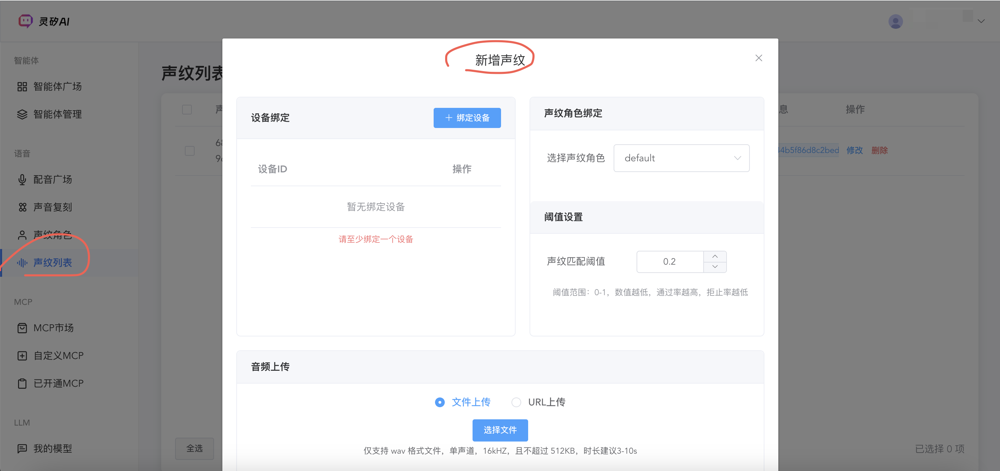
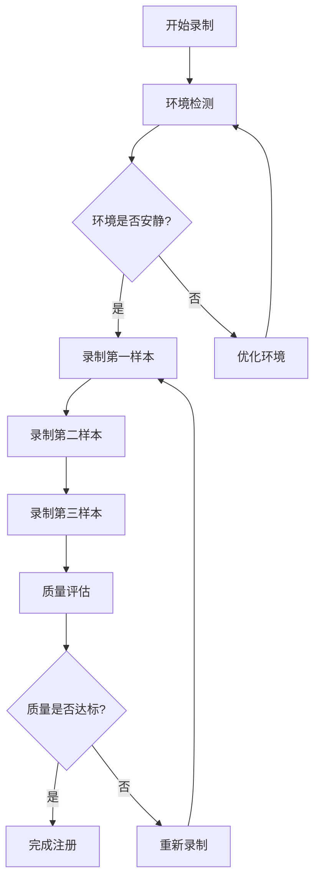

# 声纹识别使用最佳实践指南

## 1. 概述
### 1.1 声纹识别概述
声纹识别是灵矽AI平台的核心生物识别功能，基于3D-Speaker模型提供高精度的身份认证和用户识别能力。本指南将帮助您快速掌握声纹识别的录制、注册和优化技巧，最大化发挥声纹识别的准确性和稳定性。
支持声纹识别的价值：
- **个性化服务**：基于声纹识别实现个性化用户体验
- **语音对话体验**：防止人声随意打断的干扰

### 1.2 使用教程
<video controls width="100%" style="max-width: 800px; margin: 0 auto; display: block;" poster="./imgs/knowledge/v_1.png">
  <source src="https://xrobot-storage.qnaigc.com/%E5%AE%98%E6%96%B9%E6%96%87%E6%A1%A3%E7%B4%A0%E6%9D%90%28%E5%8B%BF%E5%88%A0%29/voiceprint.mov" type="video/mp4">
  您的浏览器不支持视频标签。请点击 <a href="https://xrobot-storage.qnaigc.com/%E5%AE%98%E6%96%B9%E6%96%87%E6%A1%A3%E7%B4%A0%E6%9D%90%28%E5%8B%BF%E5%88%A0%29/voiceprint.mov" target="_blank">这里</a> 观看视频。
</video>


## 2. 快速开始

### 2.1 录制您的第一个声纹

**录制环境要求**：

环境尽量安静，减少干扰源，手机、电脑、硬件设备录音时尽量靠近麦克风

**录制参数建议**：
- `采样率`: 16kHz，确保音质清晰
- `音频格式`: WAV格式，无损压缩
- `录制时长`: 5-10秒，包含足够特征信息
- `音量大小`: 适中音量，避免过大或过小


### 2.2 声纹注册的最佳实践

#### 2.2.1 音频质量要求

| 质量指标 | 推荐参数 | 注意事项 |
|---------|---------|----------|
| **采样率** | 16kHz | 平衡音质和文件大小 |
| **位深度** | 16bit | 足够的动态范围 |
| **声道数** | 单声道 | 减少文件大小，提升处理速度 |
| **信噪比** | >30dB | 确保声音清晰，背景噪音最小 |

#### 2.2.2 声纹注册示例

**API使用示例**：

```bash
# 创建声纹并绑定设备和角色
curl -X POST "https://xrobo.qiniu.com/v1/voiceprint/voices/create" \
  -H "Authorization: Bearer YOUR_API_TOKEN" \
  -H "Content-Type: application/json" \
  -d '{
    "device_id": "smart_home_001",
    "role_id": "role_dad",
    "threshold": 0.6,
    "audio_url": "https://storage.example.com/dad_voice.wav"
  }'

# 为第二个用户创建声纹
curl -X POST "https://xrobo.qiniu.com/v1/voiceprint/voices/create" \
  -H "Authorization: Bearer YOUR_API_TOKEN" \
  -H "Content-Type: application/json" \
  -d '{
    "device_id": "smart_home_001",
    "role_id": "role_mom",
    "threshold": 0.6,
    "audio_url": "https://storage.example.com/mom_voice.wav"
  }'
```

::: tip 注册建议
- **声纹数量**: 每个设备建议注册不超过4个声纹，过多会影响识别准确率
- **说话者ID**: 使用有意义的标识符，便于后续管理
:::

**控制台页面示例**：


## 3. 录音优化策略

### 3.1 录音环境优化

#### 理想录音环境设置

**环境要求**：
```json
{
  "噪音控制": {
    "背景噪音": "< 40dB",
    "回声时间": "< 0.3秒", 
    "房间类型": "相对封闭的室内空间",
    "避免干扰": "远离空调、风扇等噪音源"
  },
  "设备配置": {
    "麦克风距离": "15-30cm",
    "录音角度": "正对麦克风",
    "音量调节": "适中，避免削波失真",
    "录音设备": "使用高质量麦克风"
  }
}
```

#### 避免的录音环境

```markdown
❌ **不推荐的录音环境**
- 嘈杂的公共场所（咖啡厅、商场）
- 有强烈回声的空间（大厅、浴室）
- 设备故障或音质较差的录音设备
- 距离麦克风过远（>50cm）或过近（<10cm）
```

### 3.2 录音内容优化

#### 高质量录音特征

1. **语音内容丰富性**
   - 包含多种音素和音调变化
   - 自然流畅的语音节奏
   - 避免过度重复相同词汇

2. **发音清晰度**
   - 标准的发音，避免方言过重
   - 适中的语速，不过快也不过慢
   - 清晰的吐字，避免含糊不清

3. **情感状态稳定**
   - 保持平和的情绪状态
   - 避免过度兴奋或疲惫时录音
   - 自然的说话状态，不要刻意改变音色

### 3.3 多样本录制策略

#### 多次录制规划



## 4. 识别优化技巧

### 阈值设置策略

| 应用场景 | 推荐阈值 | 特点说明 |
|---------|---------|----------|
| **高安全要求** | 0.7-0.9 | 严格匹配，误识率低，可能漏识 |
| **平衡模式** | 0.3-0.7 | 平衡准确率和便利性，推荐使用 |
| **便利优先** | 0.1-0.3 | 宽松匹配，便利性高，需注意安全 |


## 5. 设备集成最佳实践

### 多用户家庭场景

**家庭声纹管理策略**：

```bash
# 为父亲创建声纹
curl -X POST "https://xrobo.qiniu.com/v1/voiceprint/voices/create" \
  -H "Authorization: Bearer YOUR_API_TOKEN" \
  -H "Content-Type: application/json" \
  -d '{
    "device_id": "home_assistant_001",
    "role_id": "role_father",
    "threshold": 0.7,
    "audio_url": "https://storage.example.com/father_voice.wav"
  }'

# 为母亲创建声纹
curl -X POST "https://xrobo.qiniu.com/v1/voiceprint/voices/create" \
  -H "Authorization: Bearer YOUR_API_TOKEN" \
  -H "Content-Type: application/json" \
  -d '{
    "device_id": "home_assistant_001",
    "role_id": "role_mother",
    "threshold": 0.6,
    "audio_url": "https://storage.example.com/mother_voice.wav"
  }'

# 为孩子1创建声纹
curl -X POST "https://xrobo.qiniu.com/v1/voiceprint/voices/create" \
  -H "Authorization: Bearer YOUR_API_TOKEN" \
  -H "Content-Type: application/json" \
  -d '{
    "device_id": "home_assistant_001",
    "role_id": "role_child_1",
    "threshold": 0.5,
    "audio_url": "https://storage.example.com/child1_voice.wav"
  }'

# 为孩子2创建声纹
curl -X POST "https://xrobo.qiniu.com/v1/voiceprint/voices/create" \
  -H "Authorization: Bearer YOUR_API_TOKEN" \
  -H "Content-Type: application/json" \
  -d '{
    "device_id": "home_assistant_001",
    "role_id": "role_child_2",
    "threshold": 0.5,
    "audio_url": "https://storage.example.com/child2_voice.wav"
  }'
```

## 6. 常见问题与解决方案

### 6.1 录音质量问题

#### 问题1：背景噪音过大

**症状**：识别准确率低，经常识别失败

**解决方案**：
```bash
# 优化录音环境
环境要求：
- 选择安静的房间录制
- 关闭风扇、空调等噪音源
- 使用降噪麦克风
- 调整录音距离到15-30cm
```

#### 问题2：声音过小或过大

**症状**：提取的特征向量质量差

**诊断步骤**：
1. 检查麦克风灵敏度设置
2. 调整录音音量到适中水平
3. 重新录制声纹样本

### 6.2 识别准确率问题

#### 问题3：同一用户识别结果不一致

**优化策略**：
```json
{
  "声纹质量优化": {
    "增加录制样本": "录制3-5个不同场景的声纹",
    "优化录制内容": "使用包含丰富音素的文本",
    "环境一致性": "在相似环境中录制和识别"
  },
  "参数调优": {
    "降低阈值": "从0.2调整到0.1",
    "增加特征维度": "确保使用完整的192维特征",
    "时间窗口": "适当延长录音时长到8-10秒"
  }
}
```

#### 问题4：跨设备识别效果差

**解决方案**：
- 在目标设备上重新录制声纹
- 校准不同设备的音频参数
- 使用设备无关的特征提取方法
- 建立设备特定的声纹模型


## 7. 儿童声纹特殊处理

### 儿童声纹挑战

| 挑战类型 | 影响因素 | 解决策略 |
|---------|---------|----------|
| **声音变化** | 生长发育导致声音快速变化 | 缩短更新周期到3个月 |
| **录音质量** | 配合度不高，录音质量不稳定 | 游戏化录制流程 |
| **识别准确率** | 声音特征不够稳定 | 降低匹配阈值，增加样本 |
| **隐私保护** | 需要特殊的隐私保护措施 | 家长授权，定期清理 |


## 8. 总结与建议

### 8.1 最佳实践清单

- [ ] **录音环境**：确保安静无噪音的录制环境，信噪比>30dB
- [ ] **音频质量**：使用16kHz采样率WAV格式，录制5-10秒清晰语音
- [ ] **声纹数量**：每设备声纹不超过4个，确保识别准确率
- [ ] **阈值设置**：根据安全要求选择合适阈值，平衡便利性和安全性
- [ ] **定期维护**：建立声纹更新机制，定期检查识别质量
- [ ] **隐私保护**：加密存储声纹数据，严格控制访问权限

### 8.2 技术发展趋势

1. **多模态融合**：声纹+人脸+指纹的综合身份认证
2. **边缘计算**：设备端声纹处理，提升隐私保护
3. **自适应学习**：根据使用习惯自动优化识别参数
4. **跨语言支持**：支持多种语言和方言的声纹识别

### 8.3 进阶学习资源

- [声纹识别API文档](../api/voice.md) - 完整的API接口说明
- [长期记忆最佳实践](./longterm-memory-start.md) - 用户身份与记忆关联

---

**技术支持**：如果您在使用过程中遇到问题，请参考API文档或联系技术支持团队。我们将为您提供专业的指导和解决方案。