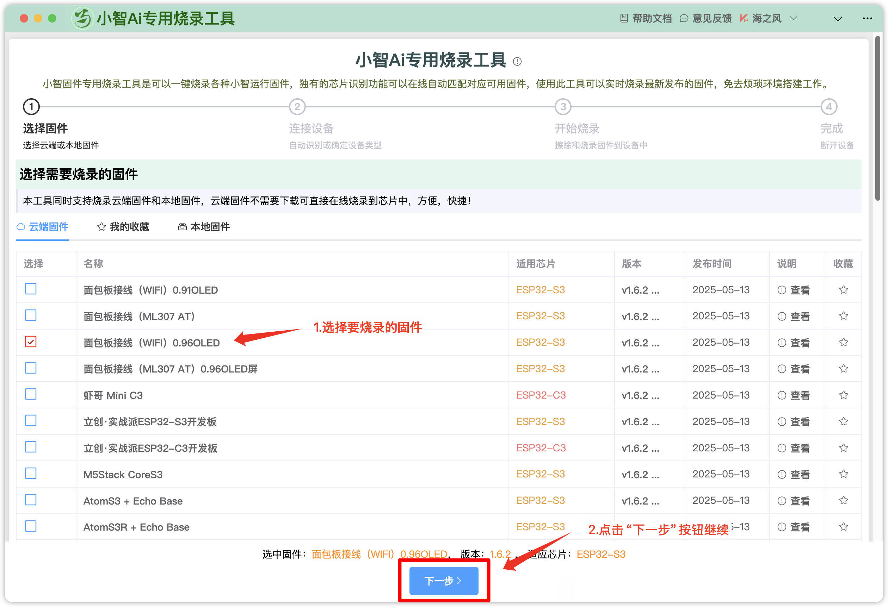
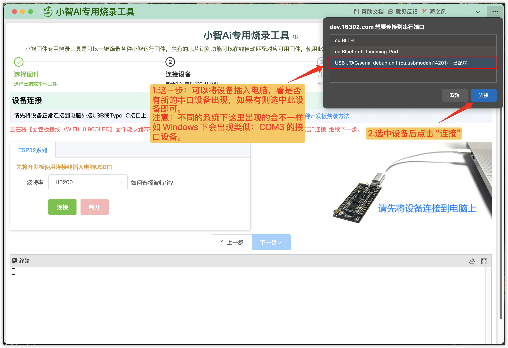
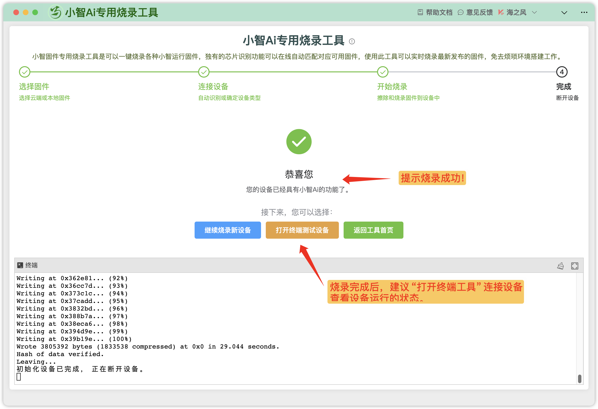

下载固件后，可参考 [Flash 工具/Web 端烧录固件（无 IDF 开发环境）](https://ccnphfhqs21z.feishu.cn/wiki/Zpz4wXBtdimBrLk25WdcXzxcnNS)中的 3 种烧录方式进行烧录，推荐使用下述方法，比较方便。

## 小智AI固件专用烧录工具—— 鹿戴马物联一站式开发工具

注意：为了更好的体验，请使用Edge浏览器访问。支持微信扫码登录和帐号登录。

https://dev.16302.com/tools/xiaozhiinit

**烧录首页预览如下：**

小智固件专用烧录工具是可以一键烧录各种小智运行固件，独有的芯片识别功能可以在线自动匹配对应可用固件，使用此工具可以实时烧录最新发布的固件，免去烦琐环境搭建工作。

**主要操作步骤如下：**

### 1.1 **选择固件**

选择云端或本地固件

### **1.2 连接设备**

自动识别或确定设备类型

### **1.3 开始烧录**

擦除和烧录固件到设备中

### **1.4 完成**

烧录完成，提示断开设备。返回 或进入终端测试设备。

