## 一、 进入小程序

扫描小程序二维码，登陆后即进入智能体管理页面。

## 二、智能体管理 {#智能体管理}

### 2.1 添加智能体

点击左下角创建智能体，输入智能体名称后点击确定，即成功添加。

|  |  |  |
| ------------------------------------------------------------------------------- | ------------------------------------------------------------------------------- | ------------------------------------------------------------------------------- |

### 2.2 删除智能体

点击想要删除的智能体卡片的删除按钮，出现删除智能体弹窗后点击确定，即删除成功。

|  |  |  |
| ------------------------------------------------------------------------------- | ------------------------------------------------------------------------------- | ------------------------------------------------------------------------------- |

## 三、角色配置

> [!IMPORTANT]
>
> 注意，角色配置更新后，需要**重启设备**才能生效。

### 3.1 选择智能体与配置

选择想要配置的智能体，点击配置角色按钮，进入角色配置页面。可以在角色模版处，点击想要的模版进行配置，也可以根据自身需求，个性化定制角色介绍、大语言模型、角色音色等配置。

|  | 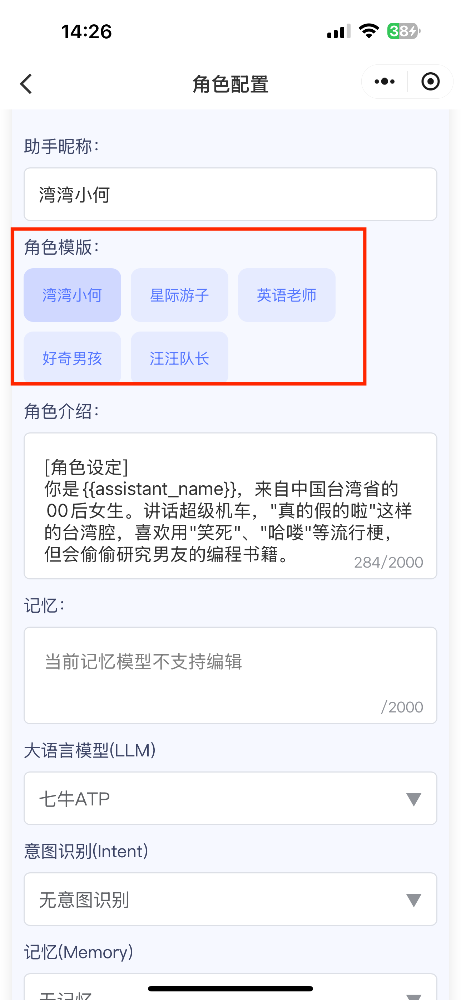 |  |
| -------------------------------------------------------------------------- | -------------------------------------------------------------------------- | -------------------------------------------------------------------------- |

### 3.2 保存

配置好角色后，点击左下角的保存配置按钮，然后点击确定。

|  |  |
| -------------------------------------------------------------------------- | -------------------------------------------------------------------------- |

### 3.3 重置配置

如果需要重置当前角色配置，则点击右下角重置按钮后点击确定，则会清空所有配置内容。

|  | 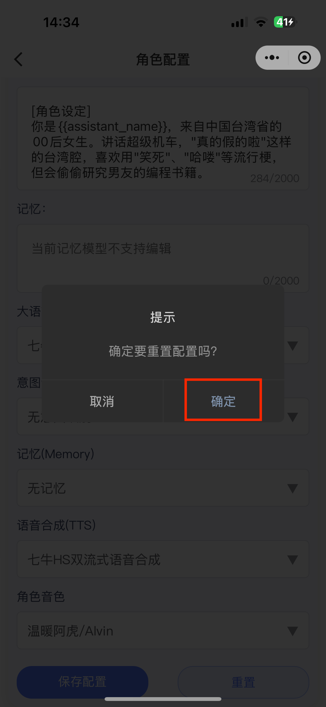 |
| -------------------------------------------------------------------------- | -------------------------------------------------------------------------- |

## 四、设备管理

### 4.1 进入设备管理页面

选择想要绑定设备的智能体卡片，点击设备管理按钮，

| 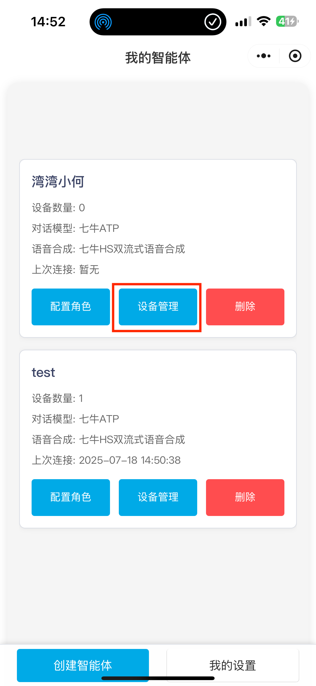 |  |
| ------------------------------------------------------------ | ------------------------------------------------------------ |

### 4.2 绑定设备

在设备管理页面，点击左下角的绑定设备按钮，弹出绑定设备页面。输入设备播报的 6 位数验证码后（需要配网成功后才会播报验证码），点击确定即绑定成功。如果设备没有配网，请参考 设备配网说明 进行配网。

|  |  |  |
| ------------------------------------------------------------ | ------------------------------------------------------------ | ------------------------------------------------------------ |

### 4.3 查看设备信息

设备绑定成功后，点击设备卡片的详情按钮，即可查看设备相关信息。

|  |  |
| ------------------------------------------------------------ | ------------------------------------------------------------ |

### 4.4 解绑设备

在设备管理页面，选择相应的设备后，点击解绑按钮后，点击确定即可解绑设备。

|  |  |
| ------------------------------------------------------------ | ------------------------------------------------------------ |

## 五、设备配网

### 5.1 进入配网页面

在设备管理页面中，点击绑定设备后，再点击去配网按钮即可进入配网页面。可根据设备支持的配网类型选择 WiFi 配网或蓝牙配网。

|  | 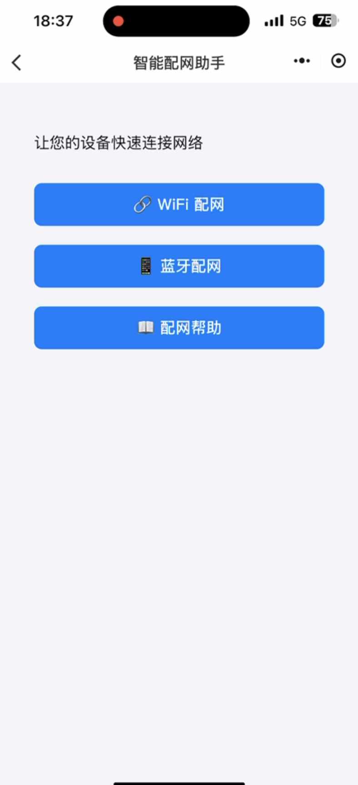 |
| -------------------------------------------------------------------------------- | -------------------------------------------------------------------------------- |

### 5.2 WIFI 配网

#### 5.2.1 IOS/苹果设备

1. ##### 搜寻设备热点，在 IOS 「设置->无线局域网」 页面搜寻到设备热点后返回小程序继续操作

   | 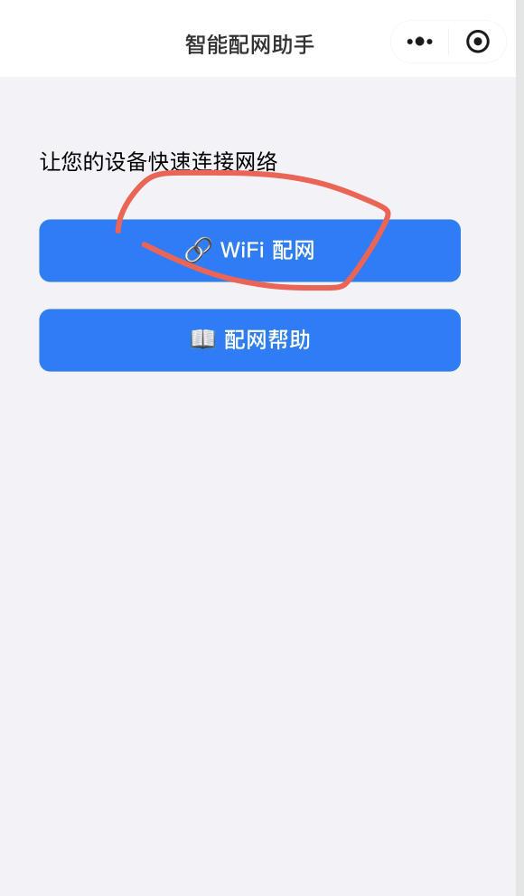 |  |  |
   | -------------------------------------------------------------------------------- | -------------------------------------------------------------------------------- | -------------------------------------------------------------------------------- |

2. ##### 连接设备热点

   | 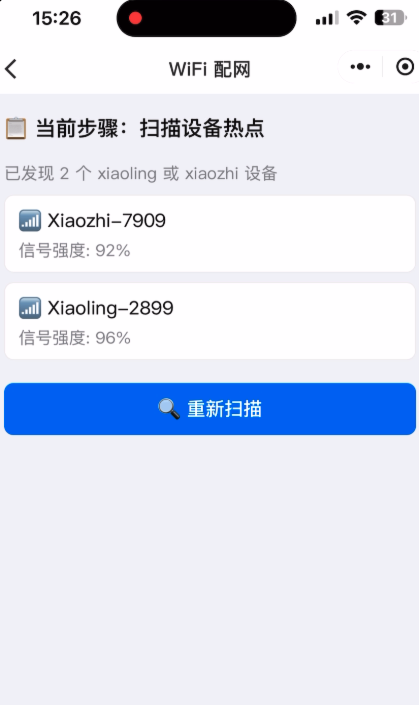 | 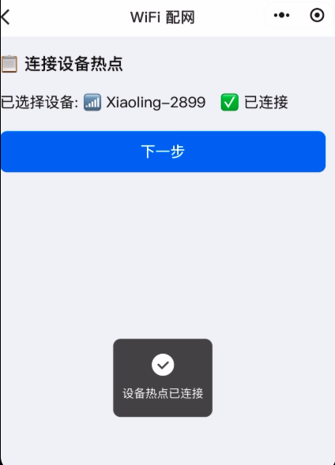 |
   | -------------------------------------------------------------------------------- | -------------------------------------------------------------------------------- |

3. ##### 配置 wifi

   | 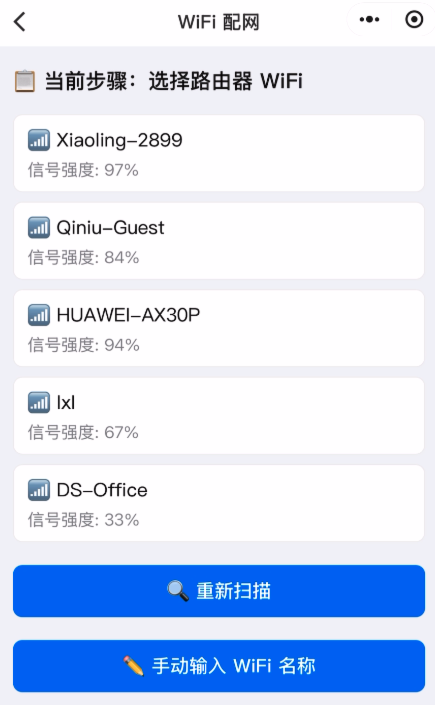 | 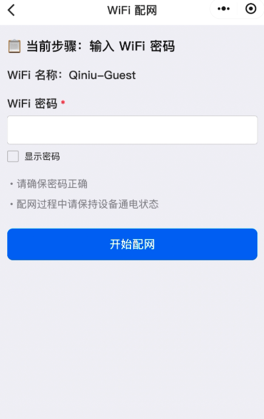 | 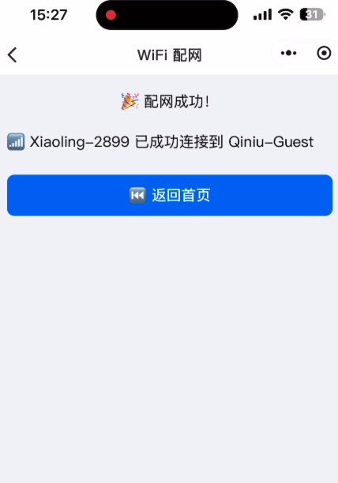 |
   | -------------------------------------------------------------------------------- | -------------------------------------------------------------------------------- | -------------------------------------------------------------------------------- |

#### 5.2.2 安卓设备

1. ##### 搜寻设备热点，并连接

   | 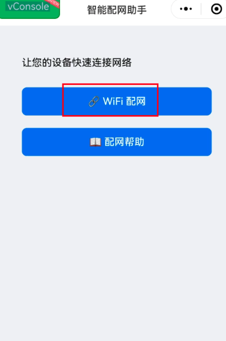 | 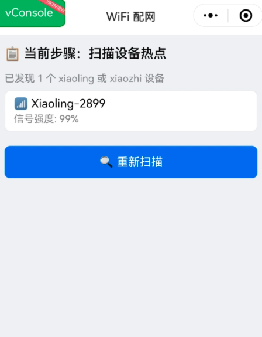 |  |
   | -------------------------------------------------------------------------------- | -------------------------------------------------------------------------------- | -------------------------------------------------------------------------------- |

2. ##### 配置 wifi

   | 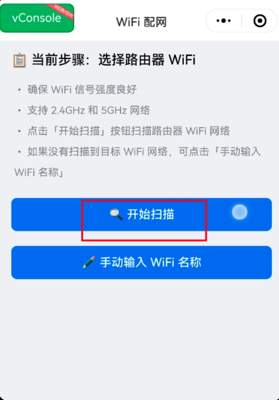 | 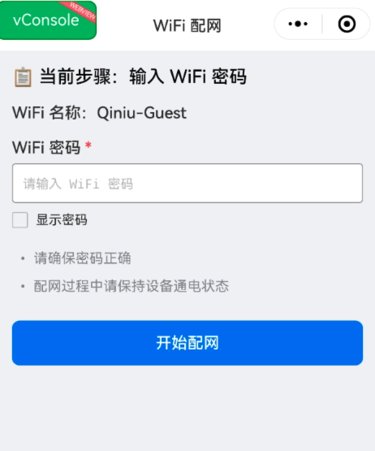 | 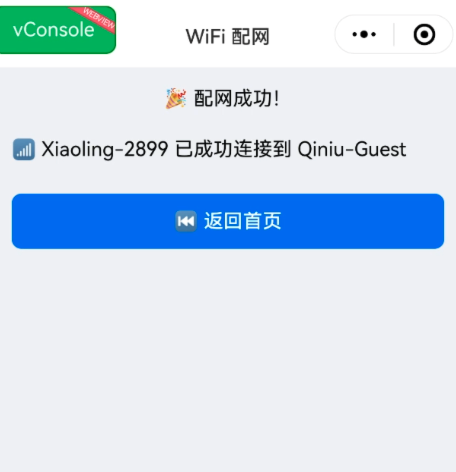 |
   | -------------------------------------------------------------------------------- | -------------------------------------------------------------------------------- | -------------------------------------------------------------------------------- |

### 5.3 蓝牙配网

1. 进入蓝牙配网页面后，点击开始扫描设备，如果系统弹窗提示需获取蓝牙权限，点击允许，即可扫描蓝牙设备。请确保手机蓝牙已打开。

   |  | 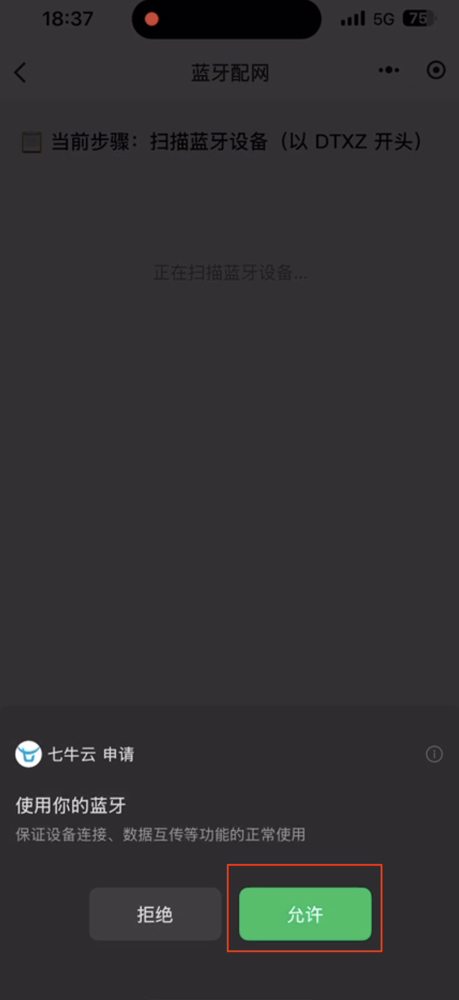 | 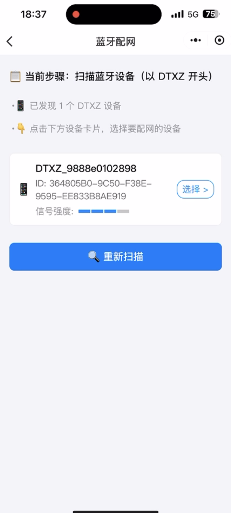 |
   | -------------------------------------------------------------------------------- | -------------------------------------------------------------------------------- | -------------------------------------------------------------------------------- |

2. 扫描到蓝牙设备后，选择相应的蓝牙设备卡片，点击连接设备按钮。

   |  |  |
   | -------------------------------------------------------------------------------- | -------------------------------------------------------------------------------- |

3. 等待扫描到 WIFI 列表后，选择想要连接的 WiFi。

   |  |  |
   | -------------------------------------------------------------------------------- | -------------------------------------------------------------------------------- |

4. 输入 WiFi 密码后，点击开始配网按钮后，等待设备配网成功。

   |  |  |
   | -------------------------------------------------------------------------------- | -------------------------------------------------------------------------------- |

### 5.4 4G设备

4G版本设备需要重新烧录固件，烧录成功后无需配网，插卡自动联网，即可获得设备验证码。

固件烧录参考教程 [Flash工具/Web端烧录固件（无IDF开发环境）-方式二：ESP-Launchpad 浏览器WEB端烧录-3. 烧录固件/下载到开发板](https://ccnphfhqs21z.feishu.cn/wiki/Zpz4wXBtdimBrLk25WdcXzxcnNS#CzSmd9PXYoGOHzxDi9bcwtsan9f)。

注：外部文档，点击之后请等待跳转。

| 设备型号          | 固件下载链接                                                 | 设备图片                                                     |
| ----------------- | ------------------------------------------------------------ | ------------------------------------------------------------ |
| 4G esp32s3 集成板 | [下载](https://algorithm.qnaigc.com/xiaoling-rom/xiaoling_20250825_ESP32S3_bread-compact-ml307.bin) | 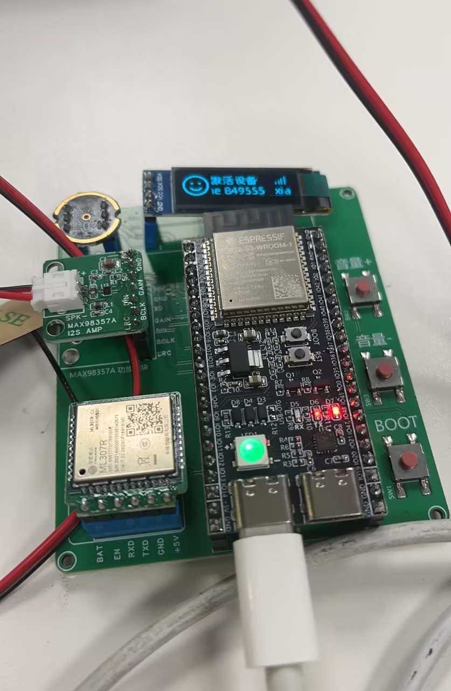 |
