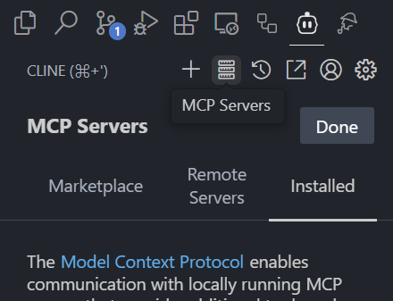
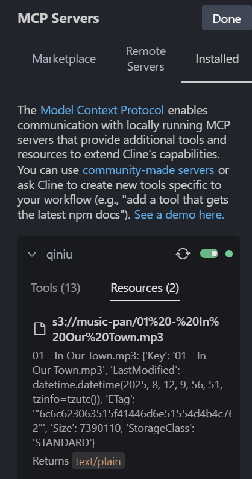
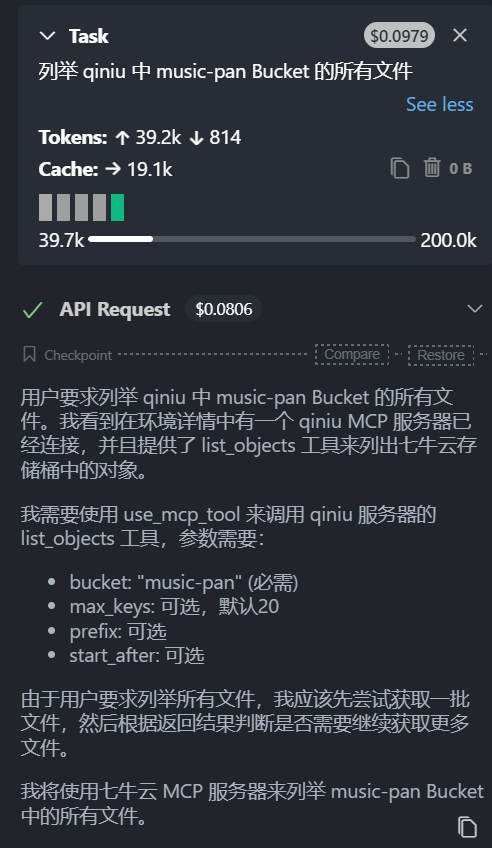
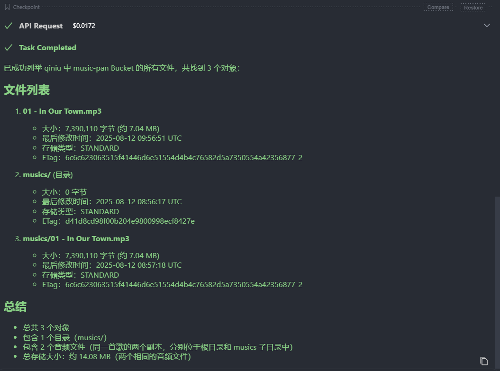
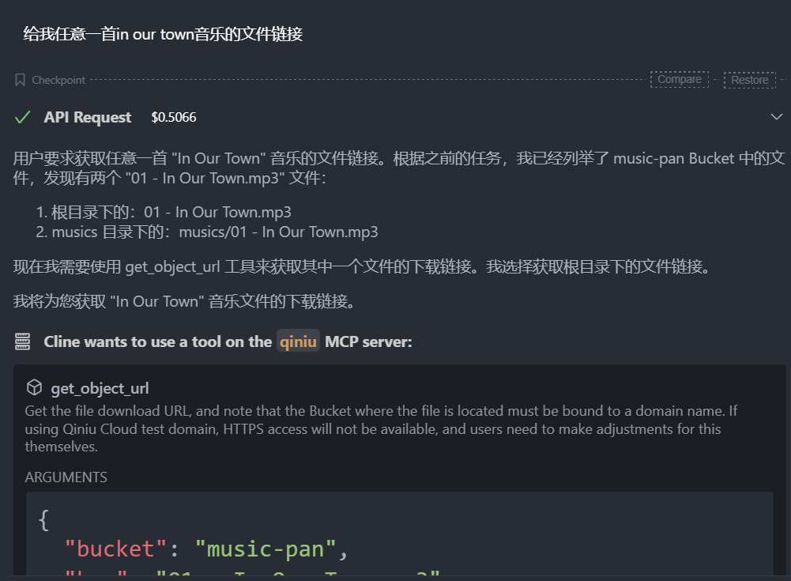
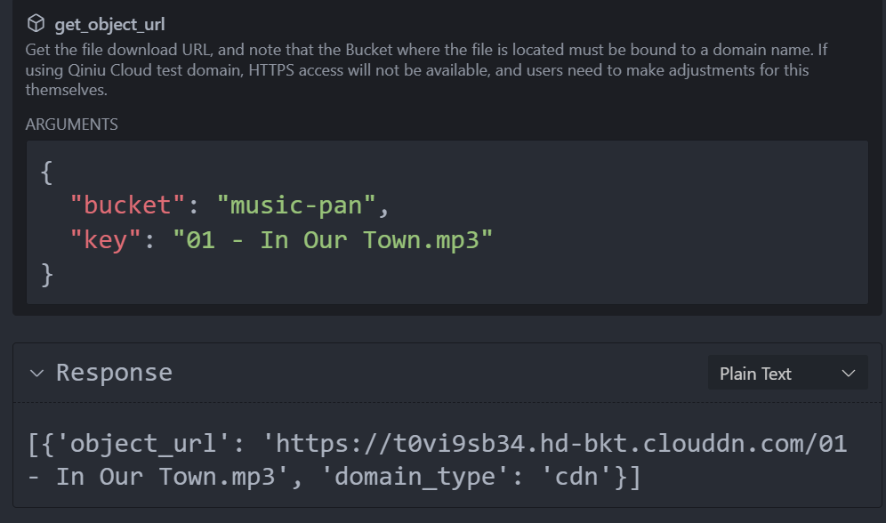

## 1. 环境配置

### 下载uv

#### Mac

推荐使用 brew 安装

```bash
brew install uv
```

#### Linux & Mac

1. 安装

    ```bash
    curl -LsSf https://astral.sh/uv/install.sh | sh
    ```

2. 安装完成后，请确保将软件包安装路径（包含 uv 和 uvx 可执行文件的目录）添加到系统的 PATH 环境变量中。

    假设安装包路径为 /Users/xxx/.local/bin（见安装执行输出）

    1. 临时生效（当前会话），在当前终端中执行以下命令

        ```bash
        export PATH="/Users/xxx/.local/bin:$PATH"
        ```

    2. 永久生效（推荐），在当前终端中执行以下命令

        ```bash
        echo 'export PATH="/Users/xxx/.local/bin:$PATH"' >> ~/.bash_profile
        source ~/.bash_profile
        ```

#### Windows

```powershell
powershell -ExecutionPolicy ByPass -c "irm <https://astral.sh/uv/install.ps1> | iex"
```

### 手动安装 qiniu-mcp-server （可选）

手动使用uv安装qiniu-mcp-server，可以确认uv安装无误，减少后续失败需要排查的因素

```bash
uv tool install qiniu-mcp-server
```

## 2. 准备七牛云存储

### 空间创建

前往 [七牛云 空间管理](https://portal.qiniu.com/kodo/bucket)


1. 点击新建空间，先输入`名称`，记住这个名称，这是之后需要使用的参数`QINIU_BUCKETS`

    

2. 存储区域选择以国内优先、离你的远近其次

3. 访问控制一定要选择**公开**，否则之后会访问不到文件

### 文件上传

在空间管理中点击你刚创建的空间，然后点击上传文件，然后就可以看到下面的菜单。


然后点击菜单左下角的选择文件，选择完文件后点击开始上传。

由于这个空间是为了MCP服务定制的，没有什么别的要存放，音乐文件直接存放在根目录就好了。

### 获取key

进入个人中心 - [密钥管理](https://portal.qiniu.com/developer/user/key)


创建密钥，然后记录AK（access key）与SK（secret key），在后续配置需要使用它们。

::: warning
AK与SK是重要隐私，避免泄露给不可信来源。

如有泄露，可在密钥管理页面停用、删除。
:::

## 3. 配置MCP

以vs code 插件 cline 为例，注意这个插件需要登录才能配置mcp



进入插件的页面，点击MCP服务器图标（上图鼠标光标所指的位置），然后点击下面的Installed，最后点击Configure MCP Servers

这时配置文件就自动打开了

基本模板如下

```json{9-13}
{
  "mcpServers": {
    "qiniu": {
      "command": "uvx",
      "args": [
        "qiniu-mcp-server"
      ],
      "env": {
        "QINIU_ACCESS_KEY": "YOUR_ACCESS_KEY",
        "QINIU_SECRET_KEY": "YOUR_SECRET_KEY",
        "QINIU_REGION_NAME": "YOUR_REGION_NAME",
        "QINIU_ENDPOINT_URL": "YOUR_ENDPOINT_URL",
        "QINIU_BUCKETS": "YOUR_BUCKET_A,YOUR_BUCKET_B"
     },
      "disabled": false
    }
  }
}
```

复制模板到配置中，替换env中的5个字段

1. **QINIU_ACCESS_KEY**: 七牛云存储 [密钥管理](https://portal.qiniu.com/developer/user/key)
2. **QINIU_SECRET_KEY**: 七牛云存储 [密钥管理](https://portal.qiniu.com/developer/user/key)
3. **QINIU_REGION_NAME**: 根据你创建空间时所选择区域，参考 [存储区域](https://developer.qiniu.com/kodo/1671/4.region-endpoint-fq)
4. **QINIU_ENDPOINT_URL**: 使用上一条获取的区域名称，替换`https://s3.QINIU_REGION_NAME.qiniucs.com`中的`QINIU_REGION_NAME`
5. **QINIU_BUCKETS**: 你创建的空间名称，如果有多个，使用英文半角逗号隔开，建议最多 20 个 bucket

::: info
该模板也适用于cursor。

claude 中使用时可能会遇到：Error: spawn uvx ENOENT 错误，解决方案：command 中 参数填写 uvx 的绝对路径，eg: /usr/local/bin/uvx
:::

### 配置成功

当一切配置完成后，可以看到绿色的状态指示，有一些Tools与Resources



### 测试功能

#### 能力集

1. 存储
    - 获取 Bucket 列表
    - 获取 Bucket 中的文件列表
    - 上传本地文件，以及给出文件内容进行上传
    - 读取文件内容
    - 获取文件下载链接
2. 智能多媒体
    - 图片缩放
    - 图片切圆角
3. CDN
    - 根据链接刷新文件
    - 根据链接预取文件

#### 在对话中测试

在对话中，使用以下提示词尝试获取所有音乐文件

```text
列举 qiniu 中 music-pan Bucket 的文件
```



我在存储中只有两个相同音乐文件，分别在根目录与music目录中，这里我们拿到了所有文件与目录信息



尝试获取音乐的链接，没有问题：





::: info

可以使用其他名称替换`"qiniu"`来访问MCP

```json{3}
{
  "mcpServers": {
    "qiniu": {
        ...
    }
  }
}
```

:::

## 4. 相关链接

[七牛云对象存储 - 开发者文档](https://developer.qiniu.com/kodo)

Github [qiniu-mcp-serve](https://github.com/qiniu/qiniu-mcp-server)
