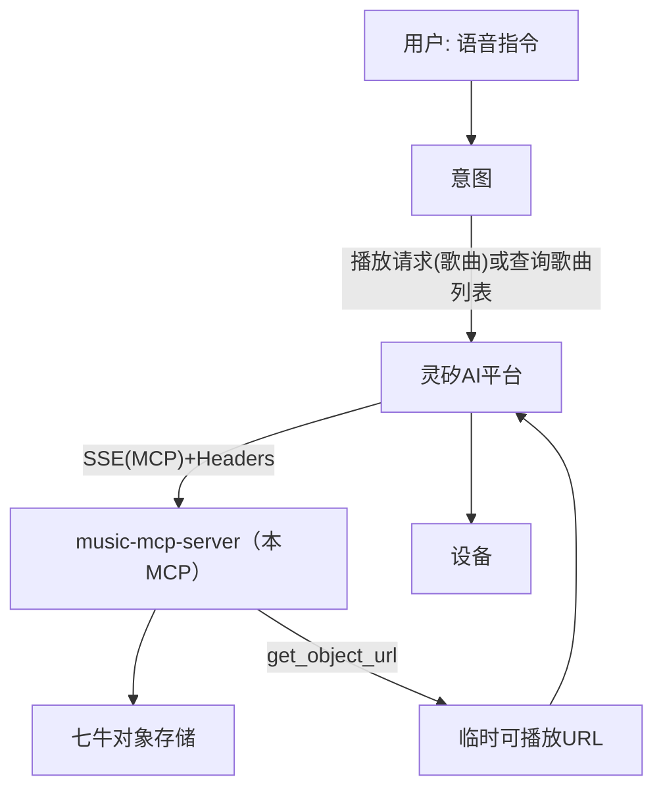
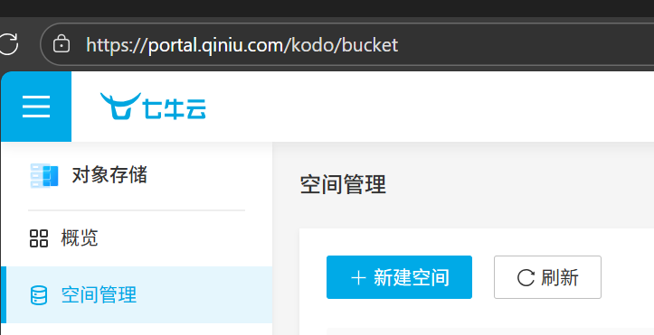
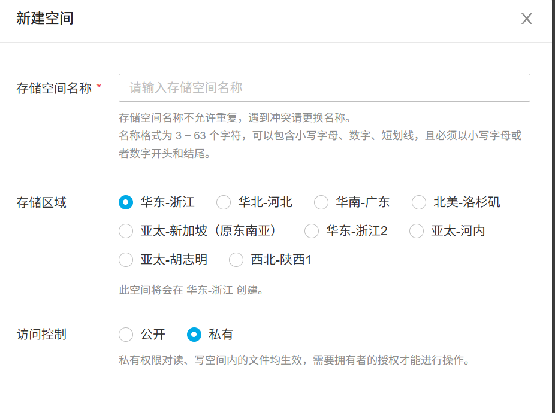
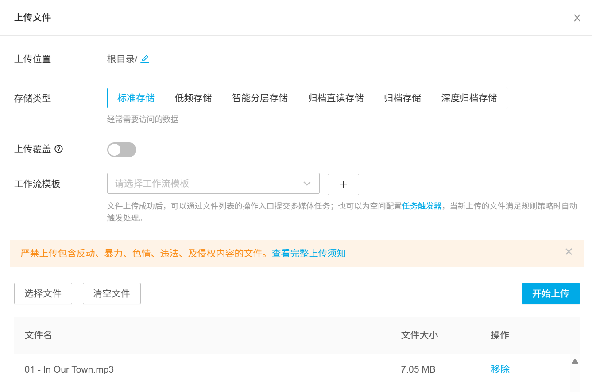
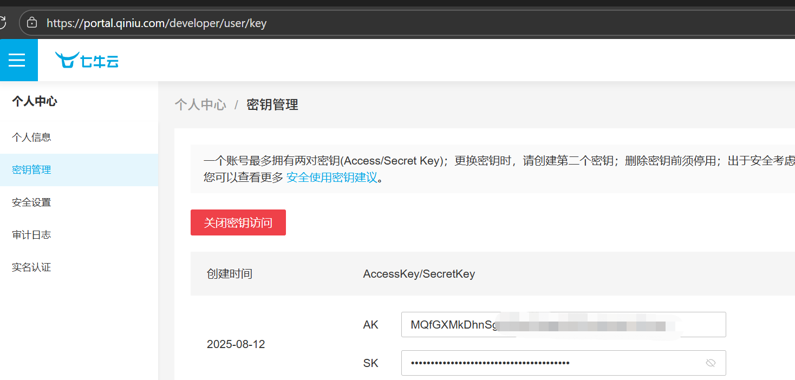
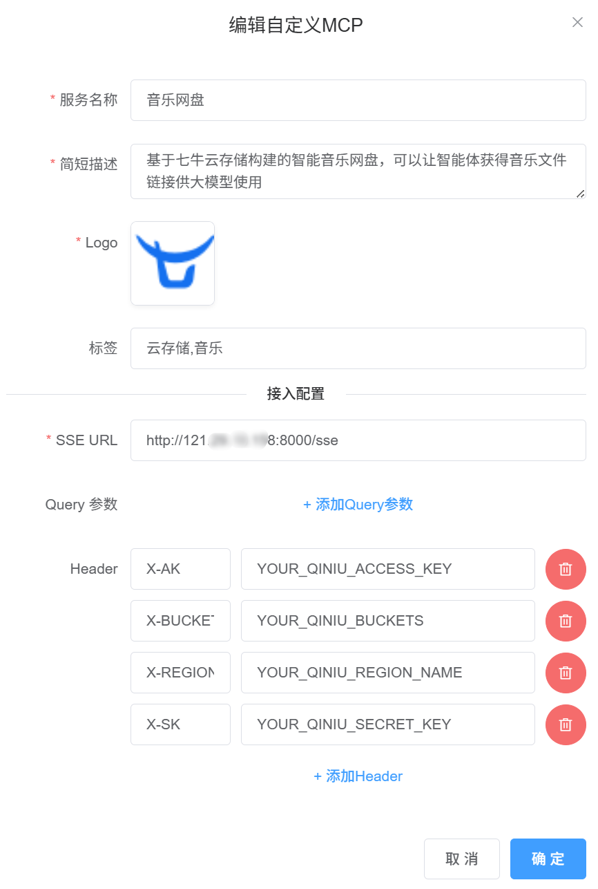
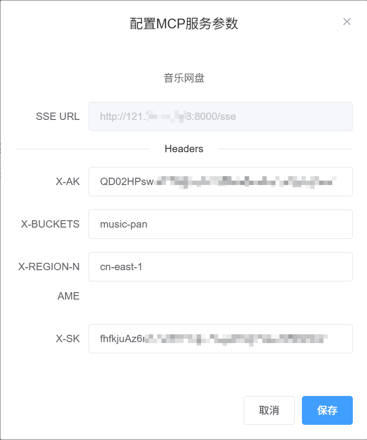

---
title: 基于七牛云存储服务构建一个音乐网盘MCP
---   

## 1. 需求背景与目标

- 背景：目标场景是在灵矽AI平台智能硬件对话时，当用户以自然语言发出“播放某首/某目录音乐”请求时，MCP可以提供对应（假设存在）音乐文件的可访问 URL。

- 目标：通过 MCP（Model Context Protocol）提供标准化的MCP Tools，使语音智能体在对话流程中检索音乐并获取可播放链接。

- 非目标：MCP 不负责音乐的上传与管理、转码或播放控制；也不提供在线播放 UI。音乐文件由用户自行上传至对象存储；本服务仅返回文件 URL。

## 2. 实现原理与技术架构

### 2.1 系统架构概览

本方案基于 MCP（Model Context Protocol）协议，为智能语音对话硬件提供音乐文件管理与播放能力。系统采用分层架构设计，通过 SSE（Server-Sent Events）建立实时通信通道，支持动态配置注入和会话隔离。



### 2.2 会话配置与隔离

- **动态配置注入**：客户端通过 HTTP Headers 传递认证信息和存储配置
  - `X-Qiniu-AK`: Access Key（访问密钥）
  - `X-Qiniu-SK`: Secret Key（私有密钥）
  - `X-Qiniu-Region`: 存储区域（如 cn-east-1）
  - `X-Qiniu-Buckets`: 允许访问的存储桶列表

- **会话隔离机制**：基于 Headers 建立独立的会话上下文，确保多用户/多租户间的数据隔离
- **安全策略**：敏感信息仅在请求传递过程中存在，不在服务端持久化

## 3. 部署

### 3.1 服务器准备

可以使用[七牛云轻量服务器](https://portal.qiniu.com/las)

### 3.2 环境依赖与准备 `uv`

<details>
<summary>Mac 系统</summary>

推荐使用 brew 安装：

```bash
brew install uv
```

</details>

<details>

<summary>
Linux & Mac 系统
</summary>

1. 安装命令：

   ```bash
   curl -LsSf https://astral.sh/uv/install.sh | sh
   ```

2. 配置环境变量：

   安装完成后，需要将 uv 可执行文件路径添加到系统 PATH 中。假设安装路径为 `/Users/xxx/.local/bin`：

   - 临时生效（当前会话）：

     ```bash
     export PATH="/Users/xxx/.local/bin:$PATH"
     ```

   - 永久生效（推荐）：

     ```bash
     echo 'export PATH="/Users/xxx/.local/bin:$PATH"' >> ~/.bash_profile
     source ~/.bash_profile
     ```

</details>

<details>
<summary>Windows 系统</summary>

```powershell
powershell -ExecutionPolicy ByPass -c "irm https://astral.sh/uv/install.ps1 | iex"
```

</details>

### 3.3 获取代码

暂无

### 3.4 启动server

```bash
uv --directory . run music-mcp-server --transport sse --port 8000
```

## 4. 配置与使用

### 4.1 准备七牛云存储

#### 空间创建

前往 [七牛云 空间管理](https://portal.qiniu.com/kodo/bucket)



1. 点击新建空间，先输入`名称`，记住这个名称，后续将作为 Header `X-Qiniu-Buckets` 的取值。

   

2. 存储区域选择以国内优先、离你的远近其次

3. 设置域名. 未设置域名时，七牛云提供的测试域名只能通过http访问。

#### 文件上传

在空间管理中点击你刚创建的空间，然后点击上传文件，然后就可以看到下面的菜单。



目录选择没有要求，只要将放到当前空间里面就好了

然后点击菜单左下角的选择文件，选择完文件后点击开始上传。

<!-- 由于这个空间是为了该 MCP 服务定制的，没有什么别的要存放，音乐文件直接存放在根目录就好了。 -->

#### 获取 key

进入个人中心 - [密钥管理](https://portal.qiniu.com/developer/user/key)



创建密钥，然后记录 AK（access key）与 SK（secret key），在后续 Header 传递时需要使用它们。

::: warning
AK 与 SK 是重要隐私，避免泄露给不可信来源。

如有泄露，可在密钥管理页面停用、删除。
:::

### 4.2 创建自定义MCP

来到灵矽AI控制台，登录之后，点击左侧的侧边栏选项“自定义MCP”，然后点击“添加自定义MCP”。

在弹出的对话框中你需要按照表单填写服务名称、简短描述、LOGO、tag，以及接入配置，接入配置填写需要注意，你是以服务提供者的身份填写信息，不是以使用者的身份填写信息：

- SSE URL: 需要填写完整的，带有http(s)协议的、可访问的URL，通常还是以/SSE结尾

<!-- todo -->
<!-- - Query 参数：若需要多租户/不同 profile，可增加 profile/tenant 等查询参数参与服务端路由与限权。 -->

- Header 参数：将上文 headers 列为用户必填项，标注字段说明与示例值。API_Key之类的一般都填写在这里。

填写示例：



### 4.3 使用MCP

回到灵矽AI控制台，点击左侧的侧边栏选项“自定义MCP”，找到你刚创建的MCP，然后点击“开通”。或者，如果你想要其他人的MCP，可以点击侧边栏的“MCP市场”，然后开通你需要的MCP。

填写必要参数：



后续可以到侧边栏“已开通MCP”中查看、修改配置或删除mcp。

随后，可以在智能体-角色配置页面启用新的mcp了。

## 5. 相关链接

<!-- [七牛云对象存储 - 开发者文档](https://developer.qiniu.com/kodo) -->

当前 music-mcp-server SSE URL：`http://121.29.19.158:8000/sse`
