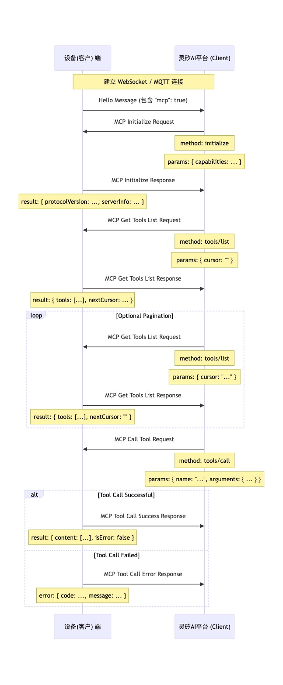

---
title: 灵矽AI平台与设备端MCP协议交互指南
---   

## 概述

MCP（Model Context Protocol）是新一代推荐用于物联网控制的协议，通过标准 JSON-RPC 2.0 格式在后台与设备间发现和调用"工具"（Tool），实现灵活的设备控制。

本文详细介绍灵矽AI平台（MCP客户端）与设备端（MCP服务器）之间的协作流程，帮助开发者实现大模型通过MCP协议控制万物的能力。

## 目录

- [概述](#概述)
- [目录](#目录)
- [典型使用流程](#典型使用流程)
  - [流程图](#流程图)
- [协议格式规范](#协议格式规范)
  - [整体消息结构](#整体消息结构)
  - [JSON-RPC 2.0字段说明](#json-rpc-20字段说明)
- [详细交互流程](#详细交互流程)
  - [步骤1：连接建立与能力通告](#步骤1连接建立与能力通告)
  - [步骤2：初始化MCP会话](#步骤2初始化mcp会话)
  - [步骤3：发现设备工具列表](#步骤3发现设备工具列表)
    - [响应格式一：标准工具列表（向后兼容）](#响应格式一标准工具列表向后兼容)
    - [响应格式二：带类型标识的工具列表（推荐）](#响应格式二带类型标识的工具列表推荐)
  - [步骤4：调用设备工具](#步骤4调用设备工具)
- [设备端工具注册方法](#设备端工具注册方法)
  - [AddTool方法说明](#addtool方法说明)
  - [典型注册示例](#典型注册示例)
## 典型使用流程

MCP协议的交互主要围绕客户端（灵矽AI平台）发现和调用设备上的"工具"（Tool）进行：

```
时间线：
┌─────────────┐                    ┌─────────────────┐
│   设备端    │                    │   灵矽AI平台    │
│ (MCP服务器) │                    │  (MCP客户端)    │
└─────────────┘                    └─────────────────┘
       │                                    │
       │ ①── hello 消息（能力声明）──→       │
       │                                    │
       │ ←── ② initialize（会话初始化）──    │
       │                                    │
       │ ③── 响应（服务器能力）──→           │
       │                                    │
       │ ←── ④ tools/list（工具发现）──      │
       │                                    │
       │ ⑤── 工具列表响应 ──→                │
       │                                    │
       │ ←── ⑥ tools/call（工具调用）──      │
       │                                    │
       │ ⑦── 执行结果响应 ──→                │
       │                                    │
```

**详细步骤说明：**

1. **🚀 设备启动**：设备启动后通过基础协议（如 WebSocket/MQTT）与灵矽AI建立连接
2. **🤝 初始化会话**：灵矽AI通过 MCP 协议的 `initialize` 方法初始化会话
3. **🔍 发现工具**：灵矽AI通过 `tools/list` 获取设备支持的所有工具及参数说明
4. **⚡ 执行控制**：灵矽AI通过 `tools/call` 调用具体工具，实现对设备的控制

### 流程图



## 协议格式规范

根据 MCP 协议规范，MCP 消息是封装在基础通信协议（如 WebSocket 或 MQTT）的消息体中的。其内部结构遵循 [JSON-RPC 2.0](https://www.jsonrpc.org/specification) 规范。

### 整体消息结构

```json
{
  "session_id": "...",    // 会话ID
  "type": "mcp",          // 消息类型，固定为"mcp"
  "payload": {             // JSON-RPC 2.0负载
    "jsonrpc": "2.0",
    "method": "...",      // 方法名 (如 "initialize", "tools/list", "tools/call")
    "params": { ... },     // 方法参数 (对于 request)
    "id": ...,            // 请求ID (对于 request 和 response)
    "result": { ... },     // 方法执行结果 (对于 success response)
    "error": { ... }       // 错误信息 (对于 error response)
  }
}
```

### JSON-RPC 2.0字段说明

| 字段 | 类型 | 说明 |
|------|------|------|
| `jsonrpc` | string | 固定的字符串 "2.0" |
| `method` | string | 要调用的方法名称（对于 Request） |
| `params` | object | 方法的参数，一个结构化值，通常为对象（对于 Request） |
| `id` | number/string | 请求的标识符，客户端发送请求时提供，服务器响应时原样返回。用于匹配请求和响应 |
| `result` | any | 方法成功执行时的结果（对于 Success Response） |
| `error` | object | 方法执行失败时的错误信息（对于 Error Response） |

## 详细交互流程

### 步骤1：连接建立与能力通告

> **⏰ 时机**：设备启动并成功连接到灵矽AI平台后  
> **📤 发送方**：设备端  
> **📋 消息类型**：基础协议的 "hello" 消息  
> **🎯 目的**：声明设备支持的能力列表，包括 MCP 协议支持

```
┌─────────────┐                    ┌─────────────────┐
│   设备端    │ ──── hello 消息 ──→ │   灵矽AI平台    │
│ (MCP服务器) │                    │  (MCP客户端)    │
└─────────────┘                    └─────────────────┘
```

**📨 设备端 → 灵矽平台**

```json
{
  "type": "hello",
  "version": "1.0",
  "features": {
    "mcp": true
  },
  "transport": "websocket", // 或 "mqtt"
  "audio_params": { },
  "session_id": "device_session_123" // 设备收到服务器hello后可能设置
}
```

### 步骤2：初始化MCP会话

> **⏰ 时机**：灵矽AI平台收到设备 "hello" 消息，确认设备支持 MCP 后  
> **📤 发送方**：灵矽AI平台（客户端）  
> **🔧 方法**：`initialize`  
> **🎯 目的**：建立 MCP 会话，交换客户端和服务器能力信息

```
┌─────────────┐                    ┌─────────────────┐
│   设备端    │ ←── initialize ──── │   灵矽AI平台    │
│ (MCP服务器) │                    │  (MCP客户端)    │
└─────────────┘                    └─────────────────┘
```

**📨 灵矽平台 → 设备端**

```json
{
  "jsonrpc": "2.0",
  "method": "initialize",
  "params": {
    "capabilities": {
      // 客户端能力，可选
      
      // 摄像头视觉相关
      "vision": {
        "url": "http://example.com/vision", // 摄像头: 图片处理地址(必须是http地址, 不是websocket地址)
        "token": "vision_token_123" // url token
      }
      
      // ... 其他客户端能力
    }
  },
  "id": 1 // 请求 ID
}
```

**⏱️ 设备响应时机**：设备收到 initialize 请求并处理后

**📨 设备端 → 灵矽平台**

```json
{
  "jsonrpc": "2.0",
  "id": 1, // 匹配请求 ID
  "result": {
    "protocolVersion": "2024-11-05",
    "capabilities": {
      "tools": {} // 这里的 tools 似乎不列出详细信息，需要 tools/list
    },
    "serverInfo": {
      "name": "智能音箱设备", // 设备名称 (BOARD_NAME)
      "version": "1.2.3" // 设备固件版本
    }
  }
}
```

### 步骤3：发现设备工具列表

> **⏰ 时机**：灵矽AI平台需要获取设备当前支持的具体功能（工具）列表时  
> **📤 发送方**：灵矽AI平台（客户端）  
> **🔧 方法**：`tools/list`  
> **🎯 目的**：获取设备支持的所有工具及其参数说明

```
┌─────────────┐                    ┌─────────────────┐
│   设备端    │ ←── tools/list ──── │   灵矽AI平台    │
│ (MCP服务器) │                    │  (MCP客户端)    │
└─────────────┘                    └─────────────────┘
```

**📨 灵矽平台 → 设备端**

```json
{
  "jsonrpc": "2.0",
  "method": "tools/list",
  "params": {
    "cursor": "" // 用于分页，首次请求为空字符串
  },
  "id": 2 // 请求 ID
}
```

**⏱️ 设备响应时机**：设备收到 tools/list 请求并生成工具列表后

**📨 设备端 → 灵矽平台**

#### 响应格式一：标准工具列表（向后兼容）

```json
{
  "jsonrpc": "2.0",
  "id": 2, // 匹配请求 ID
  "result": {
    "tools": [ // 工具对象列表
      {
        "name": "self.get_device_status",
        "description": "获取设备当前状态信息",
        "inputSchema": {
          "type": "object",
          "properties": {},
          "required": []
        }
      },
      {
        "name": "self.audio_speaker.set_volume",
        "description": "设置音箱音量",
        "inputSchema": {
          "type": "object",
          "properties": {
            "volume": {
              "type": "integer",
              "minimum": 0,
              "maximum": 100,
              "description": "音量大小，范围0-100"
            }
          },
          "required": ["volume"]
        }
      }
      // ... 更多工具
    ],
    "nextCursor": null // 如果列表很大需要分页，这里会包含下一个请求的 cursor 值
  }
}
```

#### 响应格式二：带类型标识的工具列表（推荐）

为了同时支持标准工具（tool）和 RPC 函数调用（rpc），新增 `type` 字段用于区分工具类型：

```json
{
  "jsonrpc": "2.0",
  "id": 2, // 匹配请求 ID
  "result": {
    "tools": [ // 工具对象列表
      {
        "name": "self.get_device_status",
        "description": "获取设备当前状态信息",
        "type": <int>, // 函数类型，0 表示 tool 函数，1 表示 rpc 函数
        "inputSchema": {
          "type": "object",
          "properties": {},
          "required": []
        }
      },
      {
        "name": "self.audio_speaker.set_volume",
        "description": "设置音箱音量",
        "type": 0, // 函数类型，0 表示 tool 函数
        "inputSchema": {
          "type": "object",
          "properties": {
            "volume": {
              "type": "integer",
              "minimum": 0,
              "maximum": 100,
              "description": "音量大小，范围0-100"
            }
          },
          "required": ["volume"]
        }
      }
      // ... 更多工具
    ],
    "nextCursor": null // 如果列表很大需要分页，这里会包含下一个请求的 cursor 值
  }
}
```

**字段说明**：

- `type`：函数类型标识，0 表示 tool 函数，1 表示 rpc 函数
- 其他字段与标准 MCP 工具定义保持一致

**分页处理**：如果 `nextCursor` 字段非空，客户端需要再次发送 `tools/list` 请求，并在 `params` 中带上这个 cursor 值以获取下一页工具。

### 步骤4：调用设备工具

> **⏰ 时机**：灵矽AI平台需要执行设备上的某个具体功能时  
> **📤 发送方**：灵矽AI平台（客户端）  
> **🔧 方法**：`tools/call`  
> **🎯 目的**：调用设备上的具体工具，执行实际的控制操作

```
┌─────────────┐                    ┌─────────────────┐
│   设备端    │ ←── tools/call ──── │   灵矽AI平台    │
│ (MCP服务器) │                    │  (MCP客户端)    │
└─────────────┘                    └─────────────────┘
```

**📨 灵矽平台 → 设备端**

```json
{
  "jsonrpc": "2.0",
  "method": "tools/call",
  "params": {
    "name": "self.audio_speaker.set_volume", // 要调用的工具名称
    "arguments": {
      // 工具参数，对象格式
      "volume": 50 // 参数名及其值
    }
  },
  "id": 3 // 请求 ID
}
```

**⏱️ 设备响应时机**：设备收到 tools/call 请求，执行相应的工具函数后

**📨 设备端 → 灵矽平台（成功响应）**

```json
{
  "jsonrpc": "2.0",
  "id": 3, // 匹配请求 ID
  "result": {
    "content": [
      {
        "type": "text",
        "text": "音量已设置为50%"
      }
    ],
    "isError": false
  }
}
```

**📨 设备端 → 灵矽平台（错误响应）**

```json
{
  "jsonrpc": "2.0",
  "id": 3,
  "error": {
    "code": -32601,
    "message": "未知工具: self.non_existent_tool"
  }
}
```

## 设备端工具注册方法

### AddTool方法说明

设备通过 `McpServer::AddTool` 方法注册可被灵矽AI平台调用的"工具"。其常用函数签名如下：

```cpp
void AddTool(
    const std::string& name,           // 工具名称，建议唯一且有层次感，如 self.dog.forward
    const std::string& description,    // 工具描述，简明说明功能，便于大模型理解
    const PropertyList& properties,    // 输入参数列表（可为空），支持类型：布尔、整数、字符串
    std::function<ReturnValue(const PropertyList&)> callback // 工具被调用时的回调实现
);
```

**参数说明**：

- `name`：工具唯一标识，建议用"模块.功能"命名风格
- `description`：自然语言描述，便于 AI/用户理解
- `properties`：参数列表，支持类型有布尔、整数、字符串，可指定范围和默认值
- `callback`：收到调用请求时的实际执行逻辑，返回值可为 bool/int/string

### 典型注册示例

以下是典型的工具注册示例（以 ESP-Hi 为例）：

```cpp
void InitializeTools() {
    auto& mcp_server = McpServer::GetInstance();
    
    // 例1：无参数，控制机器人前进
    mcp_server.AddTool("self.dog.forward", "机器人向前移动", PropertyList(), 
        [this](const PropertyList&) -> ReturnValue {
            servo_dog_ctrl_send(DOG_STATE_FORWARD, NULL);
            return true;
        });
    
    // 例2：带参数，设置灯光 RGB 颜色
    mcp_server.AddTool("self.light.set_rgb", "设置RGB颜色", PropertyList({
        Property("r", kPropertyTypeInteger, 0, 255),
        Property("g", kPropertyTypeInteger, 0, 255),
        Property("b", kPropertyTypeInteger, 0, 255)
    }), [this](const PropertyList& properties) -> ReturnValue {
        int r = properties["r"].value<int>();
        int g = properties["g"].value<int>();
        int b = properties["b"].value<int>();
        led_on_ = true;
        SetLedColor(r, g, b);
        return true;
    });
}
```
