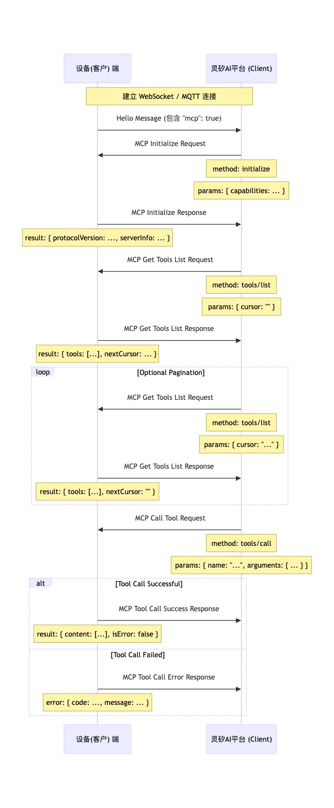

## 概述

MCP（Model Context Protocol）用于让灵矽AI平台通过标准 JSON-RPC 2.0 消息发现并调用设备端能力。设备端是 MCP Server，灵矽AI平台是 MCP Client；MCP 消息承载在基础 WebSocket 文本消息中，外层使用灵矽设备协议，内层使用 JSON-RPC 2.0。

本文说明设备端需要发送和接收的字段，重点覆盖 `hello` 能力声明、`initialize`、`tools/list`、`tools/call` 以及工具结果格式。

## 目录

- [概述](#概述)
- [典型使用流程](#典型使用流程)
- [协议格式规范](#协议格式规范)
- [详细交互流程](#详细交互流程)
- [工具定义规范](#工具定义规范)
- [错误处理](#错误处理)
- [设备端工具注册建议](#设备端工具注册建议)

## 典型使用流程

MCP 交互主要围绕平台发现并调用设备端工具进行：

```text
时间线：
┌─────────────┐                    ┌─────────────────┐
│   设备端    │                    │   灵矽AI平台    │
│ (MCP Server)│                    │  (MCP Client)   │
└─────────────┘                    └─────────────────┘
       │                                    │
       │ ① hello，声明 features.mcp=true ─→ │
       │                                    │
       │ ←──────── ② hello 响应 ─────────── │
       │                                    │
       │ ←──── ③ mcp.initialize(id=1) ───── │
       │                                    │
       │ ④ initialize 响应(id=1) ─────────→ │
       │                                    │
       │ ←──── ⑤ mcp.tools/list(id=2) ───── │
       │                                    │
       │ ⑥ tools/list 响应(id=2) ─────────→ │
       │                                    │
       │ ←──── ⑦ mcp.tools/call(id>=3) ──── │
       │                                    │
       │ ⑧ tools/call 响应(id>=3) ────────→ │
       │                                    │
```

步骤说明：

1. 设备建立 WebSocket 连接后，先发送基础协议 `hello`。
2. 只有 `hello.features.mcp` 为布尔值 `true` 时，平台才会启动设备端 MCP。
3. 平台会发送 `initialize`，并立即发送第一次 `tools/list`。
4. 设备返回工具列表后，平台把普通工具暴露给大模型；RPC-only 工具只用于内部后续调用。
5. 大模型需要控制设备时，平台发送 `tools/call`，设备执行后返回结果。

### 流程图



## 协议格式规范

### 基础消息外层

所有 WebSocket 文本消息都必须带 `type` 字段。MCP 消息的外层固定为 `type: "mcp"`，JSON-RPC 2.0 内容放在 `payload` 中。

通用消息骨架如下。实际发送时，`method/params`、`result`、`error` 会根据消息类型择一出现，不会同时全部出现。

```json
{
  "type": "mcp",
  "payload": {
    "jsonrpc": "2.0",
    "id": "<request_id>",
    "method": "<method_name>",
    "params": {},
    "result": {},
    "error": {
      "code": "<error_code>",
      "message": "<error_message>"
    }
  }
}
```

字段说明：

| 字段 | 类型 | 是否必填 | 说明 |
| --- | --- | --- | --- |
| `type` | string | 是 | MCP 消息固定为 `"mcp"` |
| `payload` | object | 是 | JSON-RPC 2.0 消息体 |
| `payload.jsonrpc` | string | 是 | 固定为 `"2.0"` |
| `payload.id` | number | 请求/响应必填 | 请求标识。设备响应必须返回对应 ID |
| `payload.method` | string | request/notification 必填 | 方法名，如 `initialize`、`tools/list`、`tools/call` |
| `payload.params` | object | request/notification 可选 | 方法参数 |
| `payload.result` | any | success response 必填 | 成功响应结果 |
| `payload.error` | object/string | error response 必填 | 失败响应错误信息 |

注意事项：

- 当前协议只解析 `payload` 字段，不解析旧字段 `data`。
- MCP 外层不携带 `session_id`。`session_id` 只会出现在平台返回的基础协议 `hello`、`stt`、`tts`、`llm` 等消息中。
- MCP 的 `payload.id` 需要是数字型整数；设备响应时不要使用字符串 ID。

平台当前使用的请求 ID：

| 请求 | 方法 | ID |
| --- | --- | --- |
| 初始化 | `initialize` | `1` |
| 工具发现 | `tools/list` | `2` |
| 工具调用 | `tools/call` | 从 `3` 开始递增 |

## 详细交互流程

### 步骤1：连接建立与能力通告

| 项目 | 说明 |
| --- | --- |
| 时机 | 设备启动并成功连接到灵矽AI平台后 |
| 发送方 | 设备端 |
| 消息类型 | 基础协议 `hello` 消息 |
| 目的 | 声明设备支持的能力列表，包括 MCP 协议支持 |

设备端先发送基础协议 `hello`。平台只有在收到 `features.mcp: true` 后才会初始化设备端 MCP。

`hello` 的完整字段、音频参数和平台响应请参考 [WebSocket 协议：设备发送 Hello 消息](../platform/websocket.md#步骤2设备发送-hello-消息) 与 [WebSocket 协议：服务器 Hello 响应](../platform/websocket.md#步骤3服务器hello响应)。在 MCP 场景中，需要重点确认设备端 `hello.features.mcp` 为布尔值 `true`。

### 步骤2：初始化 MCP 会话

| 项目 | 说明 |
| --- | --- |
| 时机 | 平台收到设备 `hello`，并确认设备支持 MCP 后 |
| 发送方 | 灵矽AI平台 |
| MCP 方法 | `initialize` |
| 目的 | 建立 MCP 会话，交换客户端与设备端能力信息 |

该消息外层必须是 `type: "mcp"`，JSON-RPC 内容放在 `payload` 中。

平台发送字段结构：

```json
{
  "type": "mcp",
  "payload": {
    "jsonrpc": "2.0",
    "id": 1,
    "method": "initialize",
    "params": {
      "protocolVersion": "2024-11-05",
      "capabilities": {
        "roots": {
          "listChanged": true
        },
        "sampling": {},
        "vision": {
          "url": "<vision_http_url>",
          "token": "<optional_auth_token>"
        }
      },
      "clientInfo": {
        "name": "<client_name>",
        "version": "<client_version>"
      }
    }
  }
}
```

字段说明：

| 字段 | 说明 |
| --- | --- |
| `protocolVersion` | 平台使用的 MCP 协议版本 |
| `clientInfo.name` | 平台客户端名称 |
| `clientInfo.version` | 平台客户端版本 |
| `capabilities.roots.listChanged` | 平台支持 roots 列表变化能力 |
| `capabilities.sampling` | 平台声明 sampling 能力 |
| `capabilities.vision` | 可选。存在时表示平台提供 HTTP 视觉解释接口 |
| `capabilities.vision.url` | HTTP 地址，不是 WebSocket 地址 |
| `capabilities.vision.token` | 可选。服务端启用鉴权时提供 |

平台发送参考 Demo（示例值仅用于说明）：

```json
{
  "type": "mcp",
  "payload": {
    "jsonrpc": "2.0",
    "id": 1,
    "method": "initialize",
    "params": {
      "protocolVersion": "2024-11-05",
      "capabilities": {
        "roots": {
          "listChanged": true
        },
        "sampling": {},
        "vision": {
          "url": "http://example.com/mcp/vision/explain",
          "token": "optional_auth_token"
        }
      },
      "clientInfo": {
        "name": "XiaozhiClient",
        "version": "1.0.0"
      }
    }
  }
}
```

设备端响应字段结构：

```json
{
  "type": "mcp",
  "payload": {
    "jsonrpc": "2.0",
    "id": 1,
    "result": {
      "protocolVersion": "2024-11-05",
      "capabilities": {
        "tools": {}
      },
      "serverInfo": {
        "name": "<device_name>",
        "version": "<device_version>"
      }
    }
  }
}
```

平台只记录 `initialize` 响应是否成功；工具详情以 `tools/list` 为准。如果设备返回 `id: 1` 的 `error`，本次 MCP 初始化会终止。

### 步骤3：发现设备工具列表

| 项目 | 说明 |
| --- | --- |
| 时机 | 平台需要获取设备当前支持的工具列表时 |
| 发送方 | 灵矽AI平台 |
| MCP 方法 | `tools/list` |
| 目的 | 获取设备支持的所有工具及参数说明 |

平台发送 `tools/list` 获取设备工具。第一次请求不带 `params`；分页续拉时才会带 `params.cursor`。所有 `tools/list` 请求使用 `id: 2`。

平台第一次发送字段结构：

```json
{
  "type": "mcp",
  "payload": {
    "jsonrpc": "2.0",
    "id": 2,
    "method": "tools/list"
  }
}
```

分页续拉时平台发送字段结构：

```json
{
  "type": "mcp",
  "payload": {
    "jsonrpc": "2.0",
    "id": 2,
    "method": "tools/list",
    "params": {
      "cursor": "<next_cursor>"
    }
  }
}
```

设备端响应字段结构：

```json
{
  "type": "mcp",
  "payload": {
    "jsonrpc": "2.0",
    "id": 2,
    "result": {
      "tools": [
        {
          "name": "<tool_name>",
          "description": "<tool_description>",
          "inputSchema": {
            "type": "object",
            "properties": {},
            "required": []
          }
        },
        {
          "name": "<rpc_tool_name>",
          "description": "<rpc_tool_description>",
          "type": "rpc",
          "inputSchema": {
            "type": "object",
            "properties": {}
          }
        }
      ],
      "nextCursor": null
    }
  }
}
```

设备端响应参考 Demo（示例值仅用于说明）：

```json
{
  "type": "mcp",
  "payload": {
    "jsonrpc": "2.0",
    "id": 2,
    "result": {
      "tools": [
        {
          "name": "self.get_device_status",
          "description": "获取设备当前状态信息",
          "inputSchema": {
            "type": "object",
            "properties": {},
            "required": []
          }
        },
        {
          "name": "self.audio_speaker.set_volume",
          "description": "设置音箱音量",
          "type": 0,
          "inputSchema": {
            "type": "object",
            "properties": {
              "volume": {
                "type": "integer",
                "minimum": 0,
                "maximum": 100,
                "description": "音量大小，范围 0-100"
              }
            },
            "required": ["volume"]
          }
        },
        {
          "name": "self.system.reboot",
          "description": "重启设备，仅供内部 RPC 调用",
          "type": "rpc",
          "inputSchema": {
            "type": "object",
            "properties": {}
          }
        }
      ],
      "nextCursor": null
    }
  }
}
```

`tools/list` 结果字段说明：

| 字段 | 类型 | 是否必填 | 说明 |
| --- | --- | --- | --- |
| `tools` | array | 是 | 工具列表。缺失或不是数组会导致本次 MCP 初始化失败 |
| `tools[].name` | string | 是 | 设备端原始工具名。为空会被跳过 |
| `tools[].description` | string | 否 | 工具说明，会提供给大模型理解工具用途 |
| `tools[].inputSchema` | object | 否 | JSON Schema。缺失时平台按 `{"type":"object"}` 处理 |
| `tools[].type` | number/string | 否 | 缺省或 `0` 表示普通工具；`1` 或 `"rpc"` 表示 RPC-only 工具 |
| `nextCursor` | string/null | 否 | 非空字符串表示还有下一页 |

分页规则：

- 如果 `nextCursor` 是非空字符串，平台会继续发送 `tools/list`，并带上该 cursor。
- 如果 `nextCursor` 为空、`null` 或缺失，平台认为工具列表已结束。
- 多页工具会先暂存，只有最后一页结束后才一次性生效。

兼容说明：

当前协议也兼容设备用 `payload.method: "tools/list"` 加 `payload.params.tools` 的通知式返回，但推荐设备端始终使用标准 JSON-RPC response，即 `id: 2` 加 `result.tools`。

### 步骤4：调用设备工具

| 项目 | 说明 |
| --- | --- |
| 时机 | 平台需要执行设备上的某个具体功能时 |
| 发送方 | 灵矽AI平台 |
| MCP 方法 | `tools/call` |
| 目的 | 调用设备上的具体工具，执行实际控制操作 |

平台需要控制设备时，会发送 `tools/call`。调用 ID 从 `3` 开始递增，超时时间为 30 秒。

平台发送字段结构：

```json
{
  "type": "mcp",
  "payload": {
    "jsonrpc": "2.0",
    "id": 3,
    "method": "tools/call",
    "params": {
      "name": "<tool_name>",
      "arguments": {
        "<argument_name>": "<argument_value>"
      }
    }
  }
}
```

平台发送参考 Demo（示例值仅用于说明）：

```json
{
  "type": "mcp",
  "payload": {
    "jsonrpc": "2.0",
    "id": 3,
    "method": "tools/call",
    "params": {
      "name": "self.audio_speaker.set_volume",
      "arguments": {
        "volume": 50
      }
    }
  }
}
```

设备端成功响应字段结构：

```json
{
  "type": "mcp",
  "payload": {
    "jsonrpc": "2.0",
    "id": 3,
    "result": {
      "content": [
        {
          "type": "text",
          "text": "<tool_result_text>"
        }
      ],
      "isError": false
    }
  }
}
```

设备端成功响应参考 Demo（示例值仅用于说明）：

```json
{
  "type": "mcp",
  "payload": {
    "jsonrpc": "2.0",
    "id": 3,
    "result": {
      "content": [
        {
          "type": "text",
          "text": "音量已设置为 50%"
        }
      ],
      "isError": false
    }
  }
}
```

设备端也可以返回非标准结构，平台会把 `result` 转成字符串；但推荐使用 `content[].text`，平台会提取所有非空文本并用换行拼接。

这里的 `content[].type` 是工具结果内容块类型，当前推荐返回 `"text"`；它和 `tools/list` 中用于区分普通工具/RPC-only 工具的 `tools[].type` 不是同一个字段。

设备端工具执行失败时，可以返回 JSON-RPC error：

```json
{
  "type": "mcp",
  "payload": {
    "jsonrpc": "2.0",
    "id": 3,
    "error": {
      "code": -32601,
      "message": "<error_message>"
    }
  }
}
```

也可以返回工具结果错误：

```json
{
  "type": "mcp",
  "payload": {
    "jsonrpc": "2.0",
    "id": 3,
    "result": {
      "isError": true,
      "error": "<error_message>"
    }
  }
}
```

两种错误都会让平台认为本次工具调用失败。

## 工具定义规范

### 工具类型

这里的 `type` 指的是 `tools/list` 响应中单个工具对象的类型字段，完整路径为 `payload.result.tools[].type`，不是 MCP 外层的 `type: "mcp"`，也不是工具调用结果里的 `payload.result.content[].type`。

位置示例：

```json
{
  "type": "mcp",
  "payload": {
    "result": {
      "tools": [
        {
          "name": "<tool_name>",
          "type": "<tool_type>"
        }
      ]
    }
  }
}
```

具体取值见上方 `tools/list` 结果字段说明中的 `tools[].type`。普通工具会进入大模型工具列表；RPC-only 工具会注册到平台，但不会作为普通工具提供给大模型。

### 工具名规范化

设备在 `tools/list` 中上报的是原始工具名，平台内部会把它规范化成适合大模型函数调用的名称。真正下发 `tools/call` 时，平台会再还原为设备原始工具名。

规范化规则：

- 首尾空白会被去掉。
- 字母、数字、下划线 `_`、短横线 `-` 会保留。
- 点号、斜杠、中文等其他字符会替换成 `_`。
- 如果第一个字符不是字母或 `_`，平台会添加 `tool_` 前缀。
- 规范化后最长 64 个字符。

示例：

| 设备上报原始名称 | 平台内部名称 |
| --- | --- |
| `self.screen.set_theme` | `self_screen_set_theme` |
| `self.audio_speaker.set_volume` | `self_audio_speaker_set_volume` |
| `9light_mode` | `tool_9light_mode` |
| `灯/光` | `___` |

如果两个原始工具名规范化后发生冲突，平台会保留先注册的工具，丢弃后注册的冲突工具。因此设备端应尽量使用稳定、唯一、ASCII 友好的工具名。

### inputSchema 建议

`inputSchema` 推荐使用 JSON Schema object。字段结构示例：

```json
{
  "type": "object",
  "properties": {
    "<argument_name>": {
      "type": "<argument_type>",
      "description": "<argument_description>"
    }
  },
  "required": ["<argument_name>"]
}
```

参考 Demo（示例值仅用于说明）：

```json
{
  "type": "object",
  "properties": {
    "volume": {
      "type": "integer",
      "minimum": 0,
      "maximum": 100,
      "description": "音量大小，范围 0-100"
    }
  },
  "required": ["volume"]
}
```

平台会做兼容修正：

- `inputSchema` 缺失或不是对象时，按 `{"type":"object"}` 处理。
- `type` 缺失时，补为 `"object"`。
- `required` 只保留非空字符串字段名。
- `properties` 不是对象时会被忽略。

## 错误处理

| 场景 | 平台行为 |
| --- | --- |
| 设备未在 `hello.features.mcp` 声明 `true` | 不启动 MCP，忽略后续设备 MCP 消息 |
| MCP 外层使用 `data` 而不是 `payload` | 不会被当前协议解析 |
| 设备响应 ID 不是数字 | 响应会被忽略 |
| `initialize` 返回 `error` | 本次 MCP 初始化终止 |
| `tools/list` 缺失 `result.tools` 或 `params.tools` | 本次 MCP 初始化终止 |
| `tools/list` 返回 `error` | 本次 MCP 初始化终止，暂存工具会被丢弃 |
| `tools/call` 30 秒内无响应 | 本次调用超时 |
| `tools/call` 返回 JSON-RPC `error` | 本次调用失败 |
| `tools/call` 返回 `result.isError: true` | 本次调用失败，`result.error` 会作为错误原因 |

## 设备端工具注册建议

设备端可以通过本地 MCP Server 的工具注册接口把硬件能力暴露出来。无论底层接口名称是什么，最终上报给平台的工具应满足以下要求：

- `name` 稳定唯一，建议使用模块化命名，如 `self.audio_speaker.set_volume`。
- `description` 用自然语言说明功能、限制和副作用，方便大模型选择工具。
- `inputSchema` 明确每个参数的类型、取值范围和必填项。
- 普通工具不写 `type` 或写 `type: 0`；仅供平台内部调用的函数写 `type: "rpc"` 或 `type: 1`。
- 工具执行结果优先返回 `content[].text`，便于平台把结果放回对话上下文。

典型工具列表片段：

```json
{
  "name": "self.light.set_rgb",
  "description": "设置设备 RGB 灯光颜色",
  "type": 0,
  "inputSchema": {
    "type": "object",
    "properties": {
      "r": {
        "type": "integer",
        "minimum": 0,
        "maximum": 255
      },
      "g": {
        "type": "integer",
        "minimum": 0,
        "maximum": 255
      },
      "b": {
        "type": "integer",
        "minimum": 0,
        "maximum": 255
      }
    },
    "required": ["r", "g", "b"]
  }
}
```
