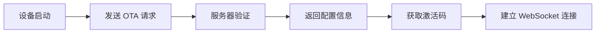

# OTA 协议文档

## 目录

- [概述](#概述)
- [快速开始](#快速开始)
- [API 参考](#api-参考)
- [完整示例](#完整示例)
- [错误处理](#错误处理)
- [常见问题](#常见问题)

## 概述

### 什么是 OTA

OTA（Over-The-Air）更新是一种通过无线网络将软件更新直接推送到设备的技术。小智设备通过 OTA 协议可以：

- 🔄 **自动获取固件更新**：检查并下载最新固件版本
- 🔑 **设备激活**：获取设备激活码进行身份验证
- 🌐 **服务器配置**：获取 WebSocket 和 MQTT 服务器连接信息
- ⏰ **时间同步**：同步服务器时间到设备

### 工作流程



### 基本信息

| 项目 | 值 |
|------|-----|
| **API 地址** | `https://xrobo.qiniuapi.com/v1/ota/` |
| **请求方法** | `POST` |
| **内容类型** | `application/json` |
| **认证方式** | 设备 ID + 客户端 ID |

## 快速开始

### 前置条件

在进行 OTA 请求之前，请确保：

- ✅ 设备已连接到稳定的网络
- ✅ 设备电量充足
- ✅ 已获取设备的 MAC 地址
- ✅ 已生成客户端 UUID

### 最小请求示例

```bash
curl -X POST https://xrobo.qiniuapi.com/v1/ota/ \
  -H "Content-Type: application/json" \
  -H "Device-Id: D4:06:06:B6:A9:FB" \
  -H "Client-Id: web_test_client" \
  -H "User-Agent: esp-box-3/1.5.6" \
  -H "Activation-Version: 2" \
  -d '{
    "application": {
      "version": "1.0.0",
      "elf_sha256": "1234567890abcdef1234567890abcdef1234567890abcdef"
    },
    "board": {
      "type": "esp-box-3",
      "name": "esp-box-3",
      "ssid": "MyWiFi",
      "rssi": -45
    }
  }'
```

## API 参考

### 请求头参数

| 参数名 | 类型 | 必需 | 说明 | 示例 |
|--------|------|------|------|------|
| `Activation-Version` | string | ✅ | 激活版本，efuse 区有序列号为"2"，无为"1" | `"2"` |
| `Device-Id` | string | ✅ | 设备唯一标识符（MAC 地址或伪 MAC） | `"D4:06:06:B6:A9:FB"` |
| `Client-Id` | string | ✅ | 客户端 UUID v4（重装后会变化） | `"web_test_client"` |
| `User-Agent` | string | ✅ | 客户端名称和版本号 | `"esp-box-3/1.5.6"` |
| `Accept-Language` | string | ❌ | 客户端当前语言 | `"zh-CN"` |

### 请求体参数

#### 必需参数

| 参数名 | 类型 | 说明 |
|--------|------|------|
| `application` | object | 设备当前固件版本信息 |
| `application.version` | string | 当前固件版本号 |
| `application.elf_sha256` | string | 固件文件完整性校验 Hash |
| `board` | object | 开发板信息 |
| `board.type` | string | 开发板类型 |
| `board.name` | string | 开发板 SKU |
| `board.ssid` | string | Wi-Fi 网络名称 |
| `board.rssi` | number | Wi-Fi 信号强度 |

#### 可选参数

| 参数名 | 类型 | 说明 |
|--------|------|------|
| `mac_address` | string | MAC 地址（与 Device-Id 一致） |
| `uuid` | string | 客户端 ID（与 Client-Id 一致） |
| `chip_model_name` | string | 芯片型号（如 esp32s3） |
| `flash_size` | number | 闪存大小 |
| `psram_size` | number | PSRAM 大小 |
| `partition_table` | array | 设备分区表信息 |

### 响应参数

#### 成功响应 (200 OK)

| 参数名 | 类型 | 说明 |
|--------|------|------|
| `activation` | object | 设备激活信息 |
| `activation.code` | string | **激活码**（重要） |
| `activation.message` | string | 屏幕显示消息 |
| `websocket` | object | WebSocket 服务器配置 |
| `websocket.url` | string | WebSocket 连接地址 |
| `mqtt` | object | MQTT 服务器配置（可选） |
| `server_time` | object | 服务器时间信息 |
| `server_time.timestamp` | number | 当前时间戳 |
| `server_time.timezone` | string | 服务器时区 |
| `server_time.timezone_offset` | number | 时区偏移量 |
| `firmware` | object | 固件更新信息 |
| `firmware.version` | string | 最新固件版本 |
| `firmware.url` | string | 固件下载链接 |

#### 错误响应

| 状态码 | 说明 | 响应体 |
|--------|------|--------|
| 400 | 请求参数错误 | `{"error": "Device ID is required"}` |
| 500 | 服务器内部错误 | `{"error": "Failed to read device auto_update status"}` |

## 完整示例

### 请求示例

```http
POST https://xrobo.qiniuapi.com/v1/ota/
Host: xrobo.qiniuapi.com
Content-Type: application/json
Accept-Language: zh-CN
Device-Id: D4:06:06:B6:A9:FB
Client-Id: web_test_client
User-Agent: esp-box-3/1.5.6
Activation-Version: 2
```

```json
{
  "version": 0,
  "uuid": "web_test_client",
  "application": {
    "name": "xiaoling-web-test",
    "version": "1.0.0",
    "compile_time": "2025-04-16 10:00:00",
    "idf_version": "4.4.3",
    "elf_sha256": "1234567890abcdef1234567890abcdef1234567890abcdef"
  },
  "ota": { 
    "label": "xiaoling-web-test" 
  },
  "board": {
    "type": "xiaoling-web-test",
    "name": "xiaoling-web-test",
    "ssid": "MyWiFiNetwork",
    "rssi": -45,
    "channel": 6,
    "ip": "192.168.1.100",
    "mac": "D4:06:06:B6:A9:FA"
  },
  "flash_size": 16777216,
  "minimum_free_heap_size": 50000,
  "mac_address": "D4:06:06:B6:A9:FA",
  "chip_model_name": "esp32s3",
  "chip_info": { 
    "model": 9, 
    "cores": 2, 
    "revision": 0, 
    "features": 32 
  },
  "partition_table": [
    { 
      "label": "nvs", 
      "type": 1, 
      "subtype": 2, 
      "address": 36864, 
      "size": 24576 
    }
  ]
}
```

### 成功响应示例

```json
{
  "server_time": {
    "timestamp": 1752119934489,
    "timeZone": "Asia/Shanghai",
    "timezone_offset": 480
  },
  "activation": {
    "code": "608303",  // 🔑 重要：这是设备激活码
    "message": "http://60.205.58.18:8002\n608303",
    "challenge": "D4:06:06:B6:A9:FA"
  },
  "firmware": {
    "version": "1.0.0",
    "url": "https://xrobo.qiniuapi.com/v1/ota/firmware_download_url"
  },
  "websocket": {
    "url": "ws://xrobo-io.qiniuapi.com/v1/ws/"  // 🌐 WebSocket 连接地址
  }
}
```

## 错误处理

### 常见错误及解决方案

#### 400 Bad Request - 缺少设备 ID

```json
{
  "error": "Device ID is required"
}
```

**解决方案**：检查请求头中是否包含 `Device-Id` 参数

#### 400 Bad Request - 无效的 OTA 请求

```json
{
  "error": "Invalid OTA request"
}
```

**解决方案**：
- 检查请求体 JSON 格式是否正确
- 确认必需字段 `application` 和 `board` 是否存在
- 验证字段类型是否匹配

#### 500 Internal Server Error - 服务器错误

```json
{
  "error": "Failed to read device auto_update status"
}
```

**解决方案**：
- 稍后重试请求
- 检查网络连接
- 联系技术支持

### 错误处理最佳实践

```javascript
// 示例：JavaScript 错误处理
async function performOTARequest(deviceData) {
  try {
    const response = await fetch('https://xrobo.qiniuapi.com/v1/ota/', {
      method: 'POST',
      headers: {
        'Content-Type': 'application/json',
        'Device-Id': deviceData.deviceId,
        'Client-Id': deviceData.clientId,
        'User-Agent': deviceData.userAgent,
        'Activation-Version': '2'
      },
      body: JSON.stringify(deviceData.payload)
    });

    if (!response.ok) {
      const errorData = await response.json();
      throw new Error(`OTA 请求失败: ${errorData.error}`);
    }

    const result = await response.json();
    
    // 提取关键信息
    const activationCode = result.activation?.code;
    const websocketUrl = result.websocket?.url;
    
    return { activationCode, websocketUrl, ...result };
    
  } catch (error) {
    console.error('OTA 请求错误:', error.message);
    throw error;
  }
}
```

## 常见问题

### Q: 激活码的有效期是多长？
A: 激活码通常有效期为 24 小时，建议获取后尽快使用。

### Q: 设备重启后需要重新获取激活码吗？
A: 是的，设备重启或重新连接网络后需要重新发起 OTA 请求获取新的激活码。

### Q: WebSocket 连接失败怎么办？
A: 请检查：
1. WebSocket URL 是否正确
2. 网络连接是否稳定
3. 防火墙是否阻止了 WebSocket 连接

### Q: 如何判断是否有固件更新？
A: 比较响应中的 `firmware.version` 与设备当前版本，如果不同且 `firmware.url` 存在，则有更新可用。

### Q: MAC 地址格式有什么要求？
A: MAC 地址应使用冒号分隔的格式，如：`D4:06:06:B6:A9:FB`，字母使用大写。
