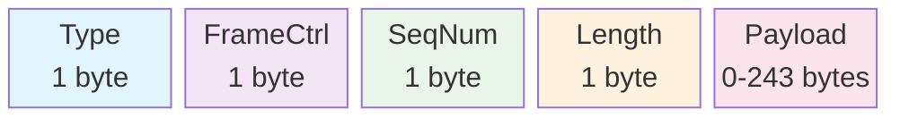
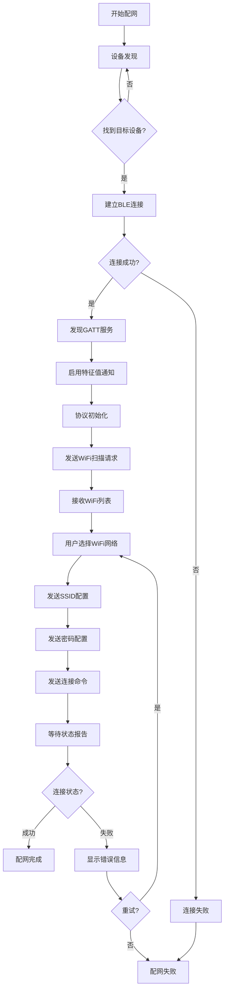
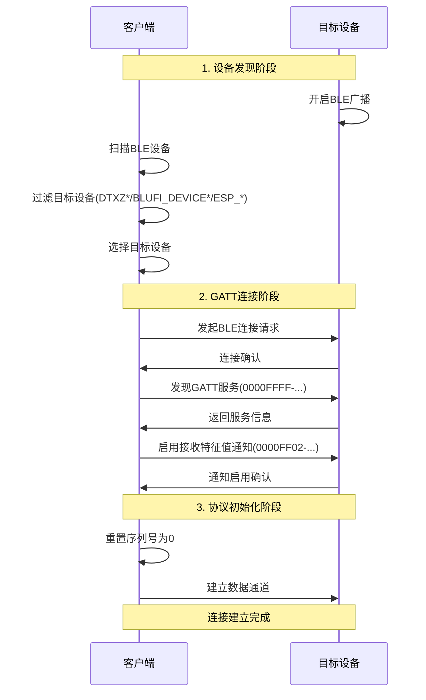
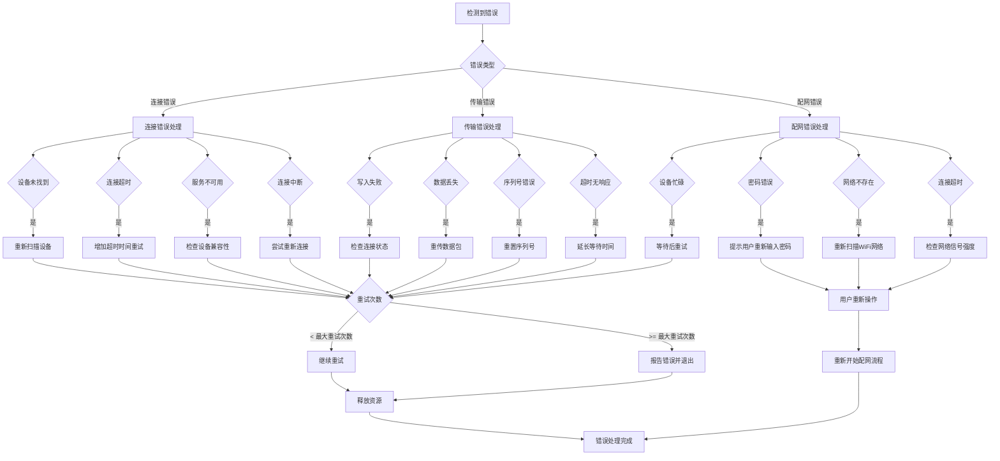

## 1. 协议概述

### 1.1 协议定义

本协议基于ESP32 BluFi标准，定义了通过蓝牙低功耗（BLE）进行Wi-Fi网络配置的通信协议。该协议允许客户端设备通过蓝牙通道向目标设备传输Wi-Fi配置信息，实现设备的网络连接配置。

### 1.2 协议特性

- **传输层**: 蓝牙低功耗（BLE 4.0+）
- **应用层**: BluFi协议
- **数据编码**: UTF-8字符串编码
- **最大传输单元**: 247字节（BLE MTU限制）
- **序列控制**: 8位序列号管理
- **数据完整性**: 长度字段校验
- **分片支持**: 大数据包分片传输

## 2. 服务架构

### 2.1 GATT服务定义

**主服务UUID**: `0000FFFF-0000-1000-8000-00805F9B34FB`

**特征值定义**:

| 特征值名称 | UUID | 属性 | 描述 |
|-----------|------|------|------|
| 发送特征值 | `0000FF01-0000-1000-8000-00805F9B34FB` | Write | 客户端向设备发送数据 |
| 接收特征值 | `0000FF02-0000-1000-8000-00805F9B34FB` | Notify | 设备向客户端推送数据 |

### 2.2 设备识别

**设备名称规则**: 设备名称应匹配以下模式之一：

- `DTXZ*`
- `BLUFI_DEVICE*`
- `ESP_*`

**连接模式**:

- 设备作为外围设备（Peripheral）进行广播
- 客户端作为中心设备（Central）发起连接

## 3. 数据帧格式

### 3.1 帧结构定义



```
+--------+--------+--------+--------+--------+...+--------+
| Type   |FrameCtrl| SeqNum | Length |      Payload     |
+--------+--------+--------+--------+--------+...+--------+
| 1 byte | 1 byte | 1 byte | 1 byte |    0-243 bytes   |
```

### 3.2 字段定义

#### Type字段（1字节）

帧类型标识，由主类型和子类型组成：

- **主类型**（低2位）：定义帧的基本类别
- **子类型**（高6位）：定义帧的具体功能

**主类型定义**：

- `0x00`: 控制帧
- `0x01`: 数据帧
- `0x02`: 加密数据帧
- `0x03`: 保留

**Type值计算公式**：`Type = (SubType << 2) | MainType`

#### FrameCtrl字段（1字节）

帧控制位定义：

| 位 | 名称 | 描述 |
|----|------|------|
| 0 | 加密标志 | 0=未加密，1=已加密 |
| 1 | 校验标志 | 0=无校验，1=有校验 |
| 2 | 方向标志 | 0=客户端到设备，1=设备到客户端 |
| 3 | ACK标志 | 0=无需ACK，1=需要ACK |
| 4 | 分片标志 | 0=完整帧，1=分片帧 |
| 5-7 | 保留位 | 必须为0 |

#### SeqNum字段（1字节）

序列号，用于数据包排序和重传控制：

- 取值范围：0-255
- 循环使用
- 每发送一个数据包，序列号递增1

#### Length字段（1字节）

Payload数据长度，取值范围0-243字节

#### Payload字段（0-243字节）

实际数据内容，格式根据帧类型而定

## 4. 协议消息定义

### 4.1 WiFi扫描消息

#### 4.1.1 WiFi扫描请求

**帧类型**: `0x24` (SubType=0x09, MainType=0x00)

**帧格式**:

```
Type: 0x24
FrameCtrl: 0x00
SeqNum: <序列号>
Length: 0x00
Payload: (空)
```

#### 4.1.2 WiFi扫描响应

**帧类型**: `0x45` (SubType=0x11, MainType=0x01)

**帧格式**:

```
Type: 0x45
FrameCtrl: 0x04 (设备到客户端)
SeqNum: <序列号>
Length: <数据长度>
Payload: <WiFi列表数据>
```

**WiFi列表数据格式**:

```
+--------+--------+--------+...+--------+
| Length | RSSI   |    SSID Bytes    |
+--------+--------+--------+...+--------+
| 1 byte | 1 byte |   Length-1 bytes |
```

多个WiFi网络按此格式连续排列。

**RSSI字段说明**:

- 数据类型：有符号字节（-128到127）
- 负值表示：如果值>127，实际RSSI = 值 - 256

### 4.2 WiFi配置消息

#### 4.2.1 SSID配置

**帧类型**: `0x09` (SubType=0x02, MainType=0x01)

**帧格式**:

```
Type: 0x09
FrameCtrl: 0x00
SeqNum: <序列号>
Length: <SSID字节长度>
Payload: <SSID的UTF-8字节>
```

#### 4.2.2 密码配置

**帧类型**: `0x0D` (SubType=0x03, MainType=0x01)

**帧格式**:

```
Type: 0x0D
FrameCtrl: 0x00
SeqNum: <序列号>
Length: <密码字节长度>
Payload: <密码的UTF-8字节>
```

#### 4.2.3 连接命令

**帧类型**: `0x0C` (SubType=0x03, MainType=0x00)

**帧格式**:

```
Type: 0x0C
FrameCtrl: 0x00
SeqNum: <序列号>
Length: 0x00
Payload: (空)
```

### 4.3 状态报告消息

#### 4.3.1 状态报告

**帧类型**: `0x3D` (SubType=0x0F, MainType=0x01)

**帧格式**:

```
Type: 0x3D
FrameCtrl: 0x04 (设备到客户端)
SeqNum: <序列号>
Length: <状态数据长度>
Payload: <状态数据>
```

**状态数据格式**:

```
+--------+--------+
| OpMode | Status |
+--------+--------+
| 1 byte | 1 byte |
```

**OpMode定义**:

- `0x01`: Station模式
- `0x02`: AP模式
- `0x03`: Station+AP模式

**Status定义**:

- `0x00`: 连接成功
- `0x01`: 连接失败
- `0x02`: 密码错误
- `0x03`: 网络不存在
- `0x04`: 连接超时

## 5. 协议流程

### 5.1 整体配网流程图

<details>
<summary>整体配网流程图</summary>



</details>

### 5.2 连接建立流程

<details>
<summary>连接建立流程图</summary>



</details>

1. **设备发现**
   - 设备开启BLE广播
   - 客户端扫描并过滤目标设备
   - 选择目标设备

2. **GATT连接**
   - 建立BLE连接
   - 发现GATT服务
   - 启用特征值通知

3. **协议初始化**
   - 重置序列号
   - 建立数据通道

### 5.3 WiFi配网流程


1. **WiFi扫描**
   - 发送WiFi扫描请求
   - 接收WiFi列表响应
   - 解析可用网络

2. **配置传输**
   - 发送SSID配置
   - 发送密码配置
   - 发送连接命令

3. **状态监控**
   - 等待状态报告
   - 解析连接结果
   - 完成配网流程

## 6. 数据编码规范

### 6.1 UTF-8编码

所有字符串数据必须使用UTF-8编码：

**编码规则**:

- ASCII字符（0x00-0x7F）：单字节编码
- 双字节字符（0x80-0x7FF）：110xxxxx 10xxxxxx
- 三字节字符（0x800-0xFFFF）：1110xxxx 10xxxxxx 10xxxxxx
- 四字节字符（0x10000-0x10FFFF）：11110xxx 10xxxxxx 10xxxxxx 10xxxxxx

### 6.2 数据分片

当数据长度超过单帧限制时，应使用分片传输：

- 设置FrameCtrl的分片标志位（bit 4）
- 使用序列号标识分片顺序
- 接收端按序列号重组数据

## 7. 错误处理

<details>
<summary>错误处理流程图</summary>



</details>

### 7.1 连接错误

**错误类型**:

- 设备未找到
- 连接超时
- 服务不可用
- 连接中断

**处理原则**:

- 提供明确的错误码
- 支持重试机制
- 及时释放资源

### 7.2 数据传输错误

**错误类型**:

- 写入失败
- 数据丢失
- 序列号错误
- 超时无响应

**处理原则**:

- 检测传输状态
- 实现重传机制
- 维护序列号一致性

### 7.3 配网错误

**错误类型**:

- WiFi密码错误
- 网络不存在
- 连接超时
- 设备忙碌

**处理原则**:

- 通过状态报告反馈错误
- 提供详细的错误信息
- 支持重新配置

## 8. 安全考虑

### 8.1 序列号管理

- 使用递增序列号防止重放攻击
- 序列号范围：0-255，循环使用
- 检测序列号异常

### 8.2 连接安全

- 验证设备名称和服务UUID
- 监控连接状态
- 及时检测异常断开

### 8.3 数据完整性

- 使用Length字段验证数据长度
- 支持数据校验（可选）
- 检测数据传输错误

## 9. 性能要求

### 9.1 传输性能

- 最大MTU：247字节
- 序列号管理开销：最小化
- 分片重组：高效算法

### 9.2 响应时间

- WiFi扫描：建议15秒内完成
- 配网过程：建议30秒内完成
- 状态报告：实时响应

### 9.3 资源使用

- 内存使用：最小化缓存
- 连接复用：避免频繁建立/断开
- 超时控制：合理设置超时时间

## 10. 兼容性

### 10.1 平台兼容性

- **蓝牙版本**: BLE 4.0及以上
- **操作系统**: 支持BLE的主流平台
- **API标准**: 基于标准GATT协议

### 10.2 设备兼容性

- **芯片支持**: ESP32系列及兼容芯片
- **固件要求**: 支持BluFi协议栈
- **工作模式**: Station模式WiFi连接

## 11. 协议扩展

### 11.1 扩展原则

- 保持向后兼容性
- 使用保留字段进行扩展
- 明确版本标识

### 11.2 自定义扩展

- 可使用保留的主类型和子类型
- 扩展状态码定义
- 增加自定义Payload格式

## 七牛官方固件

| 芯片组   | 链接                                                         |
| -------- | ------------------------------------------------------------ |
| esp32-c3 | [下载](https://algorithm.qnaigc.com/xiaoling-rom/xiaoling-bread-compact-blufi.bin) |
