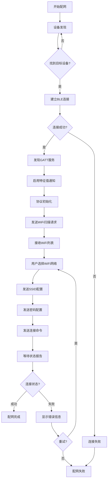
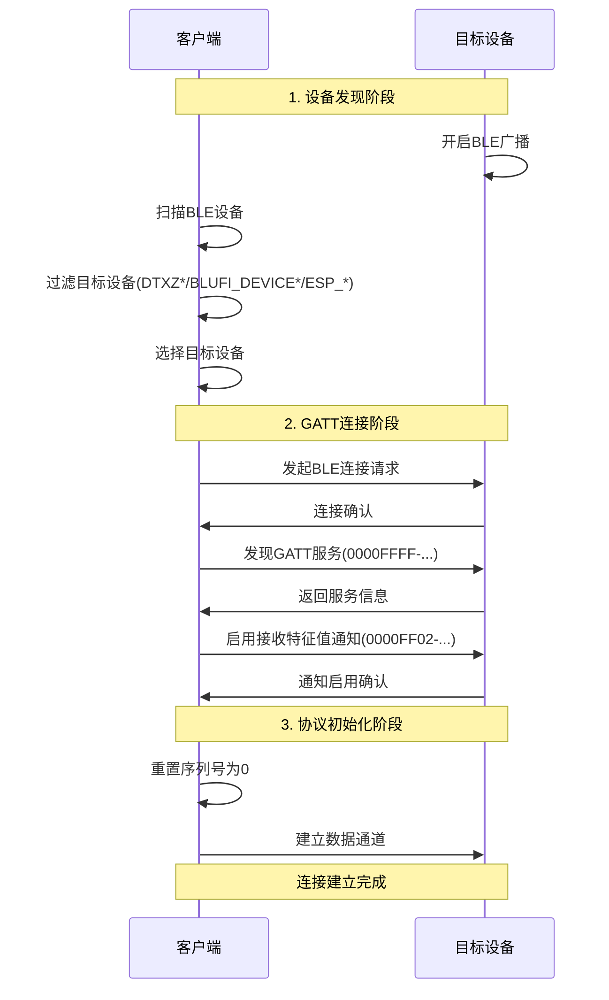
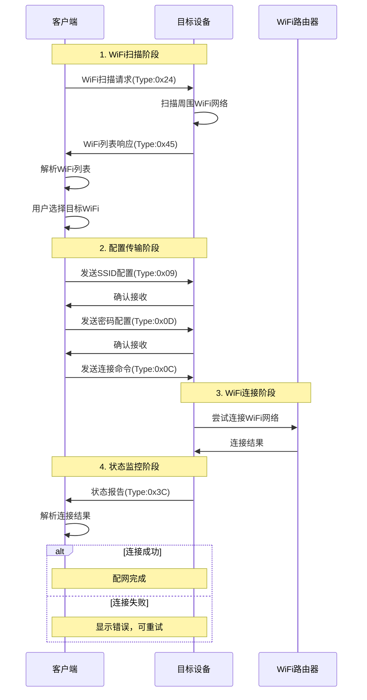
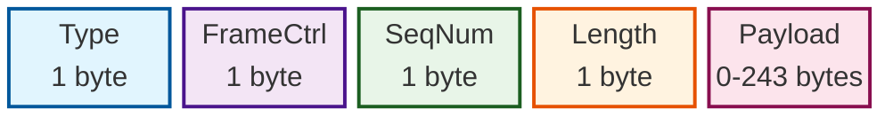
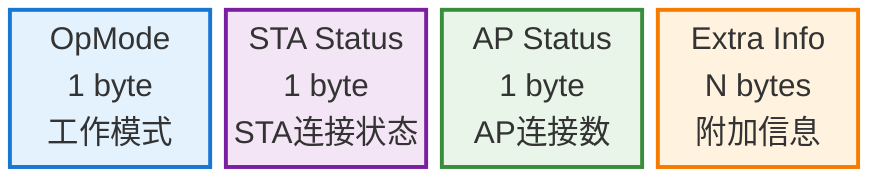
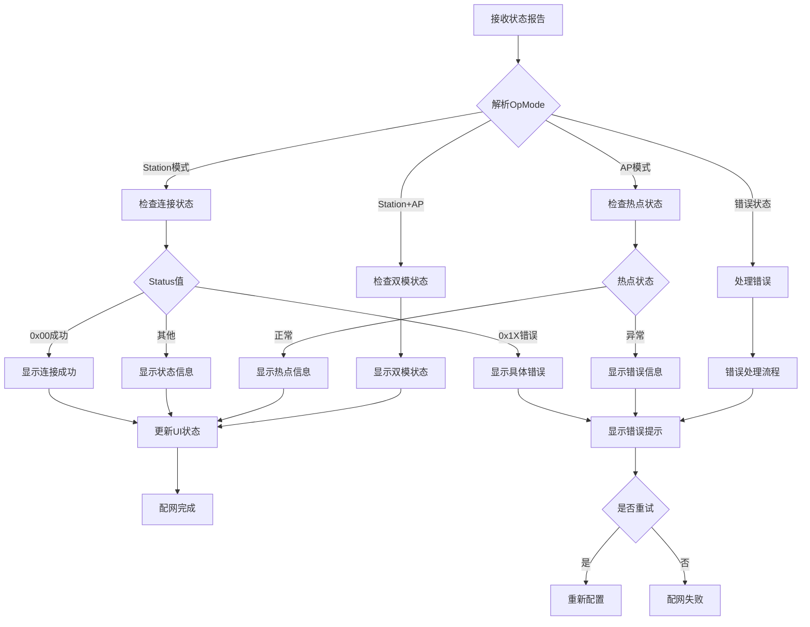
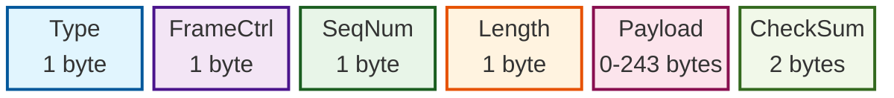
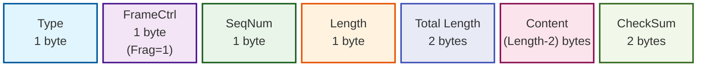
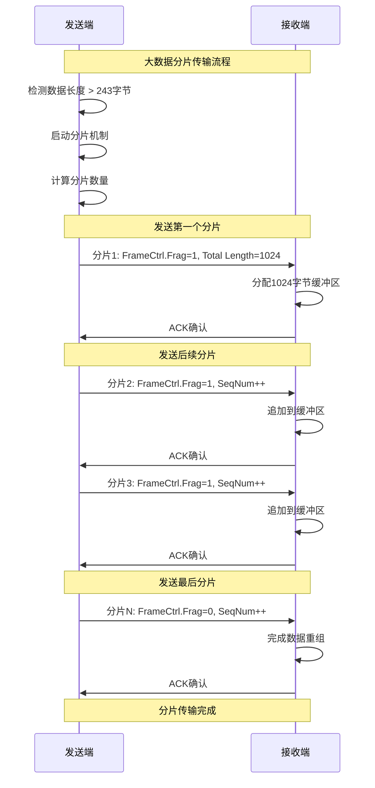

## 1. 协议概述

### 1.1 协议定义

本协议基于 [**ESP32 BluFi**](https://docs.espressif.com/projects/esp-idf/zh_CN/stable/esp32/api-guides/ble/blufi.html) 标准，定义了通过蓝牙低功耗（BLE）进行Wi-Fi网络配置的通信协议。该协议允许客户端设备(手机)通过蓝牙通道向目标设备传输Wi-Fi配置信息，实现设备的网络连接配置。

### 1.2 协议特性

- **传输层**: 蓝牙低功耗（BLE 4.0+）
- **应用层**: BluFi协议
- **数据编码**: UTF-8字符串编码
- **最大传输单元**: 247字节（BLE MTU限制）
- **序列控制**: 8位序列号管理
- **数据完整性**: 长度字段校验
- **分片支持**: 大数据包分片传输

### 1.3 协议流程

### 1.3.1 整体配网流程图

<details>
<summary>点击展开流程图</summary>



</details>

### 1.3.2 连接建立流程

<details>
<summary>点击展开流程图</summary>



</details>

1. **设备发现**
   - 设备开启BLE广播
   - 客户端扫描并过滤目标设备
   - 选择目标设备

2. **GATT连接**
   - 建立BLE连接
   - 发现GATT服务
   - 启用特征值通知

3. **协议初始化**
   - 重置序列号
   - 建立数据通道

### 1.3.3 配置WiFi流程

<details>
<summary>点击展开流程图</summary>



</details>

1. **WiFi扫描**
   - 发送WiFi扫描请求
   - 接收WiFi列表响应
   - 解析可用网络

2. **配置传输**
   - 发送SSID配置
   - 发送密码配置
   - 发送连接命令

3. **状态监控**
   - 等待状态报告
   - 解析连接结果
   - 完成配网流程

## 2. 服务架构

### 2.1 GATT服务定义

**主服务UUID**: `0000FFFF-0000-1000-8000-00805F9B34FB`

**特征值定义**:

| 特征值名称 | UUID | 属性 | 描述 |
|-----------|------|------|------|
| 发送特征值 | `0000FF01-0000-1000-8000-00805F9B34FB` | Write | 客户端向设备发送数据 |
| 接收特征值 | `0000FF02-0000-1000-8000-00805F9B34FB` | Notify | 设备向客户端推送数据 |

### 2.2 设备识别

**设备名称规则**: 设备名称name应匹配以下模式之一：

- `DTXZ*`
- `BLUFI_DEVICE*`
- `ESP_*`

**设备MAC地址获取**: 设备在广播时发送，客户端与设备连接前获取：

1. 通常可以直接通过广播发现设备时的数据包的deviceId获取
2. 由于一些[安全机制](https://developers.weixin.qq.com/miniprogram/dev/framework/device/bluetooth.html)，IOS不适用第一条（无法正常获取设备MAC地址）

    解决方案：约定将设备MAC地址设置在`localName`中，参考[微信小程序文档](https://developers.weixin.qq.com/miniprogram/dev/api/device/bluetooth/wx.onBluetoothDeviceFound.html)

    MAC地址格式可以是
    - AA:BB:CC:DD:EE:FF
    - AA-BB-CC-DD-EE-FF
    - AABBCCDDEEFF

    满足正则`/[0-9A-Fa-f]{2}([-:]?)[0-9A-Fa-f]{2}(?:\1[0-9A-Fa-f]{2}){4}$/`即可(注意$)，建议直接使用第一种，设备与智能体绑定所使用的MAC地址格式也为第一种。

**连接模式**:

- 设备作为外围设备（Peripheral）进行广播
- 客户端作为中心设备（Central）发起连接

## 3. 数据帧格式

### 3.1 帧结构定义



<!-- ```
+--------+--------+--------+--------+--------+...+--------+
| Type   |FrameCtrl| SeqNum | Length |      Payload     |
+--------+--------+--------+--------+--------+...+--------+
| 1 byte | 1 byte | 1 byte | 1 byte |    0-243 bytes   |
``` -->

### 3.2 字段定义

#### Type字段（1字节）

帧类型标识，由主类型和子类型组成：

- **主类型**（低2位）：定义帧的基本类别
- **子类型**（高6位）：定义帧的具体功能

**主类型定义**：

- `0x00`: 控制帧
- `0x01`: 数据帧
- `0x02`: 加密数据帧
- `0x03`: 保留

**Type值计算公式**：`Type = (SubType << 2) | MainType`

#### FrameCtrl字段（1字节）

帧控制字段用于控制数据帧的传输行为和安全特性，每个位都有特定的功能。

##### FrameCtrl位字段详细定义


**详细位字段说明**：

| 位 | 名称 | 值 | 含义 | 使用场景 | 注意事项 |
|----|------|----|----|----------|----------|
| **0** | **加密标志**<br/>(Encrypted) | `0` | 数据未加密 | 初始握手、公开信息 | 敏感数据必须加密 |
|  |  | `1` | 数据已加密 | WiFi密码、用户数据 | 需要先建立安全连接 |
| **1** | **校验标志**<br/>(Checksum) | `0` | 无校验和 | 控制帧、ACK帧 | 适用于可靠性要求不高的场景 |
|  |  | `1` | 包含校验和 | 重要数据传输 | 帧末尾附加2字节CRC16 |
| **2** | **方向标志**<br/>(Direction) | `0` | 客户端→设备 | 配置命令、数据上传 | 手机APP向设备发送 |
|  |  | `1` | 设备→客户端 | 状态报告、扫描结果 | 设备向手机APP发送 |
| **3** | **ACK标志**<br/>(Require ACK) | `0` | 无需确认 | 状态通知、心跳包 | 提高传输效率 |
|  |  | `1` | 需要确认 | 重要配置、关键数据 | 确保数据可靠传输 |
| **4** | **分片标志**<br/>(Fragmented) | `0` | 完整数据帧 | 小于243字节的数据 | 标准传输模式 |
|  |  | `1` | 分片数据帧 | 大于243字节的数据 | 需要分片重组 |
| **5-7** | **保留位**<br/>(Reserved) | `000` | 必须为0 |  | 发送时置0，接收时忽略 |

##### FrameCtrl常用组合值

| FrameCtrl值 | 二进制 | 含义 | 典型用途 |
|-------------|--------|------|----------|
| `0x00` | `00000000` | 未加密、无校验、客户端发送、无需ACK、完整帧 | WiFi扫描请求 |
| `0x01` | `00000001` | 已加密、无校验、客户端发送、无需ACK、完整帧 | 加密的配置数据 |
| `0x02` | `00000010` | 未加密、有校验、客户端发送、无需ACK、完整帧 | 重要的控制命令 |
| `0x04` | `00000100` | 未加密、无校验、设备发送、无需ACK、完整帧 | 设备状态通知 |
| `0x08` | `00001000` | 未加密、无校验、客户端发送、需要ACK、完整帧 | 连接命令 |
| `0x10` | `00010000` | 未加密、无校验、客户端发送、无需ACK、分片帧 | 大数据分片传输 |
| `0x0B` | `00001011` | 已加密、有校验、客户端发送、需要ACK、完整帧 | 最高安全级别传输 |
| `0x1F` | `00011111` | 已加密、有校验、设备发送、需要ACK、分片帧 | 安全的大数据传输 |

##### FrameCtrl处理逻辑

**处理原则**：

- **发送端**: 根据数据类型和安全要求设置相应标志位
- **接收端**: 按标志位执行解密、校验、确认和分片处理

##### 3.2.5 错误处理

**无效FrameCtrl值处理**：

- **保留位检查**: 保留位必须为0，非零表示协议版本不兼容
- **逻辑冲突检查**: 加密标志需要已建立安全连接
- **分片长度检查**: 分片帧长度必须足以包含Total Length字段

#### SeqNum字段（1字节）

序列号，用于数据包排序和重传控制：

- 取值范围：0-255
- 循环使用
- 每发送一个数据包，序列号递增1

#### Length字段（1字节）

Payload数据长度，取值范围0-243字节

#### Payload字段（0-243字节）

实际数据内容，格式根据帧类型而定

## 4. 协议消息定义

此处只列出配网中主要用得上的消息，具体更多消息、响应请参考[ESP32 BluFi](https://docs.espressif.com/projects/esp-idf/zh_CN/stable/esp32/api-guides/ble/blufi.html)

### 4.1 WiFi扫描消息

#### 4.1.1 WiFi扫描请求

**帧类型**: `0x24` (SubType=0x09, MainType=0x00)

**帧格式**:

```txt
Type: 0x24
FrameCtrl: 0x00
SeqNum: <序列号>
Length: 0x00
Payload: (空)
```

#### 4.1.2 WiFi扫描响应

**帧类型**: `0x45` (SubType=0x11, MainType=0x01)

**帧格式**:

```txt
Type: 0x45
FrameCtrl: 0x04 (设备到客户端)
SeqNum: <序列号>
Length: <数据长度>
Payload: <WiFi列表数据>
```

**WiFi列表数据格式**:

```txt
+--------+--------+--------+...+--------+
| Length | RSSI   |    SSID Bytes    |
+--------+--------+--------+...+--------+
| 1 byte | 1 byte |   Length-1 bytes |
```

**RSSI字段说明**:

- 数据类型：有符号字节（-128到127）
- 负值表示：如果`值`>127，实际RSSI = `值 - 256`

::: info

1. 多个WiFi网络按此格式连续排列。
2. WiFi列表的响应通常都会被分片。
:::

### 4.2 WiFi配置消息

#### 4.2.1 SSID配置

**帧类型**: `0x09` (SubType=0x02, MainType=0x01)

**帧格式**:

```txt
Type: 0x09
FrameCtrl: 0x00
SeqNum: <序列号>
Length: <SSID字节长度>
Payload: <SSID的UTF-8字节>
```

#### 4.2.2 密码配置

**帧类型**: `0x0D` (SubType=0x03, MainType=0x01)

**帧格式**:

```txt
Type: 0x0D
FrameCtrl: 0x00
SeqNum: <序列号>
Length: <密码字节长度>
Payload: <密码的UTF-8字节>
```

#### 4.2.3 连接命令

**帧类型**: `0x0C` (SubType=0x03, MainType=0x00)

**帧格式**:

```txt
Type: 0x0C
FrameCtrl: 0x00
SeqNum: <序列号>
Length: 0x00
Payload: (空)
```

### 4.3 状态报告消息

#### 4.3.1 状态报告

**帧类型**: `0x3C` (SubType=0x0F, MainType=0x00)

**帧格式**:

```txt
Type: 0x3C
FrameCtrl: 0x04 (设备到客户端)
SeqNum: <序列号>
Length: <状态数据长度>
Payload: <状态数据>
```

#### 4.3.2 状态数据格式

**数据格式说明**:

通知手机ESP设备的Wi-Fi状态，包括STA状态和SoftAP状态。用于STA设备连接手机或SoftAP。但是，当手机接收到Wi-Fi状态时，除了本帧之外，还可以回复其他帧。



#### 4.3.3 OpMode定义

| 值 | 模式 | 描述 |
|----|------|------|
| `0x00` | NULL | WiFi未初始化状态 |
| `0x01` | STA | 作为客户端连接路由器 |
| `0x02` | SoftAP | 作为热点供其他设备连接 |
| `0x03` | SoftAP & STA | 同时支持两种模式 |

要给设备配网，设备应处于STA模式(0x01或0x03)

#### 4.3.4 STA设备连接状态定义

| 值 | 状态 | 描述 |
|----|------|------|
| `0x0` | 已连接且获得IP | 处于连接状态且获得IP地址 |
| `0x1` | 未连接 | 处于非连接状态 |
| `0x2` | 正在连接 | 处于正在连接状态 |
| `0x3` | 已连接但未获得IP | 处于连接状态但未获得IP地址 |

#### 4.3.5 SoftAP连接状态定义

SoftAP的连接状态，即表示有多少STA设备已经连接到此SoftAP。

#### 4.3.6 Extra Info 附加信息定义

**Extra Info**: 按照SSID/BSSID格式提供的信息

- 如果Wi-Fi处于正在连接状态，这里将会包含最大重连次数
- 如果Wi-Fi处于非连接状态，这里将会包含Wi-Fi断开连接原因和RSSI信息

**RSSI信号强度**:

- **数据类型**: 有符号字节（-128到127）
- **单位**: dBm
- **范围**: -100dBm（很弱）到 -30dBm（很强）
- **计算**: 如果值>127，实际RSSI = `值 - 256`

### 4.4 报告异常消息

#### 4.4.1 报告异常

**帧类型**: `0x48` (SubType=0x12, MainType=0x00)

**帧格式**:

```txt
Type: 0x48
FrameCtrl: 0x04 (设备到客户端)
SeqNum: <序列号>
Length: <异常信息长度>
Payload: <异常代码>
```

**异常代码定义**:

通知手机BluFi过程出现异常：

| 代码 | 异常类型 | 描述 |
|------|----------|------|
| `0x00` | sequence error | 序列号错误 |
| `0x01` | checksum error | 校验和错误 |
| `0x02` | decrypt error | 解密错误 |
| `0x03` | encrypt error | 加密错误 |
| `0x04` | init security error | 初始化安全错误 |
| `0x05` | dh malloc error | DH内存分配错误 |
| `0x06` | dh param error | DH参数错误 |
| `0x07` | read param error | 读取参数错误 |
| `0x08` | make public error | 生成公钥错误 |
| `0x09` | data format error | 数据格式错误 |
| `0x0A` | calculate MD5 error | MD5计算错误 |
| `0x0B` | Wi-Fi scan error | Wi-Fi扫描错误 |

#### 4.4.2 状态报告触发条件

**自动触发**:

- WiFi连接状态变化时
- 接收到连接命令后
- 定期状态更新（可配置）
- 发生错误时

**手动触发**:

- 客户端请求状态查询
- 调试模式下的状态轮询

#### 4.4.3 状态报告处理流程

<details>
<summary>点击展开状态报告处理流程图</summary>



</details>

#### 4.4.4 错误状态处理策略

**错误处理策略**:

- **密码错误**: 提示用户重新输入，清除密码缓存
- **网络不存在**: 重新扫描，更新网络列表
- **连接超时**: 检查信号强度，延长超时时间重试

<!-- todo -->
## 5. 数据编码规范

### 5.1 UTF-8编码

所有字符串数据必须使用UTF-8编码：

**编码规则**:

- ASCII字符（0x00-0x7F）：单字节编码
- 双字节字符（0x80-0x7FF）：110xxxxx 10xxxxxx
- 三字节字符（0x800-0xFFFF）：1110xxxx 10xxxxxx 10xxxxxx
- 四字节字符（0x10000-0x10FFFF）：11110xxx 10xxxxxx 10xxxxxx 10xxxxxx

### 5.2 数据分片

当数据长度超过单帧限制（243字节）时，必须使用分片传输机制。

#### 5.2.1 分片触发条件

- **数据长度限制**: 当Payload数据超过243字节时
- **MTU限制**: 受BLE MTU（最大传输单元）限制
- **自动分片**: 协议栈自动处理分片逻辑

#### 5.2.2 分片帧格式

**标准帧格式**（无分片）:



**分片帧格式**（启用分片）:



#### 5.2.3 分片控制机制

**FrameCtrl分片标志位**:

- **Bit 4**: 分片标志位
  - `0`: 完整帧，无分片
  - `1`: 分片帧，需要重组

**Total Content Length字段**:

- **长度**: 2字节（16位）
- **含义**: 指示完整数据的总长度
- **用途**: 告知接收端需要分配多少内存
- **位置**: 仅在分片帧中存在，位于Payload的前2字节

#### 5.2.4 分片传输流程

<details>
<summary>点击展开分片传输流程图</summary>



</details>

#### 5.2.5 分片重组算法

**接收端重组步骤**:

1. **检测分片帧**: 检查FrameCtrl的分片标志位
2. **分配缓冲区**: 根据Total Length分配接收缓冲区
3. **数据追加**: 按序列号顺序追加分片数据
4. **完整性检查**: 验证接收数据长度和完整性

#### 5.2.6 分片错误处理

**错误类型**:

- **分片丢失**: 序列号不连续
- **分片乱序**: 序列号顺序错误
- **缓冲区溢出**: 接收数据超过预期长度
- **超时重传**: 分片传输超时

**处理策略**:

- **序列号管理**: 严格按序列号顺序接收
- **超时机制**: 设置分片接收超时时间
- **重传请求**: 检测到分片丢失时请求重传
- **缓冲区保护**: 防止缓冲区溢出攻击

## 6. 错误处理

### 6.1 连接错误

**错误类型**:

- 设备未找到
- 连接超时
- 服务不可用
- 连接中断

**处理原则**:

- 提供明确的错误码
- 支持重试机制
- 及时释放资源

### 6.2 数据传输错误

**错误类型**:

- 写入失败
- 数据丢失
- 序列号错误
- 超时无响应

**处理原则**:

- 检测传输状态
- 实现重传机制
- 维护序列号一致性

### 6.3 配网错误

**错误类型**:

- WiFi密码错误
- 网络不存在
- 连接超时
- 设备忙碌

**处理原则**:

- 通过状态报告反馈错误
- 提供详细的错误信息
- 支持重新配置

## 7. 安全考虑

### 7.1 序列号管理

- 使用递增序列号防止重放攻击
- 序列号范围：0-255，循环使用
- 检测序列号异常

### 7.2 连接安全

- 验证设备名称和服务UUID
- 监控连接状态
- 及时检测异常断开

### 7.3 数据完整性

- 使用Length字段验证数据长度
- 支持数据校验（可选）
- 检测数据传输错误

## 8. 性能要求

### 8.1 传输性能

- 最大MTU：247字节
- 序列号管理开销：最小化
- 分片重组：高效算法

### 8.2 响应时间

- WiFi扫描：建议15秒内完成
- 配网过程：建议30秒内完成
- 状态报告：实时响应

### 8.3 资源使用

- 内存使用：最小化缓存
- 连接复用：避免频繁建立/断开
- 超时控制：合理设置超时时间

## 9. 兼容性

### 9.1 平台兼容性

- **蓝牙版本**: BLE 4.0及以上
- **操作系统**: 支持BLE的主流平台
- **API标准**: 基于标准GATT协议

### 9.2 设备兼容性

- **芯片支持**: ESP32系列及兼容芯片
- **固件要求**: 支持BluFi协议栈
- **工作模式**: Station模式WiFi连接

## 10. 协议扩展

### 10.1 扩展原则

- 保持向后兼容性
- 使用保留字段进行扩展
- 明确版本标识

### 10.2 自定义扩展

- 可使用保留的主类型和子类型
- 扩展状态码定义
- 增加自定义Payload格式

## 11. 参考文档

- [ESP-IDF 编程指南 API/BluFi](https://docs.espressif.com/projects/esp-idf/zh_CN/stable/esp32/api-guides/ble/blufi.html)

### 11.1 固件实现参考

- [ESP-IDF 开源蓝牙配网代码](https://github.com/espressif/esp-idf/tree/master/examples/bluetooth/blufi)

- [WI-FI配置说明文档](https://github.com/espressif/esp-idf/blob/master/docs/zh_CN/api-guides/wifi.rst)

### 11.2 小程序实现api参考

- [微信小程序文档 蓝牙介绍](https://developers.weixin.qq.com/miniprogram/dev/framework/device/bluetooth.html)

- [微信小程序文档 蓝牙使用](https://developers.weixin.qq.com/miniprogram/dev/framework/device/ble.html#_4-%E4%B8%AD%E5%BF%83%E8%AE%BE%E5%A4%87%E7%9A%84%E4%BD%BF%E7%94%A8%E6%B5%81%E7%A8%8B)

## 12. 开源蓝牙固件

| 方案   | 链接                                                         |
| -------- | ------------------------------------------------------------ |
| esp32系列 | [下载](https://github.com/sunqirui1987/linx_blue_xiaozi/blob/main/robot%E5%9B%BA%E4%BB%B6%E7%BC%96%E8%AF%91%E8%AF%B4%E6%98%8E.pdf) |
