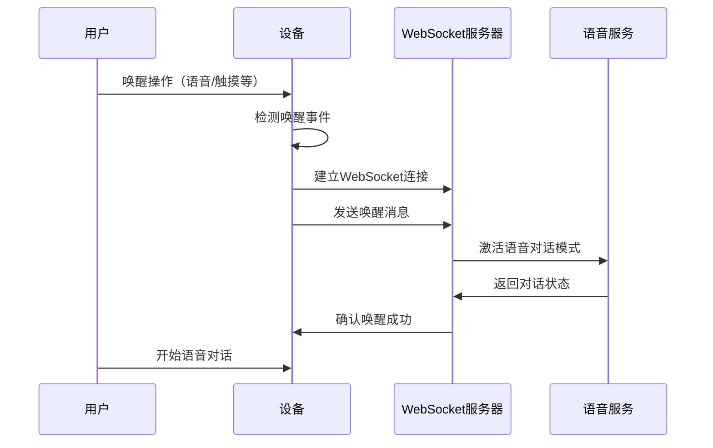
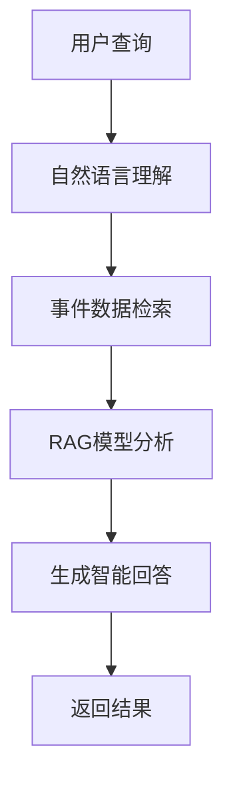

# 事件接入

事件接入是灵矽平台提供的一套事件驱动的交互机制，允许设备通过多种方式与平台进行事件通信。支持唤醒事件、异步事件、查询事件和删除事件四种类型。

## 事件类型概览

灵矽平台支持以下四种事件类型：

1. **唤醒事件** - 通过语音、触摸等方式唤醒设备进行对话
2. **异步事件** - 设备无需语音对话，通过HTTP发送事件到服务端
3. **查询事件** - 根据时间等条件查询历史事件
4. **删除事件** - 根据事件ID删除特定事件

## 1. 唤醒事件

### 功能描述

唤醒事件主要用于客户通过某种事件唤醒设备，然后进行语音对话。常见的唤醒方式包括：

- **语音唤醒**：通过特定唤醒词激活设备
- **触摸唤醒**：通过物理交互如拥抱、摸头等方式唤醒
- **其他触发方式**：按钮、传感器等

### 实现流程



### 消息格式

唤醒事件的触发条件为连接WebSocket后发送唤醒消息：

```json
{
  "session_id": "<会话 ID>",
  "type": "listen",
  "state": "detect",
  "text": "<唤醒词>"
}
```

**参数说明：**
- `session_id`: WebSocket会话的唯一标识符
- `type`: 消息类型，固定为 `"listen"`
- `state`: 监听状态，唤醒时为 `"detect"`
- `text`: 唤醒词内容，如"小智小智"、"你好"等

### 使用示例

```javascript
// WebSocket连接建立后发送唤醒消息
const wakeupMessage = {
  "session_id": "sess_12345",
  "type": "listen",
  "state": "detect",
  "text": "小智小智"
};

websocket.send(JSON.stringify(wakeupMessage));
```

## 2. 异步事件

### 功能描述

异步事件主要用于设备无需进入语音对话状态，通过HTTP将事件直接发送到服务端进行处理。适用于后台任务、定时事件、传感器数据上报等场景。

### HTTP接口

**接口地址：** `POST /v1/async-event`

**请求头：**
```http
Content-Type: application/json
Authorization: Bearer <access_token>
Device-Id: <device_id>
Client-Id: <client_id>
```

### 请求参数

```json
{
  "solvetype": "<处理方式>",
  "modeltype": "<模型类型>",
  "function": "<函数描述>",
  "triptime": "<触发时间>",
  "content": "<事件内容>"
}
```

#### solvetype（处理方式）

- **`noresponse`**: 只记录事件，返回确认消息
  - 适用场景：设置闹钟、数据记录等
  - 示例：Hey手环上报事件

- **`intent`**: 根据function描述调用相应函数
  - 适用场景：条件触发、自动化控制等
  - 示例：温度过高时自动开启空调

- **`question`**: 简单问答，无需调用函数
  - 适用场景：图片识别、简单问答等
  - 示例：拍照看题、图片描述

#### modeltype（模型类型）

- **`llm`**: 语言大模型
  - 处理文本对话、逻辑推理等

- **`vision`**: 视觉大模型
  - 处理图片识别、视觉分析等
  - 应用场景：拍题目、火灾检测、电梯检测电瓶车等

#### 其他参数

- **`function`**: JSON格式的函数描述（可选）
- **`triptime`**: 事件触发时间，ISO 8601格式
- **`content`**: 事件内容，支持文字和图片

### 响应格式

```json
{
  "status": "ok|error",
  "content": "<响应文字内容>",
  "audio": "<语音文件URL或base64>"
}
```

### 使用示例

#### 示例1：温度监控事件（intent类型）

```bash
curl -X POST "https://xrobo-io.qiniuapi.com/v1/async-event" \
  -H "Content-Type: application/json" \
  -H "Authorization: Bearer your_token" \
  -H "Device-Id: device_001" \
  -H "Client-Id: client_001" \
  -d '{
    "solvetype": "intent",
    "modeltype": "llm",
    "function": {
      "name": "temperature_control",
      "description": "当温度超过30度时开启空调",
      "parameters": {
        "temperature": 32,
        "location": "living_room"
      }
    },
    "triptime": "2024-01-15T14:30:00Z",
    "content": "客厅温度已达到32度"
  }'
```

#### 示例2：图片识别事件（vision类型）

```bash
curl -X POST "https://xrobo-io.qiniuapi.com/v1/async-event" \
  -H "Content-Type: multipart/form-data" \
  -H "Authorization: Bearer your_token" \
  -H "Device-Id: device_001" \
  -H "Client-Id: client_001" \
  -F "solvetype=chat" \
  -F "modeltype=vision" \
  -F "content=请识别这道数学题" \
  -F "image=@/path/to/math_problem.jpg"
```

#### 示例3：闹钟设置事件（noresponse类型）

```bash
curl -X POST "https://xrobo-io.qiniuapi.com/v1/async-event" \
  -H "Content-Type: application/json" \
  -H "Authorization: Bearer your_token" \
  -H "Device-Id: device_001" \
  -H "Client-Id: client_001" \
  -d '{
    "solvetype": "noresponse",
    "modeltype": "llm",
    "triptime": "2024-01-16T07:00:00Z",
    "content": "设置明天早上7点闹钟"
  }'
```

## 3. 查询事件

### 功能描述

查询事件允许根据时间、事件类型等条件查询历史事件记录，主要返回事件的content内容。

### HTTP接口

**接口地址：** `GET /v1/events`

**请求参数：**
- `start_time`: 开始时间（ISO 8601格式）
- `end_time`: 结束时间（ISO 8601格式）
- `event_type`: 事件类型（可选）
- `triptime`: 特定触发时间（可选）
- `limit`: 返回数量限制（默认20）
- `offset`: 偏移量（分页用）

### 响应格式

```json
{
  "status": "ok",
  "data": {
    "events": [
      {
        "id": "event_12345",
        "solvetype": "intent",
        "modeltype": "llm",
        "content": "客厅温度已达到32度",
        "triptime": "2024-01-15T14:30:00Z",
        "response": "已为您开启空调",
        "created_at": "2024-01-15T14:30:05Z"
      }
    ],
    "total": 1,
    "has_more": false
  }
}
```

### 使用示例

#### 查询今日所有事件

```bash
curl -X GET "https://xrobo-io.qiniuapi.com/v1/events?start_time=2024-01-15T00:00:00Z&end_time=2024-01-15T23:59:59Z" \
  -H "Authorization: Bearer your_token" \
  -H "Device-Id: device_001"
```

#### 查询特定时间点的事件

```bash
curl -X GET "https://xrobo-io.qiniuapi.com/v1/events?triptime=2024-01-15T14:30:00Z" \
  -H "Authorization: Bearer your_token" \
  -H "Device-Id: device_001"
```

## 4. 删除事件

### 功能描述

删除事件用于删除特定的历史事件记录，常用于删除已完成的闹钟事件、过期的定时任务等。

### HTTP接口

**接口地址：** `DELETE /v1/events/{event_id}`

**路径参数：**
- `event_id`: 要删除的事件ID

### 响应格式

```json
{
  "status": "ok",
  "message": "事件删除成功"
}
```

### 使用示例

#### 删除特定事件

```bash
curl -X DELETE "https://xrobo-io.qiniuapi.com/v1/events/event_12345" \
  -H "Authorization: Bearer your_token" \
  -H "Device-Id: device_001"
```

#### 批量删除事件

```bash
curl -X DELETE "https://xrobo-io.qiniuapi.com/v1/events" \
  -H "Content-Type: application/json" \
  -H "Authorization: Bearer your_token" \
  -H "Device-Id: device_001" \
  -d '{
    "event_ids": ["event_12345", "event_12346", "event_12347"]
  }'
```

## 5. 未来功能：RAG集成

### 智能事件分析

未来将事件系统与RAG（Retrieval-Augmented Generation）技术相结合，实现更智能的事件分析和查询功能。

#### 应用场景示例

- **情感分析**："今天我男朋友想我了多少次？"
- **行为统计**："这周我总共锻炼了几次？"
- **趋势分析**："最近一个月家里的温度变化趋势如何？"
- **智能提醒**："根据我的作息习惯，建议最佳睡眠时间"

#### 实现方案



## 错误处理

### 常见错误码

- `400`: 请求参数错误
- `401`: 认证失败
- `403`: 权限不足
- `404`: 事件不存在
- `429`: 请求频率过高
- `500`: 服务器内部错误

### 错误响应格式

```json
{
  "status": "error",
  "error_code": "INVALID_PARAMS",
  "message": "参数格式错误",
  "details": {
    "field": "triptime",
    "reason": "时间格式不正确，应为ISO 8601格式"
  }
}
```

## 最佳实践

### 1. 事件设计原则

- **幂等性**：相同的事件多次发送应产生相同结果
- **原子性**：事件处理要么完全成功，要么完全失败
- **可追溯**：保留完整的事件处理日志

### 2. 性能优化

- **批量处理**：对于大量异步事件，使用批量接口
- **缓存策略**：频繁查询的事件数据进行缓存
- **异步处理**：耗时操作使用异步处理模式

### 3. 安全考虑

- **认证授权**：确保所有请求都经过适当的认证
- **数据校验**：对所有输入数据进行严格校验
- **敏感信息**：避免在事件内容中包含敏感信息

## 总结

事件接入机制为灵矽平台提供了灵活强大的事件驱动能力，支持多种应用场景：

- 通过唤醒事件实现自然的人机交互
- 通过异步事件支持后台任务和自动化
- 通过查询和删除事件实现完整的事件生命周期管理
- 未来通过RAG集成实现智能事件分析

合理使用这些事件类型，可以构建出更加智能和便捷的物联网应用。