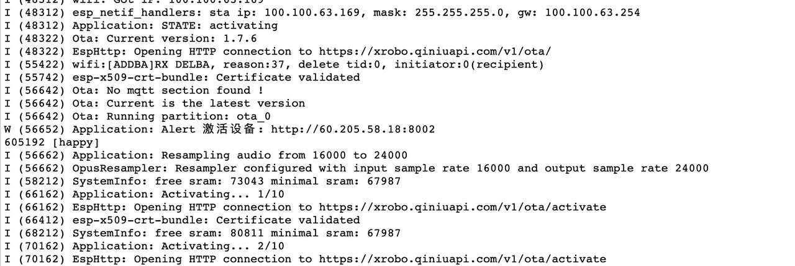

## 1. 绑定 MAC 地址

- 第一步：访问控制台，注册账号，登录

- 第二步：新建智能体：

  

- 第三步：在“设备管理”中，选择 批量导入，填写设备的 mac 地址：

  

  不知道设备 mac 地址怎么办？

## 2. 绑定设备激活码

- 第三步：通过 在“设备管理”中，选择新增，填写 设备激活码
  

怎么获取设备激活码？

### 2.1 获取设备激活码

通过 OTA 通信协议获取，参考 [OTA 协议](/xrobot/api/protocol/ota)

### 2.2 ESP32 设备通过 OTA 拿到激活码后，没有及时绑定会怎么样？

首先，设备会一直定期的发送 ota/activate 请求，提醒您去绑定；此时设备也无法唤醒，无法通话

其次，如果服务端 auth 验证需要 token，这个 token 是有保活期，超过了，需要重启设备，因为市面上的固件都没有定期 ota 过程，只有重启设备才会有 ota 消息发送。

### 2.3 怎么重新绑定

需要在控制台先解除绑定，再重新绑定，设备解除绑定后，设备当前通话并不会立刻终止，只有当重新开启会话时，会提醒你重启设备，重新拿到激活码，重新去走一遍流程。

