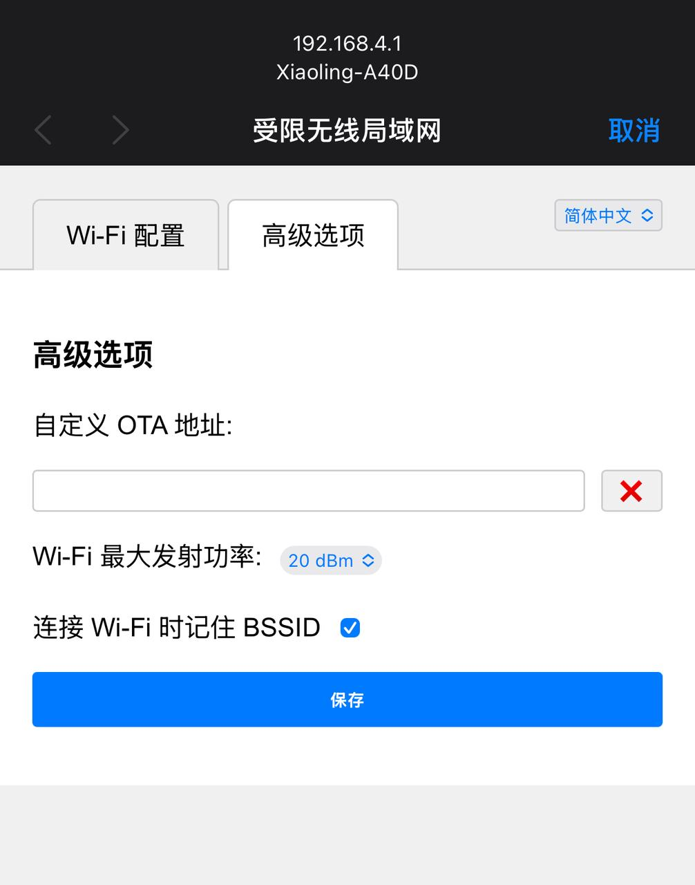

## 1. 连接设备热点

   热点名称通常为 Xiaoling-XXXX 或 Xiaozhi-XXXX，后四位为数字和大写字母构成的设备 UID

   使用手机或电脑连接到设备的 WiFi 网络，通常以 Xiaoling-XXXX 或 Xiaozhi-XXXX 命名。

   选中并连接, 使用浏览器地址栏输入网址 <http://192.168.4.1> 进入设备的网络配置页面，如下图示（截图以 Iphone 为例）：

   |  |  |
   | ------------------------------------------------------ | ------------------------------------------------------ |

## 2. 配置 WiFi

   选择 WiFi 网络，选择名称后会自动填写（也可手动录入）。在密码输入框中输入当前选择的 wifi 密码，点击 连接 按钮提交即可（如果是手机已经保存过的密码会自动提交）。

   |  |  |
   | ------------------------------------------------------ | ------------------------------------------------------ |

## 3. 配置 OTA 地址

   点击高级选项，输入该 OTA 地址后点击保存：<https://xrobo.qiniuapi.com/v1/ota/>

   

## 4. 连接并重启设备

   连接可能需要耗费 5 秒，请耐心等待，连接成功后设备将重启。重启后设备已经连上 wifi 网络，如果 wifi 不可用，重新配网。

   |  |  |
   | ------------------------------------------------------ | ------------------------------------------------------ |
