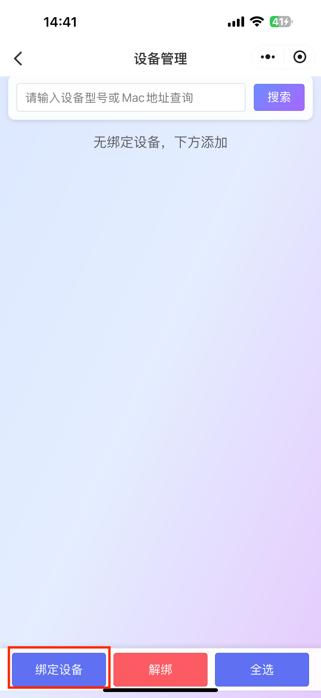
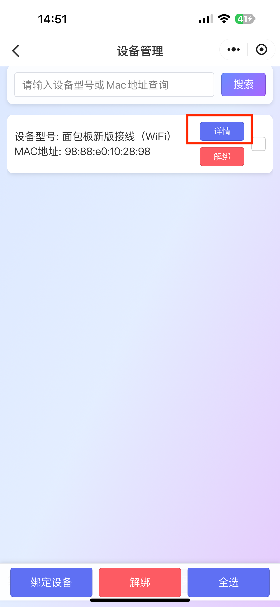
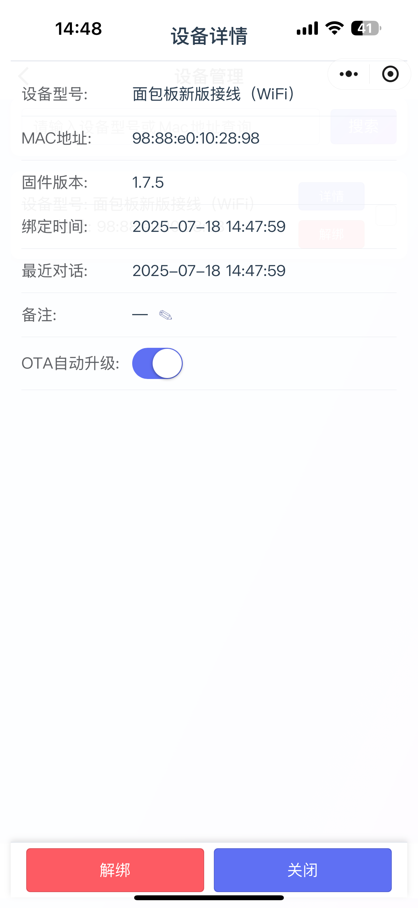

## 1. 进入设备管理页面

选择想要绑定设备的智能体卡片，点击设备管理按钮，

|  |  |
| ------------------------------------------------------------ | ------------------------------------------------------------ |

## 2. 绑定设备

在设备管理页面，点击左下角的绑定设备按钮，弹出绑定设备页面。输入设备播报的 6 位数验证码后（需要配网成功后才会播报验证码），点击确定即绑定成功。如果设备没有配网，请参考 设备配网说明 进行配网。

// todo  超链

|  |  |  |
| ------------------------------------------------------------ | ------------------------------------------------------------ | ------------------------------------------------------------ |

## 3. 查看设备信息

设备绑定成功后，点击设备卡片的详情按钮，即可查看设备相关信息。

|  |  |
| ------------------------------------------------------------ | ------------------------------------------------------------ |

## 4. 解绑设备

在设备管理页面，选择相应的设备后，点击解绑按钮后，点击确定即可解绑设备。

|  |  |
| ------------------------------------------------------------ | ------------------------------------------------------------ |

