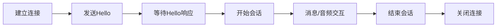
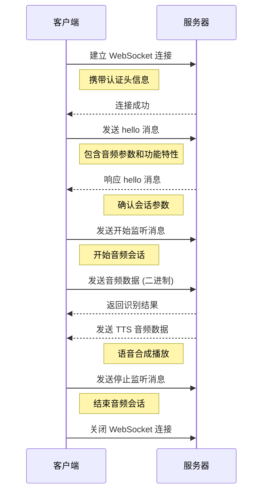

# WebSocket 协议

## 协议介绍

WebSocket 是一种网络通信协议，提供了全双工通信通道，允许客户端和服务器之间进行实时数据交换。与传统的 HTTP 请求-响应模型不同，WebSocket 允许在单个连接上进行双向通信，这使得它非常适合需要实时更新的应用场景，如在线聊天、实时游戏和金融交易等。

- **全双工通信**：客户端和服务器可以同时发送和接收消息，减少了延迟
- **长连接**：一旦建立连接，客户端和服务器可以在不重新建立连接的情况下进行多次数据交换
- **低开销**：WebSocket 连接在建立后，数据传输的开销较小，适合频繁的数据交换


::: tip 网络要求
请确保在使用 WebSocket 协议时，设备已连接到稳定的网络，以确保数据传输的可靠性。
:::

## 灵矽AI WebSocket 服务地址

**灵矽AI** 为兼容不同芯片，同时支持安全和非安全连接：

| 协议类型 | 地址 | 说明 |
|---------|------|------|
| **WSS** (推荐) | `wss://xrobo-io.qiniuapi.com/v1/ws/` | 安全WebSocket连接，使用SSL/TLS加密 |
| **WS** | `ws://xrobo-io.qiniuapi.com/v1/ws/` | 普通WebSocket连接，适用于内部网络 |

::: warning 动态地址获取
WebSocket 地址也可以通过 [**OTA协议**](OTA.md) 的返回动态获得，建议优先使用动态获取的地址。
:::

## WebSocket 通信流程

### 整体流程概览



- **会话开始**：设备终端建立WebSocket连接 → 发送hello消息 → 等待服务端hello响应
- **会话进行**：双向传输消息和音频数据
- **会话结束**：设备或服务端主动关闭WebSocket连接

### 步骤1：建立 WebSocket 连接

#### 连接初始化

设备固件或硬件终端SDK需要：
1. 创建并初始化WebSocket实例
2. 当需要开始语音会话时，构建请求头并建立连接

#### 请求头构建

```c
// 构建websocket请求头
char extra_headers[1024];
sprintf(extra_headers, sizeof(extra_headers),
    "Pragma: no-cache\r\n"
    "Cache-Control: no-cache\r\n"
    "Authorization: Bearer %s\r\n"
    "Device-Id: %s\r\n"
    "Client-Id: %s\r\n"
    "Protocol-Version: 1", 
    g_ws_token, MAC, UUID);
```

#### 必需的请求头参数

| 参数 | 格式 | 说明 |
|------|------|------|
| **Authorization** | `Bearer <token>` | 访问令牌，服务端用于身份验证 |
| **Protocol-Version** | `1` | 协议版本号，需与hello消息中version字段一致 |
| **Device-Id** | MAC地址 | 设备物理网卡MAC地址，服务端验证设备绑定状态 |
| **Client-Id** | UUID | 软件生成的唯一标识符 |

::: info 认证说明
这些请求头随WebSocket握手一起发送到服务器，服务器根据需求进行校验和认证。设备需要预先在服务端注册或绑定智能体才能通过验证。
:::

### 步骤2：设备发送 Hello 消息

连接成功后，设备端发送初始化消息告知服务器基本参数。

#### OPUS格式Hello消息

```json
{
  "type": "hello",
  "version": 1,
  "features": {
    "mcp": true  // 支持MCP协议(物联网控制新一代协议)
  },
  "transport": "websocket",
  "audio_params": {
    "format": "opus",
    "sample_rate": 16000,
    "channels": 1,
    "frame_duration": 60,
    "play_buffer_duration": 1000
  }
}
```

#### PCM格式Hello消息

```json
{
  "type": "hello",
  "version": 1,
  "features": {
    "mcp": true
  },
  "transport": "websocket",
  "audio_params": {
    "format": "pcm",
    "sample_rate": 16000,
    "channels": 1,
    "bit_depth": 16,
    "endianness": "little",
    "frame_duration": 20,
    "frame_size": 320,
    "sample_format": "signed_int16",
    "play_buffer_duration": 1000
  }
}
```

::: tip 字段说明
- **features**: 可选字段，`"mcp": true` 表示支持MCP协议进行设备能力发现和工具调用
- **audio_params**: 音频参数配置，支持OPUS和PCM两种格式
:::

### 步骤3：服务器Hello响应

服务器接收到设备的hello消息后，返回确认响应。

#### 服务器Hello响应格式

```json
{
  "type": "hello",
  "transport": "websocket",
  "session_id": "session_12345",  // 会话标识符(可选)
  "audio_params": {
    "format": "opus",
    "sample_rate": 16000,
    "channels": 1,
    "frame_duration": 60,
    "play_buffer_duration": 1000
  }
}
```

#### 响应验证

| 必需字段 | 说明 |
|----------|------|
| `type` | 必须为 "hello" |
| `transport` | 必须为 "websocket" |
| `session_id` | 会话标识符(可选)，设备端需记录 |
| `audio_params` | 服务器期望的音频参数 |

::: warning 超时处理
如果在超时时间（默认10秒）内未收到正确回复，认为连接失败并触发网络错误回调。
:::

### 步骤4：其他消息交互

握手完成后，设备端和服务器端之间可以进行双向数据传输：

#### 数据类型

| 数据类型 | 格式 | 用途 |
|----------|------|------|
| **音频数据** | 二进制帧 | OPUS/PCM编码的音频流 |
| **控制消息** | JSON文本 | TTS/STT事件、MCP协议消息、聊天状态等 |

### 步骤5：关闭连接

#### 主动关闭
- 设备/终端SDK在结束语音会话时主动断开连接
- 设备状态回到空闲状态

#### 被动断开
- 服务器端主动断开连接
- 触发相同的回调流程和状态重置

### 通信时序图



## WebSocket 通信协议详解

WebSocket 支持 **🎵 音频数据帧**（二进制方式）以及 **文本帧**（JSON方式）传输，下面分别从文本消息、MCP协议、音频数据进行详细介绍。

### 1. 会话控制类文本消息

#### 设备端发送消息

##### 1. Hello 消息
连接成功后，由设备端发送，告知服务器基本参数。

```json
{
  "type": "hello",
  "version": 1,
  "features": {
    "mcp": true
  },
  "transport": "websocket",
  "audio_params": {
    "format": "opus",
    "sample_rate": 16000,
    "channels": 1,
    "frame_duration": 60,
    "play_buffer_duration": 1000
  }
}
```

##### 2. Listen 消息
表示设备端开始、停止录音监听。

```json
{
  "session_id": "session_12345",
  "type": "listen",
  "state": "start",   // "start": 开始监听, "stop": 结束监听, "detect": 唤醒词检测
  "mode": "manual"    // 支持"manual"、"auto"模式
}
```

**监听模式说明：**
- **manual**: 手动触发模式，设备端主动控制
- **⚡ auto**: 自动触发模式，全双工，检测到语音则打断AI说话

##### 3. Abort 消息
终止当前说话（TTS播放）或语音通道。

```json
{
  "session_id": "session_12345",
  "type": "abort",
  "reason": "wake_word_detected"  // 唤醒词打断或双工模式下人声打断
}
```

##### 4. Wake Word Detected 消息
用于设备端向服务器告知检测到唤醒词。

```json
{
  "session_id": "session_12345",
  "type": "listen",
  "state": "detect",
  "text": "你好小智"
}
```

#### 服务端发送消息

##### 1. Hello 响应
服务器端返回的握手确认消息。

```json
{
  "type": "hello",
  "transport": "websocket",
  "session_id": "session_12345",
  "audio_params": {
    "format": "opus",
    "sample_rate": 24000,
    "channels": 1,
    "frame_duration": 60,
    "play_buffer_duration": 1000
  }
}
```

::: info 响应要求
必须包含 `"type": "hello"` 和 `"transport": "websocket"`，可能会带有 `audio_params`，表示服务器期望的音频参数。
:::

##### 2. STT 消息
表示服务器端识别到了用户语音（语音转文本结果）。

```json
{
  "session_id": "session_12345",
  "type": "stt",
  "text": "今天天气怎么样"
}
```

##### 3. LLM 情感消息
服务端指示设备终端调整表情动画/UI表达。

```json
{
  "session_id": "session_12345",
  "type": "llm",
  "emotion": "happy",
  "text": "😀"
}
```

**常用emoji列表：**

| Emoji | 情感 | Emoji | 情感 |
|-------|------|-------|------|
| 😶 | neutral | 😍 | loving |
| 🙂 | happy | 😳 | embarrassed |
| 😆 | laughing | 😲 | surprised |
| 😂 | funny | 😱 | shocked |
| 😔 | sad | 🤔 | thinking |
| 😠 | angry | 😉 | winking |
| 😭 | crying | 😎 | cool |
| 😌 | relaxed | 🤤 | delicious |
| 😘 | kissy | 😏 | confident |
| 😴 | sleepy | 😜 | silly |
| 🙄 | confused | - | - |

##### 4. TTS 消息
服务器TTS音频相关的状态消息。

**开始播放：**
```json
{
  "session_id": "session_12345",
  "type": "tts",
  "state": "start"
}
```

**停止播放：**
```json
{
  "session_id": "session_12345",
  "type": "tts",
  "state": "stop"
}
```

**句子开始：**
```json
{
  "session_id": "session_12345",
  "type": "tts",
  "state": "sentence_start",
  "text": "今天天气很棒！"
}
```

### 2. MCP 相关消息

MCP（Model Control Protocol）是物联网控制的新一代协议，用于设备能力发现、状态同步和控制指令。

#### MCP 交互流程

1. 设备终端在发送hello消息时包含 `"mcp": true`
2. 服务端收到`"mcp": true`会发送initialize
3. 服务端发送tool/list请求
4. 设备终端返回工具描述
5. 服务端会话过程中识别到有调用工具的需求，向设备端发送工具调用
6. 设备终端执行工具

::: tip MCP 协议优势
- **扩展性强**：可在WebSocket、MQTT等多种底层协议上传输
- **标准化**：具备更好的标准化能力
- **功能丰富**：支持设备能力发现、状态同步、控制指令等

详细用法请参考 [**端侧MCP**](https://linx.qiniu.com/docs/xrobot/mcp/hardware-mcp)。
:::

### 3. 音频数据传输
音频数据传输采用二进制方式传输，支持 **OPUS** 和 **PCM** 格式。

- 支持 **OPUS格式** 和 **PCM格式** 两种音频编码
- 当服务器发送音频二进制帧时，设备端解码并播放
- 若设备端正在"listening"（录音）状态，收到的音频帧会被忽略或清空以防冲突


## 简化流程示例

1. **设备端 → 服务端**（握手）
   ```json
   {
     "type": "hello",
     "version": 1,
     "features": {
       "mcp": true
     },
     "transport": "websocket",
     "audio_params": {
       "format": "opus",
       "sample_rate": 16000,
       "channels": 1,
       "frame_duration": 60,
       "play_buffer_duration": 1000
     }
   }
   ```

2. **服务端 → 设备端**（握手应答）
   ```json
   {
     "type": "hello",
     "transport": "websocket",
     "session_id": "xxx",
     "audio_params": {
       "format": "opus",
       "sample_rate": 16000,
       "play_buffer_duration": 1000
     }
   }
   ```

3. **设备端 → 服务器**（开始监听）
   ```json
   {
     "session_id": "xxx",
     "type": "listen",
     "state": "start",
     "mode": "auto"
   }
   ```
   同时设备端开始发送二进制帧（音频数据）。

4. **服务端 → 设备端**（ASR 结果）
   ```json
   {
     "session_id": "xxx",
     "type": "stt",
     "text": "用户说的话"
   }
   ```

5. **服务端 → 设备端**（TTS开始）
   ```json
   {
     "session_id": "xxx",
     "type": "tts",
     "state": "start"
   }
   ```
   接着服务器发送二进制音频帧给设备端播放。

6. **服务端 → 设备端**（TTS结束）
   ```json
   {
     "session_id": "xxx",
     "type": "tts",
     "state": "stop"
   }
   ```
   设备端停止播放音频，若无更多指令，则回到空闲状态。


## 错误处理

### 连接失败

- 如果Connect()返回失败或在等待服务器"hello"消息时超时，触发网络错误回调
- 设备会提示"无法连接到服务"或类似错误信息

### 服务器断开

- 如果WebSocket异常断开，回调OnDisconnected()
- 设备终端关闭音频发送通道
- 切换到Idle或其他重试逻辑

## 其他注意事项

### 鉴权

- 设备通过设置 `Authorization: Bearer <token>` 提供鉴权，服务器端需验证是否有效
- 如果令牌过期或无效，服务器可拒绝握手或在后续断开

