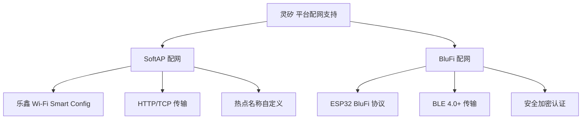
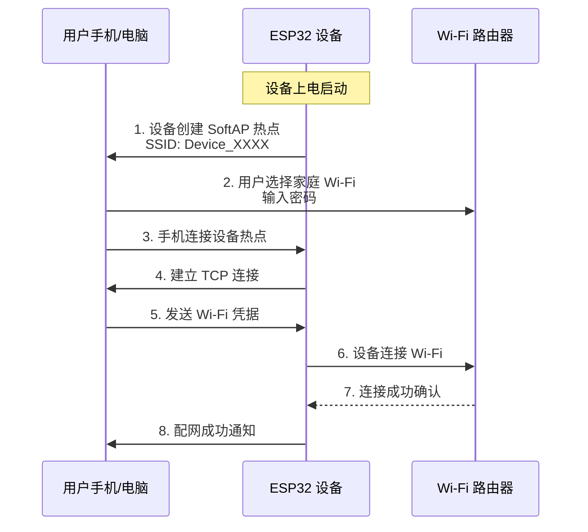
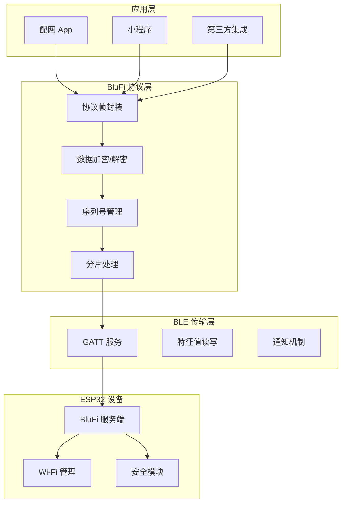
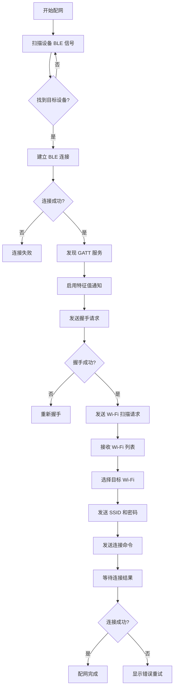

## 配网方案概述

灵矽 平台支持基于乐鑫 ESP32 系列芯片的多种 Wi-Fi 配网方式，以适应不同场景和用户需求。平台完全兼容乐鑫官方配网协议，开发者可使用乐鑫官方固件或自行开发的 ESP32 固件接入 灵矽 平台。

### 1.1 支持的配网方式

| 配网方式 | 协议标准 | 适用场景 | 优势 |
|---------|---------|---------|------|
| **SoftAP 配网** | 乐鑫 Wi-Fi Smart Config | 无蓝牙设备的环境 | 兼容性好，稳定性高 |
| **BluFi 配网** | ESP32 BluFi 协议 | 手机直连场景 | 配网成功率高，体验好 |

### 1.2 硬件要求

- **芯片平台**: ESP32-S3、ESP32-C3 系列
- **固件来源**: 乐鑫官方固件或开发者自行开发
- **内存要求**: 最小 4MB Flash，520KB SRAM
- **蓝牙支持**: BLE 4.0+（仅 BluFi 配网需要）

## 2. ESP32 固件支持

### 2.1 固件说明

灵矽 平台**不提供固件**，但**完全兼容和支持乐鑫 ESP32 系列芯片**。开发者可选择以下方式获取固件：

| 来源 | 说明 | 适用场景 |
|-----|------|---------|
| **乐鑫官方固件** | ESP-IDF 官方示例固件 | 学习、原型开发 |
| **开源社区固件** | 小智开源固件等 | 快速接入 |
| **自行开发固件** | 基于 ESP-IDF/Arduino 开发 | 深度定制 |

### 2.2 乐鑫配网协议支持

灵矽 平台完全支持乐鑫官方的两种配网协议：

## 3. SoftAP 配网协议

### 3.1 协议概述

SoftAP 配网是乐鑫官方推荐的配网方案之一。设备首先创建一个临时的 Wi-Fi 热点（Access Point），用户的手机(或者电脑)连接到这个热点后，通过 HTTP 或 TCP 协议将 Wi-Fi 凭据传输给设备。

### 3.2 协议特性

- **传输协议**: TCP/HTTP
- **工作频段**: 2.4GHz Wi-Fi
- **热点频段**: 2.4GHz（802.11 b/g/n）
- **数据加密**: AES-128（可选）
- **配网成功率**: 95%+
- **平均配网时间**: 15-30秒

### 3.3 SoftAP 配网流程

### 3.4 配网步骤详解

#### 步骤 1: 设备进入配网模式

设备上电后，进入配网模式：

- 设备创建 SoftAP 热点
- 热点名称格式: `xiaozhi_XXXX`、`xiaoling_XXXX`...

#### 步骤 2: 手机/电脑连接设备热点

1. 打开手机/电脑 Wi-Fi 设置
2. 找到设备热点（根据热点名称）
3. 点击连接

#### 步骤 3: 发送配网凭据

打开配网 App 或小程序 或者 浏览器页面登录'http://192.168.4.1/'，系统将自动检测并连接设备热点。检测到设备后，输入家庭 Wi-Fi 的 SSID 和密码，点击「开始配网」。

#### 步骤 4: 配网完成确认

配网过程中，App 会显示配网进度。配网成功后：
- 设备 LED 指示灯变为绿色常亮
- App 显示配网成功
- 设备自动切换到 STA 模式，连接家庭 Wi-Fi

### 3.5 乐鑫 SoftAP 配网参考

乐鑫官方 SoftAP 配网实现参考：

- [ESP-IDF Wi-Fi 指南](https://docs.espressif.com/projects/esp-idf/zh_CN/latest/esp32/api-guides/wifi.html)
- [ESP-IDF SoftAP 示例](https://github.com/espressif/esp-idf/tree/master/examples/wifi/getting_started/softAP)

## 4. BluFi 蓝牙配网协议

### 4.1 协议概述

BluFi 是乐鑫为 ESP32 系列芯片开发的蓝牙配网协议，通过 BLE（蓝牙低功耗）通道安全地传输 Wi-Fi 配置信息。相比传统 SoftAP 配网，BluFi 具有配网成功率高、用户体验好的优点。

### 4.2 协议特性

| 特性 | 说明 |
|-----|------|
| **传输协议** | BLE 4.0+ |
| **数据加密** | AES-128 + SHA-256 |
| **身份认证** | 设备证书 + 手机端验证 |
| **分片传输** | 支持大数据包分片 |
| **重传机制** | 自动重传，序列号校验 |
| **配网成功率** | 99%+ |
| **配网时间** | 5-15秒 |

### 4.3 BluFi 协议架构

### 4.4 BluFi 配网流程

### 4.5 详细配网步骤

#### 步骤 1: 准备工作

1. 确认设备处于配网模式（LED 蓝色闪烁）
2. 打开手机蓝牙功能
3. 打开 灵矽小程序
4. 确保手机与设备距离在 10 米以内

#### 步骤 2: 发现设备

App 自动扫描周围的 BLE 设备，列表中显示可配网的设备。设备名称根据固件配置显示。

#### 步骤 3: 建立 BLE 连接

点击目标设备，App 将尝试建立 BLE 连接。连接过程中，App 会显示连接状态和进度。连接成功后，设备 LED 指示灯变为蓝色常亮。

#### 步骤 4: 协议握手

连接建立后，App 与设备进行协议握手，完成安全认证：

1. App 发送握手请求帧
2. 设备返回设备信息和随机数
3. App 使用共享密钥加密随机数并返回
4. 设备验证通过后，握手完成

#### 步骤 5: 扫描 Wi-Fi 网络

握手成功后，App 自动请求扫描 Wi-Fi 网络。设备扫描完成后，将周围的 Wi-Fi 列表返回给 App。

#### 步骤 6: 选择并配置 Wi-Fi

1. 灵矽小程序/App 显示扫描到的 Wi-Fi 列表
2. 用户选择要连接的 Wi-Fi 网络
3. 输入 Wi-Fi 密码
4. 点击「连接」按钮

#### 步骤 7: 等待连接结果

App 将 Wi-Fi 凭据发送给设备，设备开始连接 Wi-Fi。此过程通常需要 5-10 秒。App 会实时显示连接进度和状态。

#### 步骤 8: 配网完成

配网成功后：
- 设备 LED 指示灯变为绿色常亮
- App 显示配网成功
- 显示设备的网络信息（IP 地址等）
- 设备进入正常工作模式

### 4.6 BluFi 协议详细说明

BluFi 协议详细说明请参考：

- [蓝牙配网 BluFi 协议规范](./blufi-config.md)
  
乐鑫 BluFi 官方参考文档

- [ESP-IDF BluFi 指南](https://docs.espressif.com/projects/esp-idf/zh_CN/latest/esp32/api-guides/ble/blufi.html)
- [ESP-IDF BluFi 示例代码](https://github.com/espressif/esp-idf/tree/master/examples/bluetooth/blufi)

## 5. 配网故障排查

| 问题现象 | 可能原因 | 解决方案 |
|---------|---------|---------|
| 找不到设备热点 | 设备未进入配网模式 | 让设备进入配网模式 |
| BLE 连接失败 | 手机蓝牙未开启 | 开启手机蓝牙 |
| Wi-Fi 连接失败 | 密码错误 | 确认 Wi-Fi 密码 |
| 配网超时 | 信号不稳定 | 缩短设备与路由器距离 |
| 频繁断开连接 | 干扰严重 | 更换 Wi-Fi 信道 |

## 6. 最佳实践

### 6.1 提升配网成功率

1. **环境优化**
   - 确保设备与路由器距离在 5 米以内
   - 避免在强干扰环境下配网
   - 使用 2.4GHz Wi-Fi（ESP32 不支持 5GHz）

2. **密码规范**
   - Wi-Fi 密码长度 8-63 字符
   - 避免特殊字符（如 `'"&\` 等）
   - 建议使用字母+数字组合

3. **多设备配网**
   - 逐一配网，避免同时多设备配网
   - 配网间隔至少 10 秒

### 6.2 安全建议

1. **固件安全**
   - 使用乐鑫官方或可信来源的固件
   - 定期检查固件更新
   - 启用 Wi-Fi WPA2/WPA3 加密

2. **配网安全**
   - 仅在可信环境下进行配网
   - 配网完成后及时关闭配网模式
   - 定期更换 Wi-Fi 密码

## 7. 相关文档

- [蓝牙配网 BluFi 协议规范](./blufi-config.md)
- [乐鑫 ESP-IDF 编程指南](https://docs.espressif.com/projects/esp-idf/zh_CN/latest/esp32/index.html)
- [ESP-IDF Wi-Fi API 参考](https://docs.espressif.com/projects/esp-idf/zh_CN/latest/esp32/api-reference/network/esp_wifi.html)
- [MQTT 通信协议](./MQTT.md)
- [OTA 升级指南](./OTA.md)
- [WebSocket 通信](./websocket.md)
